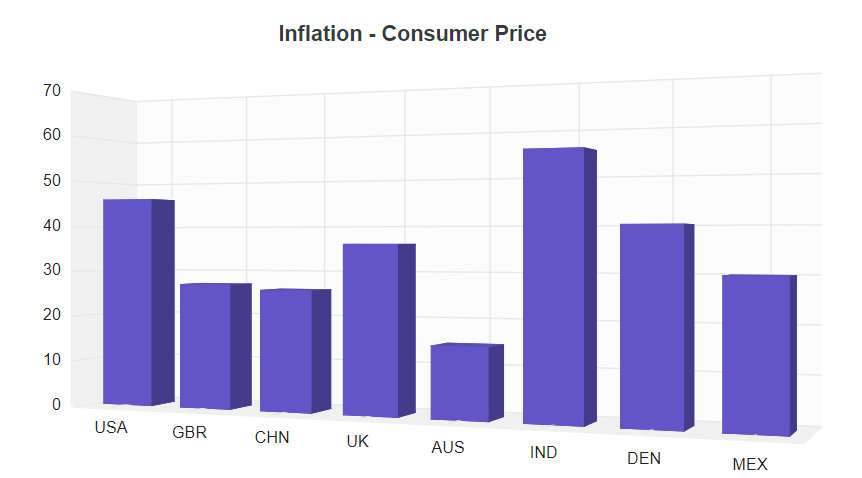

# Dimensions in Blazor 3D Chart Component

* When no size is specified, the default height and width are 450px and 600px, respectively.
* To avoid delayed rendering, architectural changes were made to the 3D Chart when the width/height were specified [in percentages](#In-Percentage) or [through style settings](#Size-for-Container) applied in the component's parent. As a result, the 3D Chart is initially rendered with the default width and height and then redrawn by adjusting only the size of the 3D Chart in a responsive manner. By including the following script in the header tag, the redrawn scenario can now be avoided.

```html
<head>
    ...
   <!--- To avoid the redraw scenario, add the CDN link below. --->
   <script src="https://cdn.syncfusion.com/blazor/syncfusion-blazor-base.min.js"></script>
</head>
```

## Size for container

The 3D chart can be rendered to its container size and it can be set via inline or CSS as demonstrated below.

```cshtml

@using Syncfusion.Blazor.Chart3D

<div style="width:350px; height:350px; background-color:red">
    <SfChart3D Title="Inflation - Consumer Price">
        <Chart3DPrimaryXAxis ValueType="Syncfusion.Blazor.Charts.ValueType.Category"></Chart3DPrimaryXAxis>

        <Chart3DSeriesCollection>
            <Chart3DSeries DataSource="@ConsumerDetails" XName="X" YName="YValue" Type="Chart3DSeriesType.Column">
            </Chart3DSeries>
        </Chart3DSeriesCollection>
    </SfChart3D>
</div>

@code{
    public class Chart3DData
    {
        public string X { get; set; }
        public double YValue { get; set; }
    }
	
    public List<Chart3DData> ConsumerDetails = new List<Chart3DData>
    {
        new Chart3DData { X= "USA", YValue= 46 },
        new Chart3DData { X= "GBR", YValue= 27 },
        new Chart3DData { X= "CHN", YValue= 26 },
        new Chart3DData { X= "UK", YValue= 36 },
        new Chart3DData { X= "AUS", YValue= 15 },
        new Chart3DData { X= "IND", YValue= 55 },
        new Chart3DData { X= "DEN", YValue= 40 },
        new Chart3DData { X= "MEX", YValue= 30 }
    };
}

```




## Size for chart

The [Width](https://help.syncfusion.com/cr/blazor/Syncfusion.Blazor.Charts.SfChart.html#Syncfusion_Blazor_Charts_SfChart_Width) and [Height](https://help.syncfusion.com/cr/blazor/Syncfusion.Blazor.Charts.SfChart.html#Syncfusion_Blazor_Charts_SfChart_Height) properties specify the size of the 3D Chart in pixels or percentages directly.

### In pixel

The [Width](https://help.syncfusion.com/cr/blazor/Syncfusion.Blazor.Charts.SfChart.html#Syncfusion_Blazor_Charts_SfChart_Width) and [Height](https://help.syncfusion.com/cr/blazor/Syncfusion.Blazor.Charts.SfChart.html#Syncfusion_Blazor_Charts_SfChart_Height) properties can be set in pixel as shown below.

```cshtml

@using Syncfusion.Blazor.Chart3D

<SfChart3D Title="Inflation - Consumer Price" Width="650px" Height="250px">
    <Chart3DPrimaryXAxis ValueType="Syncfusion.Blazor.Charts.ValueType.Category"></Chart3DPrimaryXAxis>

    <Chart3DSeriesCollection>
        <Chart3DSeries DataSource="@ConsumerDetails" XName="X" YName="YValue" Type="Chart3DSeriesType.Column">
        </Chart3DSeries>
    </Chart3DSeriesCollection>
</SfChart3D>

@code{
    public class Chart3DData
    {
        public string X { get; set; }
        public double YValue { get; set; }
    }
	
    public List<Chart3DData> ConsumerDetails = new List<Chart3DData>
	{
        new Chart3DData { X= "USA", YValue= 46 },
        new Chart3DData { X= "GBR", YValue= 27 },
        new Chart3DData { X= "CHN", YValue= 26 },
        new Chart3DData { X= "UK", YValue= 36 },
        new Chart3DData { X= "AUS", YValue= 15 },
        new Chart3DData { X= "IND", YValue= 55 },
        new Chart3DData { X= "DEN", YValue= 40 },
        new Chart3DData { X= "MEX", YValue= 30 }
    };
}

```



### In percentage

By setting the values of [Width](https://help.syncfusion.com/cr/blazor/Syncfusion.Blazor.Charts.SfChart.html#Syncfusion_Blazor_Charts_SfChart_Width) and [Height](https://help.syncfusion.com/cr/blazor/Syncfusion.Blazor.Charts.SfChart.html#Syncfusion_Blazor_Charts_SfChart_Height) properties in percentage, the 3D Chart gets its dimension with respect to its container. For example, when the [Height](https://help.syncfusion.com/cr/blazor/Syncfusion.Blazor.Charts.SfChart.html#Syncfusion_Blazor_Charts_SfChart_Height) is set to **50%**, the 3D Chart is half the height of its container.

```cshtml

@using Syncfusion.Blazor.Chart3D

<SfChart3D Title="Inflation - Consumer Price" Width="60%" height="90%">
    <Chart3DPrimaryXAxis ValueType="Syncfusion.Blazor.Charts.ValueType.Category"></Chart3DPrimaryXAxis>

    <Chart3DSeriesCollection>
        <Chart3DSeries DataSource="@ConsumerDetails" XName="X" YName="YValue" Type="Chart3DSeriesType.Column">
        </Chart3DSeries>
    </Chart3DSeriesCollection>
</SfChart3D>

@code{
    public class Chart3DData
    {
        public string X { get; set; }
        public double YValue { get; set; }
    }
	
    public List<Chart3DData> ConsumerDetails = new List<Chart3DData>
	{
        new Chart3DData { X= "USA", YValue= 46 },
        new Chart3DData { X= "GBR", YValue= 27 },
        new Chart3DData { X= "CHN", YValue= 26 },
        new Chart3DData { X= "UK", YValue= 36 },
        new Chart3DData { X= "AUS", YValue= 15 },
        new Chart3DData { X= "IND", YValue= 55 },
        new Chart3DData { X= "DEN", YValue= 40 },
        new Chart3DData { X= "MEX", YValue= 30 }
    };
}

```



N> Refer to our [Blazor 3D Chart](https://www.syncfusion.com/blazor-components/blazor-charts) feature tour page for its groundbreaking feature representations and also explore our [Blazor 3D Chart Example](https://blazor.syncfusion.com/demos/chart/line?theme=bootstrap5) to know various chart types and how to represent time-dependent data, showing trends at equal intervals.

## See also

* [Data Label](./data-labels)
* [Tooltip](./tool-tip)
* [Marker](./data-markers)