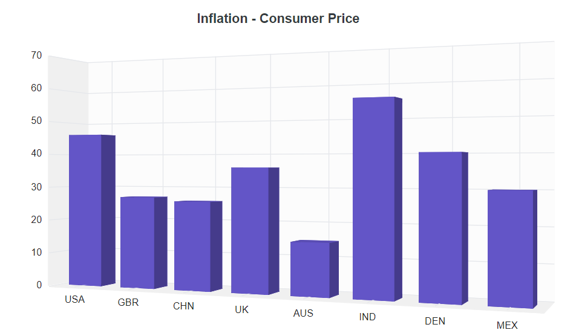

# Dimensions in Blazor 3D Chart Component

## Size for container

The 3D chart can be rendered to its container size and it can be set via inline or CSS as demonstrated below.

```cshtml

@using Syncfusion.Blazor.Chart3D

<div style="width:350px; height:350px; background-color:red">
    <SfChart3D Title="Inflation - Consumer Price">
        <Chart3DPrimaryXAxis ValueType="Syncfusion.Blazor.Chart3D.ValueType.Category"></Chart3DPrimaryXAxis>

        <Chart3DSeriesCollection>
            <Chart3DSeries DataSource="@ConsumerDetails" XName="X" YName="YValue" Type="Chart3DSeriesType.Column">
            </Chart3DSeries>
        </Chart3DSeriesCollection>
    </SfChart3D>
</div>

@code{
    public class Chart3DData
    {
        public string X { get; set; }
        public double YValue { get; set; }
    }
	
    public List<Chart3DData> ConsumerDetails = new List<Chart3DData>
    {
        new Chart3DData { X = "USA", YValue = 46 },
        new Chart3DData { X = "GBR", YValue = 27 },
        new Chart3DData { X = "CHN", YValue = 26 },
        new Chart3DData { X = "UK", YValue = 36 },
        new Chart3DData { X = "AUS", YValue = 15 },
        new Chart3DData { X = "IND", YValue = 55 },
        new Chart3DData { X = "DEN", YValue = 40 },
        new Chart3DData { X = "MEX", YValue = 30 }
    };
}

```


## Size for chart

The size of the 3D chart can be set directly through `Width` and `Height` properties.

### In Pixel

The size of the 3D chart can be set in pixel as demonstrated below.

```cshtml

@using Syncfusion.Blazor.Chart3D

<SfChart3D Title="Inflation - Consumer Price" Width="650px" Height="250px">
    <Chart3DPrimaryXAxis ValueType="Syncfusion.Blazor.Chart3D.ValueType.Category"></Chart3DPrimaryXAxis>

    <Chart3DSeriesCollection>
        <Chart3DSeries DataSource="@ConsumerDetails" XName="X" YName="YValue" Type="Chart3DSeriesType.Column">
        </Chart3DSeries>
    </Chart3DSeriesCollection>
</SfChart3D>

@code{
    public class Chart3DData
    {
        public string X { get; set; }
        public double YValue { get; set; }
    }
	
    public List<Chart3DData> ConsumerDetails = new List<Chart3DData>
	{
        new Chart3DData { X = "USA", YValue = 46 },
        new Chart3DData { X = "GBR", YValue = 27 },
        new Chart3DData { X = "CHN", YValue = 26 },
        new Chart3DData { X = "UK", YValue = 36 },
        new Chart3DData { X = "AUS", YValue = 15 },
        new Chart3DData { X = "IND", YValue = 55 },
        new Chart3DData { X = "DEN", YValue = 40 },
        new Chart3DData { X = "MEX", YValue = 30 }
    };
}

```


### In Percentage

By setting the value in percentage, the 3D Chart gets its dimension with respect to its container. For example, when the `Height` is set to **50%**, the 3D Chart renders to half of the container height.

```cshtml

@using Syncfusion.Blazor.Chart3D

<SfChart3D Title="Inflation - Consumer Price" Width="60%" Height="90%">
    <Chart3DPrimaryXAxis ValueType="Syncfusion.Blazor.Chart3D.ValueType.Category"></Chart3DPrimaryXAxis>

    <Chart3DSeriesCollection>
        <Chart3DSeries DataSource="@ConsumerDetails" XName="X" YName="YValue" Type="Chart3DSeriesType.Column">
        </Chart3DSeries>
    </Chart3DSeriesCollection>
</SfChart3D>

@code{
    public class Chart3DData
    {
        public string X { get; set; }
        public double YValue { get; set; }
    }
	
    public List<Chart3DData> ConsumerDetails = new List<Chart3DData>
	{
        new Chart3DData { X = "USA", YValue = 46 },
        new Chart3DData { X = "GBR", YValue = 27 },
        new Chart3DData { X = "CHN", YValue = 26 },
        new Chart3DData { X = "UK", YValue = 36 },
        new Chart3DData { X = "AUS", YValue = 15 },
        new Chart3DData { X = "IND", YValue = 55 },
        new Chart3DData { X = "DEN", YValue = 40 },
        new Chart3DData { X = "MEX", YValue = 30 }
    };
}

```



N> Refer to our [Blazor 3D Chart](https://www.syncfusion.com/blazor-components/blazor-3d-charts) feature tour page for its groundbreaking feature representations and also explore our [Blazor 3D Chart Example](https://blazor.syncfusion.com/demos/chart-3d/column?theme=fluent2) to know various 3D Chart types and how to represent time-dependent data, showing trends at equal intervals.
