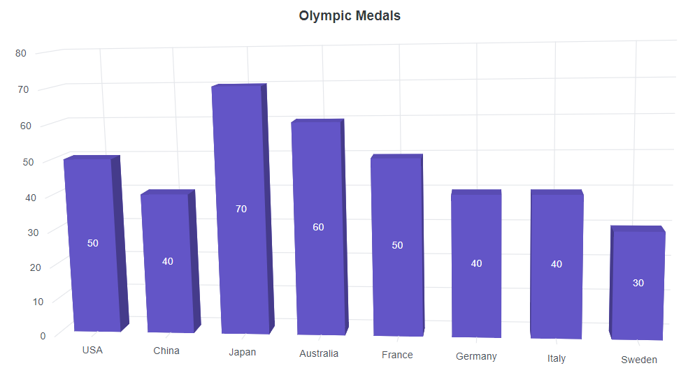
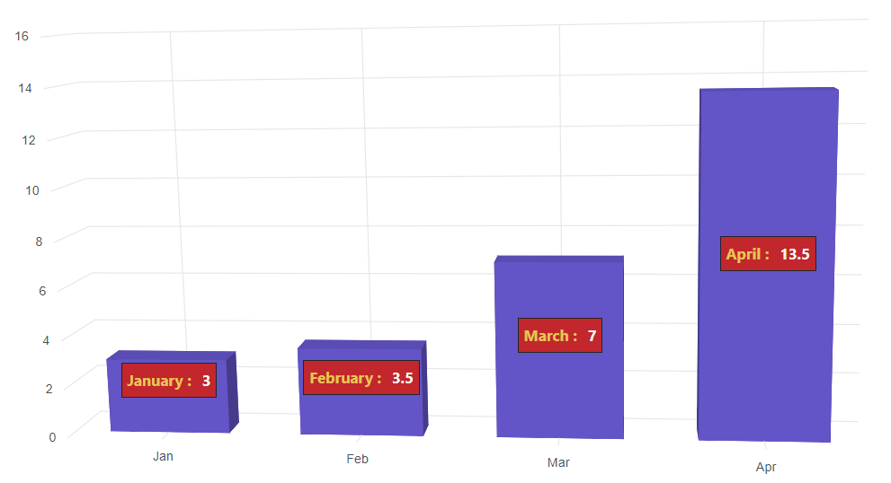
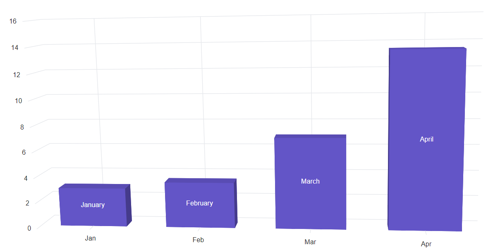
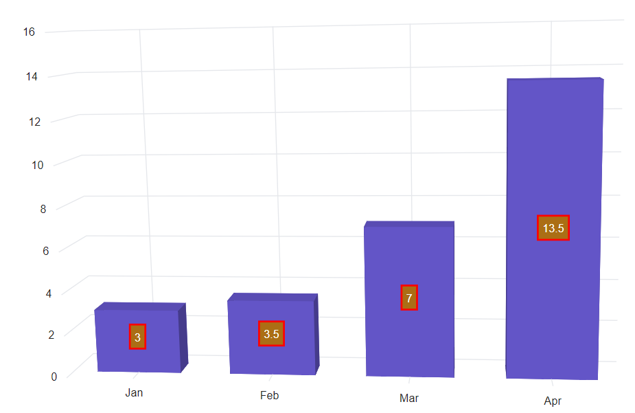
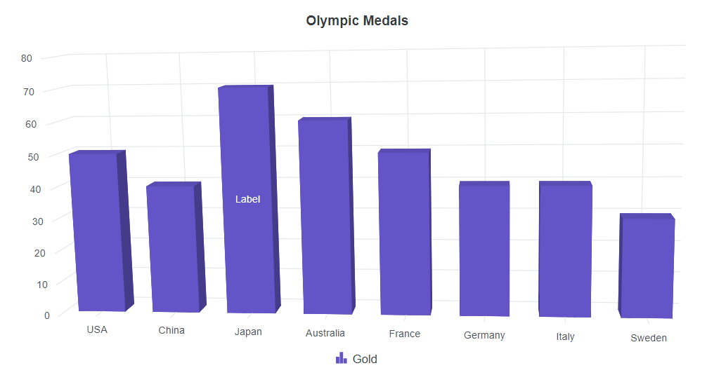

# Data Labels in Blazor 3D Chart Component

Data labels are fields that includes information about the sample point connected to an output. It can be added to a chart series by enabling the `Visible` property in the `Chart3DDataLabel`. By default, the labels will arrange smartly without overlapping.

```cshtml

@using Syncfusion.Blazor.Chart3D

<SfChart3D Title="Olympic Medals" WallColor="transparent" EnableRotation="true" RotationAngle="7" TiltAngle="10" Depth="100">
    <Chart3DPrimaryXAxis ValueType="Syncfusion.Blazor.Chart3D.ValueType.Category">
       </Chart3DPrimaryXAxis>

    <Chart3DSeriesCollection>
        <Chart3DSeries DataSource="@MedalDetails" XName="Country" YName="Gold" Type="Chart3DSeriesType.Column">
            <Chart3DDataLabel Visible="true"></Chart3DDataLabel>
        </Chart3DSeries>
    </Chart3DSeriesCollection>
</SfChart3D>

@code{
    public class Chart3DData
    {
        public string Country { get; set; }
        public double Gold { get; set; }
        public double Silver { get; set; }
    }
	
    public List<Chart3DData> MedalDetails = new List<Chart3DData>
    {
		new Chart3DData{ Country = "USA", Gold = 50, Silver = 70 },
		new Chart3DData{ Country = "China", Gold = 40, Silver = 60 },
		new Chart3DData{ Country = "Japan", Gold = 70, Silver = 60 },
		new Chart3DData{ Country = "Australia", Gold = 60, Silver = 56 },
		new Chart3DData{ Country = "France", Gold = 50, Silver = 45 },
		new Chart3DData{ Country = "Germany", Gold = 40, Silver = 30 },
		new Chart3DData{ Country = "Italy", Gold = 40, Silver = 35 },
		new Chart3DData{ Country = "Sweden", Gold = 30, Silver = 25 }
    };
}

```



## Position

The `Position` property is used to place the label either on `Top`, `Middle`, or `Bottom`.

```cshtml

@using Syncfusion.Blazor.Chart3D

<SfChart3D Title="Olympic Medals" WallColor="transparent" EnableRotation="true" RotationAngle="7" TiltAngle="10" Depth="100">
    <Chart3DPrimaryXAxis ValueType="Syncfusion.Blazor.Chart3D.ValueType.Category">
       </Chart3DPrimaryXAxis>

    <Chart3DSeriesCollection>
        <Chart3DSeries DataSource="@MedalDetails" XName="Country" YName="Gold" Type="Chart3DSeriesType.Column">
            <Chart3DDataLabel Visible="true" Position="Syncfusion.Blazor.Chart3D.Chart3DDataLabelPosition.Middle"></Chart3DDataLabel>
        </Chart3DSeries>
    </Chart3DSeriesCollection>
</SfChart3D>

@code{
    public class Chart3DData
    {
        public string Country { get; set; }
        public double Gold { get; set; }
        public double Silver { get; set; }
    }
	
    public List<Chart3DData> MedalDetails = new List<Chart3DData>
    {
		new Chart3DData{ Country = "USA", Gold = 50, Silver = 70 },
		new Chart3DData{ Country = "China", Gold = 40, Silver = 60 },
		new Chart3DData{ Country = "Japan", Gold = 70, Silver = 60 },
		new Chart3DData{ Country = "Australia", Gold = 60, Silver = 56 },
		new Chart3DData{ Country = "France", Gold = 50, Silver = 45 },
		new Chart3DData{ Country = "Germany", Gold = 40, Silver = 30 },
		new Chart3DData{ Country = "Italy", Gold = 40, Silver = 35 },
		new Chart3DData{ Country = "Sweden", Gold = 30, Silver = 25 }
    };
}

```


## Template

Label content can be formatted by using the template option. Inside the template, the placeholder text `${point.x}` and `${point.y}` can be added to display corresponding data points x & y value. Using `Chart3DDataLabelTemplate` property, the data label template can be set.

```cshtml

@using Syncfusion.Blazor.Chart3D

<SfChart3D WallColor="transparent" EnableRotation="true" RotationAngle="7" TiltAngle="10" Depth="100">
    <Chart3DPrimaryXAxis ValueType="Syncfusion.Blazor.Chart3D.ValueType.Category" />

    <Chart3DSeriesCollection>
        <Chart3DSeries DataSource="@SalesReports" XName="X" YName="Y">
                <Chart3DDataLabel Visible="true" NameField="Text">
                    <Chart3DDataLabelTemplate>
                        @{
                            var data = context as Chart3DDataPointInfo;
                        }
                        <table>
                            <tr>
                                <td align="center" style="background-color: #C1272D; font-size: 14px; color: #E7C554; font-weight: bold; padding: 5px"> @data.PointText :</td>
                                <td align="center" style="background-color: #C1272D; font-size: 14px; color: whitesmoke; font-weight: bold; padding: 5px"> @data.Y</td>
                            </tr>
                        </table>
                    </Chart3DDataLabelTemplate>
                </Chart3DDataLabel>
        </Chart3DSeries>
    </Chart3DSeriesCollection>
</SfChart3D>

@code{
    public class Data
    {
        public string X { get; set; }
        public double Y { get; set; }
        public string Text { get; set; }
    }

    public List<Data> SalesReports = new List<Data>
	{
       new Data{ X= "Jan", Y= 3, Text= "January" },
       new Data{ X= "Feb", Y= 3.5, Text= "February" },
       new Data{ X= "Mar", Y= 7, Text= "March" },
       new Data{ X= "Apr", Y= 13.5, Text= "April" }
    };
}

```



## Text mapping

Text from the data source can be mapped using the `NameField` property.

```cshtml

@using Syncfusion.Blazor.Chart3D

<SfChart3D>
    <Chart3DPrimaryXAxis ValueType="Syncfusion.Blazor.Chart3D.ValueType.Category"></Chart3DPrimaryXAxis>

    <Chart3DSeriesCollection>
        <Chart3DSeries DataSource="@WeatherReports" XName="X" YName="Y" Type="Chart3DSeriesType.Column">
            <Chart3DDataLabel Visible="true" NameField="Text"></Chart3DDataLabel>
        </Chart3DSeries>
    </Chart3DSeriesCollection>
</SfChart3D>

@code{
    public class Data
    {
        public string X { get; set; }
        public double Y { get; set; }
        public string Text { get; set; }
    }

    public List<Data> WeatherReports = new List<Data> 
	{
	   new Data{ X = "Jan", Y = 3, Text = "January" },
	   new Data{ X = "Feb", Y = 3.5, Text = "February" },
	   new Data{ X = "Mar", Y = 7, Text = "March" },
	   new Data{ X = "Apr", Y = 13.5, Text = "April" }
	};
}

```



## Format

Data label for the chart can be formatted using the `Format` property. The global formatting options can be used as 'N1', 'P1', and 'C1'.

```cshtml

@using Syncfusion.Blazor.Chart3D

<SfChart3D>
    <Chart3DPrimaryXAxis ValueType="Syncfusion.Blazor.Chart3D.ValueType.Category"></Chart3DPrimaryXAxis>

    <Chart3DSeriesCollection>
        <Chart3DSeries DataSource="@WeatherReports" XName="X" YName="Y" Type="Chart3DSeriesType.Column">
            <Chart3DDataLabel Visible="true" Format="N1"></Chart3DDataLabel>
        </Chart3DSeries>
    </Chart3DSeriesCollection>
</SfChart3D>

@code{
    public class Data
    {
        public string X { get; set; }
        public double Y { get; set; }
        public string Text { get; set; }
    }

    public List<Data> WeatherReports = new List<Data> 
	{
	   new Data{ X = "Jan", Y = 3, Text = "January" },
	   new Data{ X = "Feb", Y = 3.5, Text = "February" },
	   new Data{ X = "Mar", Y = 7, Text = "March" },
	   new Data{ X = "Apr", Y = 13.5, Text = "April" }
	};
}

```


The table below shows the results of applying various commonly used label formats to numeric data.

<!-- markdownlint-disable MD033 -->

<table>
  <tr>
    <th>Value</th>
    <th>Format</th>
    <th>Resultant Value</th>
    <th>Description</th>
  </tr>
  <tr>
    <td>1000</td>
    <td>n1</td>
    <td>1000.0</td>
    <td>The number is rounded to 1 decimal place.</td>
  </tr>
  <tr>
    <td>1000</td>
    <td>n2</td>
    <td>1000.00</td>
    <td>The number is rounded to 2 decimal places.</td>
  </tr>
   <tr>
    <td>1000</td>
    <td>n3</td>
    <td>1000.000</td>
    <td>The number is rounded to 3 decimal place.</td>
  </tr>
  <tr>
    <td>0.01</td>
    <td>p1</td>
    <td>1.0%</td>
    <td>The number is converted to percentage with 1 decimal place.</td>
  </tr>
  <tr>
    <td>0.01</td>
    <td>p2</td>
    <td>1.00%</td>
    <td>The number is converted to percentage with 2 decimal place.</td>
  </tr>
   <tr>
    <td>0.01</td>
    <td>p3</td>
    <td>1.000%</td>
    <td>The number is converted to percentage with 3 decimal place.</td>
  </tr>
  <tr>
    <td>1000</td>
    <td>c1</td>
    <td>$1000.0</td>
    <td>The currency symbol is appended to number and number is rounded to 1 decimal place.</td>
  </tr>
   <tr>
    <td>1000</td>
    <td>c2</td>
    <td>$1000.00</td>
    <td>The currency symbol is appended to number and number is rounded to 2 decimal place.</td>
  </tr>
</table>

## Margin

The `Margin` option can be applied to the data label to create space around the element.

```cshtml

@using Syncfusion.Blazor.Chart3D

<SfChart3D>
    <Chart3DPrimaryXAxis ValueType="Syncfusion.Blazor.Chart3D.ValueType.Category"></Chart3DPrimaryXAxis>

    <Chart3DSeriesCollection>
        <Chart3DSeries DataSource="@WeatherReports" XName="X" YName="Y" Type="Chart3DSeriesType.Column">
            <Chart3DDataLabel Visible="true">
                <Chart3DDataLabelBorder Color="red" Width="1"></Chart3DDataLabelBorder>
                <Chart3DDataLabelMargin Bottom="5" Left="5" Right="5" Top="5"></Chart3DDataLabelMargin>
            </Chart3DDataLabel>
        </Chart3DSeries>
    </Chart3DSeriesCollection>
</SfChart3D>

@code{
    public class Data
    {
        public string X { get; set; }
        public double Y { get; set; }
        public string Text { get; set; }
    }

    public List<Data> WeatherReports = new List<Data> 
	{
	   new Data{ X = "Jan", Y = 3, Text = "January" },
	   new Data{ X = "Feb", Y = 3.5, Text = "February" },
	   new Data{ X = "Mar", Y = 7, Text = "March" },
	   new Data{ X = "Apr", Y = 13.5, Text = "April" }
	};
}

```


## Customization

The `stroke` and `border` of data label can be customized using `Fill` and `Chart3DDataLabelBorder` properties.

```cshtml

@using Syncfusion.Blazor.Chart3D

<SfChart3D>
    <Chart3DPrimaryXAxis ValueType="Syncfusion.Blazor.Chart3D.ValueType.Category"></Chart3DPrimaryXAxis>

    <Chart3DSeriesCollection>
        <Chart3DSeries DataSource="@WeatherReports" XName="X" YName="Y" Type="Chart3DSeriesType.Column">
            <Chart3DDataLabel Visible="true">
                    <Chart3DDataLabelBorder Width="2" Color="red"></Chart3DDataLabelBorder> 
            </Chart3DDataLabel>
        </Chart3DSeries>
    </Chart3DSeriesCollection>
</SfChart3D>

@code{
    public class Data
    {
        public string X { get; set; }
        public double Y { get; set; }
        public string Text { get; set; }
    }

    public List<Data> WeatherReports = new List<Data> 
	{
	   new Data{ X = "Jan", Y = 3, Text = "January" },
	   new Data{ X = "Feb", Y = 3.5, Text = "February" },
	   new Data{ X = "Mar", Y = 7, Text = "March" },
	   new Data{ X = "Apr", Y = 13.5, Text = "April" }
	};
}

```



## Customizing specific label

A specific label can be customized by using the `TextRender` event. The `TextRender` event allows you to change the label text for the point.

```cshtml

@using Syncfusion.Blazor.Chart3D

<SfChart3D Title="Olympic Medals" DataLabelRendering="TextRender" WallColor="transparent" EnableRotation="true" RotationAngle="7" TiltAngle="10" Depth="100">
    <Chart3DPrimaryXAxis ValueType="Syncfusion.Blazor.Chart3D.ValueType.Category"/>    
    <Chart3DSeriesCollection>
        <Chart3DSeries DataSource="@MedalDetails" Name="Gold" XName="Country" Opacity="1" YName="Gold" Type="Chart3DSeriesType.Column">
            <Chart3DDataLabel Visible="true"></Chart3DDataLabel>
        </Chart3DSeries>         
    </Chart3DSeriesCollection>

    <Chart3DLegendSettings Visible="true"></Chart3DLegendSettings>
</SfChart3D>

@code{

    public class Chart3DData
    {
        public string Country { get; set; }
        public double Gold { get; set; }
        public double Silver { get; set; }
        public double Bronze { get; set; }
    }

    public List<Chart3DData> MedalDetails = new List<Chart3DData>
	{
		new Chart3DData { Country = "USA", Gold = 50, Silver = 70, Bronze = 45 },
        new Chart3DData { Country = "China", Gold = 40, Silver = 60, Bronze = 55 },
        new Chart3DData { Country = "Japan", Gold = 70, Silver = 60, Bronze = 50 },
        new Chart3DData { Country = "Australia", Gold = 60, Silver = 56, Bronze = 40 },
        new Chart3DData { Country = "France", Gold = 50, Silver = 45, Bronze = 35 },
        new Chart3DData { Country = "Germany", Gold = 40, Silver = 30, Bronze = 22 },
        new Chart3DData { Country = "Italy", Gold = 40, Silver = 35, Bronze = 37 },
        new Chart3DData { Country = "Sweden", Gold = 30, Silver = 25, Bronze = 27 }
	};

    public void TextRender(Chart3DTextRenderEventArgs args)
    {
        if (args.Point.Index == 2)
        {
            args.Text = "Label";
        }
        else
        {
            args.Cancel = true;
        }
    }
}

```



N> Refer to our [Blazor 3D Chart](https://www.syncfusion.com/blazor-components/blazor-3d-charts) feature tour page for its groundbreaking feature representations and also explore our [Blazor 3D Chart Example](https://blazor.syncfusion.com/demos/chart-3d/column?theme=fluent2) to know various 3D Chart types and how to represent time-dependent data, showing trends at equal intervals.
