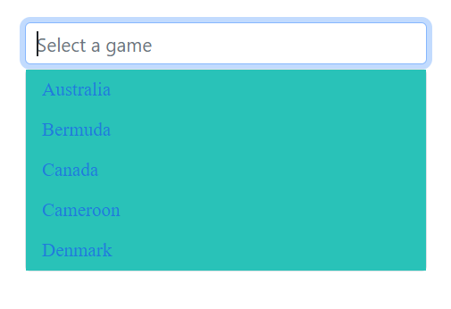

# Style and Appearance in Blazor AutoComplete Component

The following content provides the exact CSS structure that can be used to modify the control's appearance based on the user preference.

## Customizing the appearance of container element

You can customize the appearance of the container element within the autocomplete component by targeting its CSS class `.e-input`, which indicates the parent element of the input, and allows you to apply any desired styles to the component.








<!--  -->

## Customizing the dropdown icon’s color

You can customize the dropdown [icon](https://ej2.syncfusion.com/documentation/appearance/icons/#material) by targeting its CSS class `.e-ddl-icon.e-icons`, which indicates the icon element displayed within the autocomplete component, and setting the desired color to the `color` property.








<!--  -->

## Customizing the focus color

You can customize the component color when it is focused by targeting its CSS class `.e-input-focus::after`, which indicates the input element when it is focused, and set the desired color to the `background` property.








## Customizing the outline theme's focus color

You can customize the color of the autocomplete component when it is in a focused state and rendered with an outline theme,  by targeting its CSS class `e-outline` which indicates the input element when it is focused, and allows you to set the desired color to the `color` property.








<!--  -->

## Customizing the disabled component’s text color

You can customize the text color of a disabled component by targeting its CSS class `.e-input[disabled]`, which indicates the input element in a disabled state, and set the desired color to the `-webkit-text-fill-color` property.








<!--  -->

## Customizing the float label element's focusing color

You can change the text color of the floating label when it is focused by targeting its CSS classes `.e-input-focus` and `.e-float-text.e-label-top`. These classes indicate the floating label text while it is focused and set the desired color using the `color` property.








<!--  -->

## Customizing the color of the placeholder text

You can change the color of the placeholder by targeting its CSS class `input.e-input::placeholder`, which indicates the placeholder text, and set the desired color using the `color` property.








<!--  -->

## Customizing the placeholder to add mandatory indicator(*)

The mandatory indicator `*` can be applied to the placeholder by targeting its CSS class `.e-float-text::after` using the `content` style.








<!--  -->

## Customizing the text selection color

The appearance of a selected item within a autocomplete component can be customized by targeting the CSS class `input.e-input::selection` and set the desired background color and text color. This customization will only be applied when the item is selected manually. To achieve this, use the `background-color` and `color` properties of the CSS class `input.e-input::selection`.








<!--  -->

## Customizing the background color of focus, hover, and active items

You can customize the background color and text color of list items within the autocomplete component when they are in a focused, active, or hovered state by targeting the CSS classes `.e-list-item.e-item-focus`, `.e-list-item.e-active`, and `.e-list-item.e-hover`, and set the desired color to the background-color and color properties.








<!--  -->

## Customizing the appearance of pop-up element

You can customize the appearance of the popup element within the autocomplete component by targeting the CSS class `.e-list-item.e-item-focus`, which indicates the list item element when it is focused, and and allows you to apply any desired styles to the component.








<!--  -->

## Adding search icon in the Blazor AutoComplete component.

You can add the search icon to the AutoComplete component by overriding the content of the existing icon. The following code demonstrates how to add a search icon to the AutoComplete component.

```cshtml
@using Syncfusion.Blazor.DropDowns

<SfAutoComplete TValue="string" TItem="GameFields" Width="300px" ShowPopupButton="true" Placeholder="e.g. Basketball" DataSource="@Games">
    <AutoCompleteFieldSettings Value="Text"></AutoCompleteFieldSettings>
</SfAutoComplete>

<style>
    .e-ddl.e-input-group.e-control-wrapper .e-ddl-icon::before {
        content: '\e724';
        font-family: 'e-icons';
        font-size: 16px;
        opacity: 0.4;
    }
</style>

@code{
    public class GameFields
    {
        public string ID { get; set; }
        public string Text { get; set; }
    }
    public List<GameFields> Games = new List<GameFields>()
    {
        new GameFields(){ ID= "Game1", Text= "American Football" },
        new GameFields(){ ID= "Game2", Text= "Badminton" },
        new GameFields(){ ID= "Game3", Text= "Basketball" },
        new GameFields(){ ID= "Game4", Text= "Cricket" },
        new GameFields(){ ID= "Game5", Text= "Football" },
    };
}
```


<!--  -->
