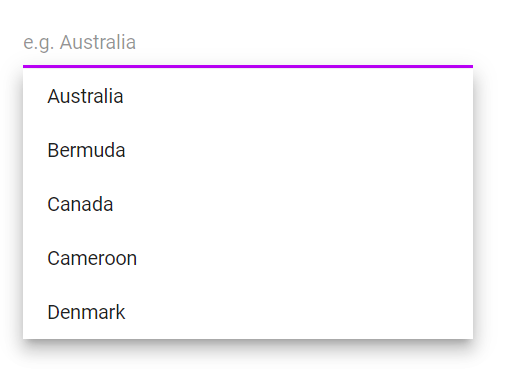
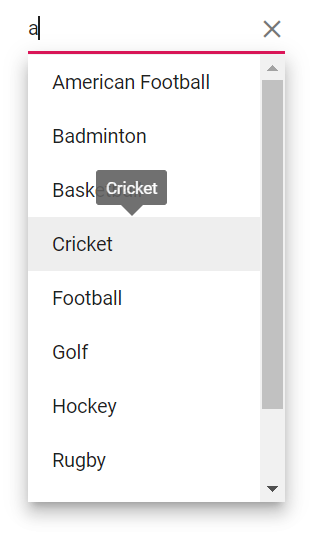
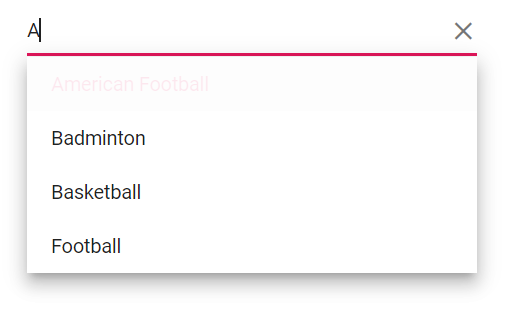
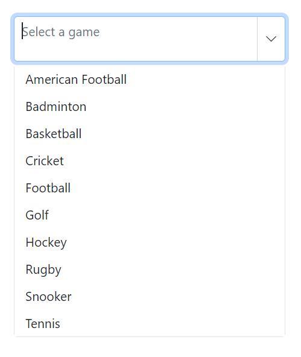
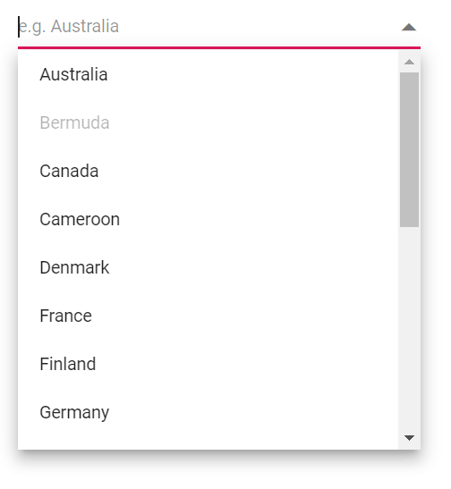

# Style and Appearance in Blazor AutoComplete Component

The following content provides the exact CSS structure that can be used to modify the control's appearance based on the user preference.

## Read-only mode

Specify the boolean value to the [Readonly](https://help.syncfusion.com/cr/blazor/Syncfusion.Blazor.DropDowns.SfDropDownList-2.html#Syncfusion_Blazor_DropDowns_SfDropDownList_2_Readonly) whether the AutoComplete allows the user to change the value or not.







## Disabled state

Specify the boolean value to the [Enabled](https://help.syncfusion.com/cr/blazor/Syncfusion.Blazor.DropDowns.SfDropDownBase-1.html#Syncfusion_Blazor_DropDowns_SfDropDownBase_1_Enabled) property that indicates whether the component is enabled or not.







### Customizing the disabled component’s text color

You can customize the text color of a disabled component by targeting its CSS class `.e-input[disabled]`, which indicates the input element in a disabled state, and set the desired color to the `-webkit-text-fill-color` property.









## Show the custom icon in dropdown icon

You can customize the dropdown [icon](https://ej2.syncfusion.com/documentation/appearance/icons#material) by targeting its CSS class `.e-ddl-icon::before`, which indicates the icon element displayed within the autocomplete component, and set the desired icon to the `content` property.







You can customize the dropdown icon for the particular component using the [CssClass](https://help.syncfusion.com/cr/blazor/Syncfusion.Blazor.DropDowns.SfDropDownList-2.html#Syncfusion_Blazor_DropDowns_SfDropDownList_2_CssClass) property and add style to the custom class which is mapped to `CssClass`.







## Adding icon in popup items

## Customizing the appearance of container element

You can customize the appearance of the container element within the autocomplete component by targeting its CSS class `.e-input`, which indicates the parent element of the input, and allows you to apply any desired styles to the component.









## Customizing the dropdown icon’s color

You can customize the dropdown [icon](https://ej2.syncfusion.com/documentation/appearance/icons/#material) by targeting its CSS class `.e-ddl-icon.e-icons`, which indicates the icon element displayed within the autocomplete component, and setting the desired color to the `color` property.









## Customizing the focus color

You can customize the component color when it is focused by targeting its CSS class `.e-input-focus::after`, which indicates the input element when it is focused, and set the desired color to the `background` property.









## Customizing the outline theme's focus color

You can customize the color of the autocomplete component when it is in a focused state and rendered with an outline theme,  by targeting its CSS class `e-outline` which indicates the input element when it is focused, and allows you to set the desired color to the `color` property.









## Customizing the background color of focus, hover, and active items

You can customize the background color and text color of list items within the autocomplete component when they are in a focused, active, or hovered state by targeting the CSS classes `.e-list-item.e-item-focus`, `.e-list-item.e-active`, and `.e-list-item.e-hover`, and set the desired color to the background-color and color properties.









## Customizing the appearance of popup element

You can customize the appearance of the popup element within the autocomplete component by targeting the CSS class `.e-list-item.e-item-focus`, which indicates the list item element when it is focused, and and allows you to apply any desired styles to the component.









## Change the HTML attributes

Add the additional html attributes such as styles, class, and more to the root element using the [HTMLAttributes](https://help.syncfusion.com/cr/blazor/Syncfusion.Blazor.DropDowns.SfDropDownList-2.html#Syncfusion_Blazor_DropDowns_SfDropDownList_2_HtmlAttributes) property and accepts n number of attributes in a key-value pair format.







## Set the various font family for autocomplete elements

The font-family of the autocomplete can be changed by overriding using the following selector. The overridden can be applied to specific component by adding a class name through the [CssClass](https://help.syncfusion.com/cr/blazor/Syncfusion.Blazor.DropDowns.SfDropDownList-2.html#Syncfusion_Blazor_DropDowns_SfDropDownList_2_CssClass) property.

In the following sample, the font family of the AutoComplete, ListItem text in AutoComplete and filterInput text are changed.







## Show tooltip on list item

You can achieve this behavior by integrating the tooltip component. When the mouse hovers over the AutoComplete option, a tooltip appears with information about the hovered list item.

The following code demonstrates how to display a tooltip when hovering over the AutoComplete option.







## Customize selected item opacity

In the following code , the CSS style that targets the `.e-list-item` class within the `.e-dropdownbase` class when it is in an active or active and hovered state. It sets the opacity property , which will make the elements appear transparent. This can be used to change the appearance of the autocomplete list items when they are in a certain state.







## Customizing the height

### Height of AutoComplete

Use the [PopupHeight](https://help.syncfusion.com/cr/blazor/Syncfusion.Blazor.DropDowns.SfDropDownList-2.html#Syncfusion_Blazor_DropDowns_SfDropDownList_2_PopupHeight) property to change the height of the popup.







### Width of AutoComplete

To customize the width of the popup alone, use the [PopupWidth](https://help.syncfusion.com/cr/blazor/Syncfusion.Blazor.DropDowns.SfDropDownList-2.html#Syncfusion_Blazor_DropDowns_SfDropDownList_2_PopupWidth) property. By default, the popup width is set based on the component's width. Use the [Width](https://help.syncfusion.com/cr/blazor/Syncfusion.Blazor.DropDowns.SfDropDownList-2.html#Syncfusion_Blazor_DropDowns_SfDropDownList_2_Width) to change the width of the component.







## Disable specific items in AutoComplete

Prevent some items in the popup list from selecting. This can be achieved by disabling the item for a specific dropdown list component by adding the custom class for the popup element using the [CssClass](https://help.syncfusion.com/cr/blazor/Syncfusion.Blazor.DropDowns.SfDropDownList-2.html#Syncfusion_Blazor_DropDowns_SfDropDownList_2_CssClass) property.

In the following code, a single list Item is hidden using js interop.












## Adding search icon in the Blazor AutoComplete component.

You can add the search icon to the AutoComplete component by overriding the content of the existing icon. The following code demonstrates how to add a search icon to the AutoComplete component.









## Customizing the float label element's focusing color

You can change the text color of the floating label when it is focused by targeting its CSS classes `.e-input-focus` and `.e-float-text.e-label-top`. These classes indicate the floating label text while it is focused and set the desired color using the `color` property.









## Customizing the color of the placeholder text

You can change the color of the placeholder by targeting its CSS class `input.e-input::placeholder`, which indicates the placeholder text, and set the desired color using the `color` property.









## Customizing the placeholder to add mandatory indicator(*)

The mandatory indicator `*` can be applied to the placeholder by targeting its CSS class `.e-float-text::after` using the `content` style.









## Customizing the text selection color

The appearance of a selected item within a autocomplete component can be customized by targeting the CSS class `input.e-input::selection` and set the desired background color and text color. This customization will only be applied when the item is selected manually. To achieve this, use the `background-color` and `color` properties of the CSS class `input.e-input::selection`.









