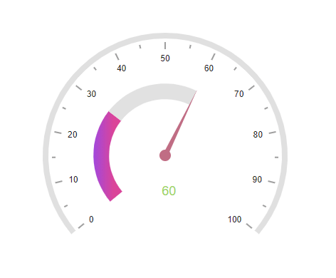

# Animation in Blazor Circular Gauge Component

By setting the [AnimationDuration](https://help.syncfusion.com/cr/blazor/Syncfusion.Blazor.CircularGauge.SfCircularGauge.html#Syncfusion_Blazor_CircularGauge_SfCircularGauge_AnimationDuration) property, all of the elements in the Circular Gauge, such as the axis lines, ticks, labels, ranges, pointers, and annotations, can be animated sequentially. When the `AnimationDuration` property is set to a value in milliseconds, the animation for the Circular Gauge is started, providing a smooth rendering effect for the component. The animation effect will not be started if the property is set to **0**, which is the default value. If this animation is enabled, the component will exhibit the following behavior.
1. The axis line will be animated in the direction of rendering (clockwise or anticlockwise).
2. After that, each tick line and label will be animated.
3. Ranges will be animated if they are available.
4. Pointers will be animated in the same way as [pointer animation](https://blazor.syncfusion.com/documentation/circular-gauge/pointers#pointer-animation) if they are available.
5. Annotations will be animated if they are available.

The animation of the Circular Gauge is demonstrated in the example below.

```cshtml

@using Syncfusion.Blazor.CircularGauge;

<SfCircularGauge AnimationDuration="2000">
        <CircularGaugeAxes>
            <CircularGaugeAxis Radius="80%" StartAngle="230" EndAngle="130">
                <CircularGaugeAxisLabelStyle Offset="-1">
                    <CircularGaugeAxisLabelFont FontFamily="inherit"></CircularGaugeAxisLabelFont>
                </CircularGaugeAxisLabelStyle>
                <CircularGaugeAxisLineStyle Width="8" Color="#E0E0E0" />
                <CircularGaugeAxisMajorTicks Offset="5" />
                <CircularGaugeAxisMinorTicks Offset="5" />
                <CircularGaugePointers>
                    <CircularGaugePointer Value=60 Radius="60%" PointerWidth="7" Color="#c06c84">
                        <CircularGaugePointerAnimation Duration="500" />
                        <CircularGaugeCap Radius="8" Color="#c06c84">
                            <CircularGaugeCapBorder Width="0" />
                        </CircularGaugeCap>
                        <CircularGaugeNeedleTail Length="0%" />
                    </CircularGaugePointer>
                </CircularGaugePointers>
            <CircularGaugeRanges>
                <CircularGaugeRange Color="#E63B86" Start="0" End="30" StartWidth="22" EndWidth="22" Radius="60%">
                    <LinearGradient StartValue="0%" EndValue="100%">
                        <ColorStops>
                            <ColorStop Opacity="1" Offset="0%" Color="#9e40dc" />
                            <ColorStop Opacity="1" Offset="70%" Color="#d93c95" />
                        </ColorStops>
                    </LinearGradient>
                </CircularGaugeRange>
                <CircularGaugeRange Color="#E0E0E0" Start="30" End="60" StartWidth="22" EndWidth="22" Radius="60%" />
            </CircularGaugeRanges>
            <CircularGaugeAnnotations>
                <CircularGaugeAnnotation Angle="165" Radius="35%" ZIndex="1">
                    <ContentTemplate>
                        <div style="font-size:18px;margin-left: -20px;margin-top: -12px; color:#9DD55A">60</div>
                    </ContentTemplate>
                </CircularGaugeAnnotation>
            </CircularGaugeAnnotations>
            </CircularGaugeAxis>
        </CircularGaugeAxes>
    </SfCircularGauge>
    
```



