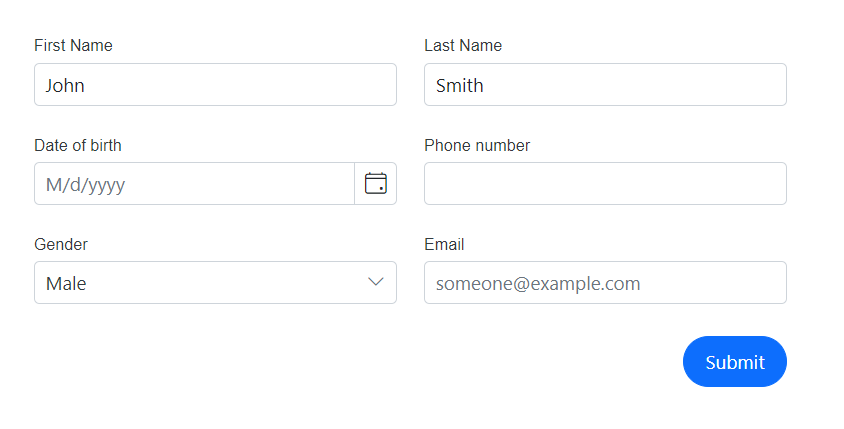
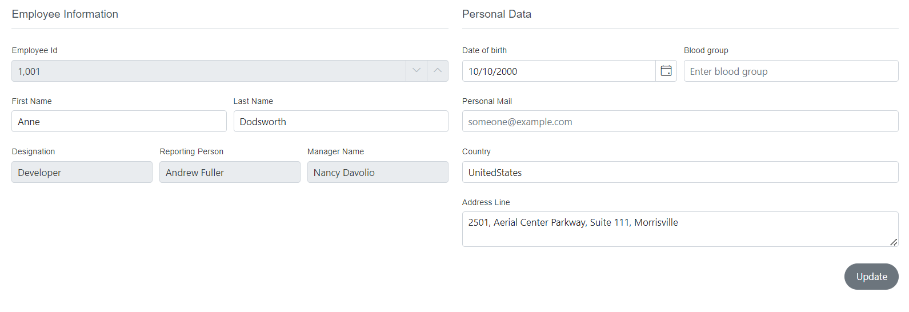

# Column layout in Blazor DataForm Component

This segment provides guidance on dividing the form field editors inside the DataForm component into a column-based layout. Additionally, it details the method for setting the column span for each `FormItem`.

The [ColumnCount](https://help.syncfusion.com/cr/blazor/Syncfusion.Blazor.DataForm.SfDataForm.html#Syncfusion_Blazor_DataForm_SfDataForm_ColumnCount) property allows us to specify the number of columns into which the DataForm should be divided. Additionally, by utilizing the [ColumnSpan](https://help.syncfusion.com/cr/blazor/Syncfusion.Blazor.DataForm.FormItem.html#Syncfusion_Blazor_DataForm_FormItem_ColumnSpan) attribute of a `FormItem`, we can control the width of the editor, either allowing it to expand to full width or allocating it a portion of the width based on the provided column span.




@using Syncfusion.Blazor.DataForm
@using System.ComponentModel.DataAnnotations

<SfDataForm Width="50%"
            Model="@RegistrationDetailsModel" ColumnCount="6" ColumnSpacing="20px">

    <FormValidator>
        <DataAnnotationsValidator></DataAnnotationsValidator>
    </FormValidator>

    <FormItems>
        <FormItem Field="@nameof(RegistrationDetailsModel.FirstName)" LabelText="First Name"  ColumnSpan="2"></FormItem>
        <FormItem Field="@nameof(RegistrationDetailsModel.MiddleName)" LabelText="Middle Name" ColumnSpan="2"></FormItem>
        <FormItem Field="@nameof(RegistrationDetailsModel.LastName)" LabelText="Last Name" ColumnSpan="2"></FormItem>
        <FormItem Field="@nameof(RegistrationDetailsModel.DOB)" LabelText="Date of birth" Placeholder="M/d/yyyy" EditorType="FormEditorType.DatePicker" ColumnSpan="3"></FormItem>
        <FormItem Field="@nameof(RegistrationDetailsModel.Sex)" LabelText="Gender" ColumnSpan="3"></FormItem>
        <FormItem Field="@nameof(RegistrationDetailsModel.Email)" LabelText="Gender" ColumnSpan="6" Placeholder="someone@example.com"></FormItem>
    </FormItems>

</SfDataForm>

@code {

    public enum Gender
    {
        Male,
        Female,
        Others
    }

    public class RegistrationDetails
    {

        [Required(ErrorMessage = "Please enter your first name")]
        public string FirstName { get; set; }

        public string MiddleName { get; set; }

        [Required(ErrorMessage = "Please enter your last name")]
        public string LastName { get; set; }

        [Required(ErrorMessage = "Please enter your date of birth")]
        public DateTime? DOB { get; set; }

        [Required(ErrorMessage = "Please choose your gender")]
        public Gender Sex { get; set; }

        [Required(ErrorMessage = "Please enter your email address")]
        [EmailAddress(ErrorMessage = "Please enter valid email address")]
        public string Email { get; set; }
    }

    private RegistrationDetails RegistrationDetailsModel = new RegistrationDetails()
    {
        FirstName = "John",
        MiddleName = "Doe",
        LastName = "Smith"
    };

}


{% endtabs % }

In the provided example, the layout of the DataForm is segmented into six equal columns, with the editor fields distributed accordingly, depending on the column span allocated to each one.

## Form groups with column layout

This section explains how to configure the DataForm component on dividing the collection of [FormGroups](https://help.syncfusion.com/cr/blazor/Syncfusion.Blazor.DataForm.FormGroup.html) and organizing the subdivisions within the `FormGroup`.




@using Syncfusion.Blazor.DataForm
@using Syncfusion.Blazor.Buttons
@using System.ComponentModel.DataAnnotations

<SfDataForm ID="MyForm"
            Model="@EmployeeDetailsModel"
            ColumnCount=2
            ColumnSpacing="20px">

    <FormValidator>
        <DataAnnotationsValidator></DataAnnotationsValidator>
    </FormValidator>

    <FormItems>
        <FormGroup ColumnCount="6" LabelText="Employee Information" ColumnSpacing="10px">
            <FormItem Field="@nameof(EmployeeDetailsModel.EmployeeId)" ColumnSpan="6" LabelText="Employee Id" />
            <FormItem Field="@nameof(EmployeeDetailsModel.FirstName)" ColumnSpan="3" LabelText="First Name" />
            <FormItem Field="@nameof(EmployeeDetailsModel.LastName)" ColumnSpan="3" LabelText="Last Name" />
            <FormItem Field="@nameof(EmployeeDetailsModel.Designation)" ColumnSpan="2" LabelText="Designation" />
            <FormItem Field="@nameof(EmployeeDetailsModel.ReportingPerson)" ColumnSpan="2" LabelText="Reporting Person" />
            <FormItem Field="@nameof(EmployeeDetailsModel.ManagerName)" ColumnSpan="2" LabelText="Manager Name" />
        </FormGroup>

        <FormGroup LabelText="Personal Data" ColumnCount="2" ColumnSpacing="10px">
            <FormItem Field="@nameof(EmployeeDetailsModel.DateOfBirth)" ColumnSpan="1" EditorType="FormEditorType.DatePicker" LabelText="Date of birth" />
            <FormItem Field="@nameof(EmployeeDetailsModel.BloodGroup)" ColumnSpan="1" LabelText="Blood group" Placeholder="Enter blood group" />
            <FormItem Field="@nameof(EmployeeDetailsModel.PersonalMailId)" ColumnSpan="2" LabelText="Personal Mail" Placeholder="someone@example.com" />
            <FormItem Field="@nameof(EmployeeDetailsModel.Country)" ColumnSpan="2" LabelText="Country" EditorType="FormEditorType.AutoComplete" />
            <FormItem Field="@nameof(EmployeeDetailsModel.AddressLine)" ColumnSpan="2" EditorType="FormEditorType.TextArea" LabelText="Address Line" />
        </FormGroup>

    </FormItems>

    <FormButtons>
        <SfButton>Update</SfButton>
    </FormButtons>

</SfDataForm>

@code {

    private EmployeeDetails EmployeeDetailsModel = new EmployeeDetails()
        {
            EmployeeId = 1001,
            FirstName = "Anne",
            LastName = "Dodsworth",
            Department = "Web",
            Designation = "Developer",
            ReportingPerson = "Andrew Fuller",
            ManagerName = "Nancy Davolio",
            DateOfBirth = new DateTime(2000, 10, 10),
            AddressLine = @"2501, Aerial Center Parkway, Suite 111, Morrisville",
            Country = Country.UnitedStates
        };

    public enum Country
    {
        UnitedStates,
        Bermuda,
        Australia,
        Finland,
        France,
        Denmark,
        Cameroon,
        Canada
    }
    public class EmployeeDetails
    {
        [Editable(false)]
        [Display(Name = "Please enter the employee ID")]
        public int EmployeeId { get; set; }
        [Required(ErrorMessage = "Please enter the first name.")]
        [Display(Name = "First Name")]
        public string FirstName { get; set; }
        [Required(ErrorMessage = "Please enter the last name.")]
        [Display(Name = "Last Name")]
        public string LastName { get; set; }
        [Required(ErrorMessage = "Please enter the department.")]
        [Display(Name = "Department")]
        public string Department { get; set; }
        [Editable(false)]
        public string ReportingPerson { get; set; }
        [Editable(false)]
        public string ManagerName { get; set; }
        [Editable(false)]
        public string Designation { get; set; }
        [Required(ErrorMessage = "Please enter the date of birth.")]
        [Display(Name = "Date Of Birth")]
        public DateTime? DateOfBirth { get; set; }
        [Required(ErrorMessage = "Please enter your personal mail address.")]
        public string PersonalMailId { get; set; }
        [Required(ErrorMessage = "Please enter your address line.")]
        public string AddressLine { get; set; }
        [Required(ErrorMessage = "Please enter your blood group.")]
        public string BloodGroup { get; set; }
        [Required(ErrorMessage = "Please choose the country.")]
        public Country Country { get; set; }
    }
}


{% endtabs % }

In the provided example, the DataForm is divided into two sections, with each section populating its respective `FormGroup`. The first group is further segmented into six subsections, with the elements within it distributed according to their assigned column span. In a similar manner, the second group is split into two columns, with its elements being divided accordingly.

## See Also

* [Adaptive Layout structure](https://blazor.syncfusion.com/demos/data-form/adaptive-layout?theme=fluent)