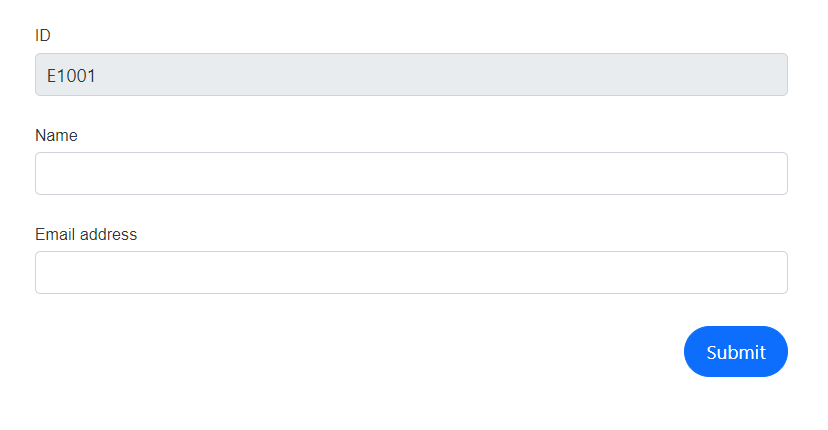
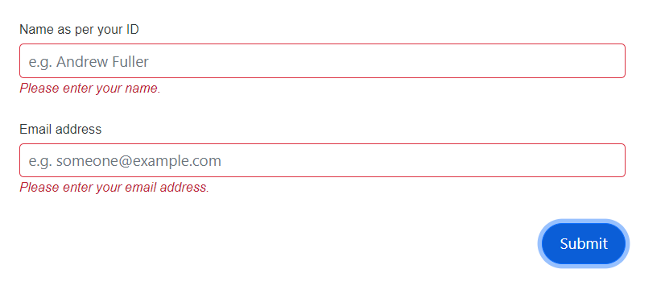
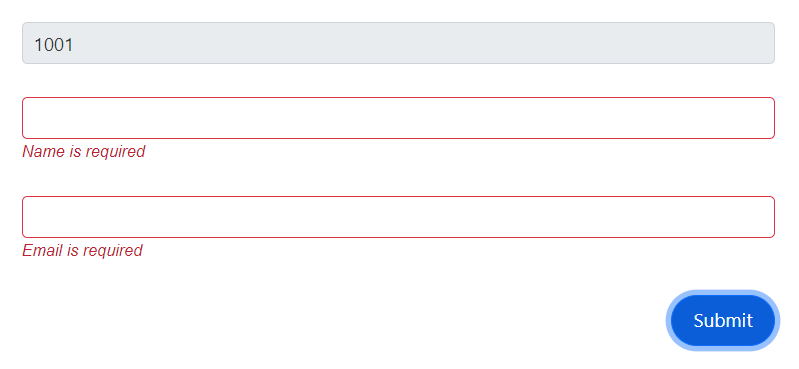

# Form items

The [FormItem](https://help.syncfusion.com/cr/blazor/Syncfusion.Blazor.DataForm.FormItem.html)  can be utilized to set up various configuration for the editor component, including the unique identifier (id), the type of editor component used, any additional CSS classes to be applied to the editor, and whether the field is to be active (enabled) or inactive (disabled) upon being rendered.The below example showcases the different property usages.

## Configuring the model field and ID

The [Field](https://help.syncfusion.com/cr/blazor/Syncfusion.Blazor.DataForm.FormItem.html#Syncfusion_Blazor_DataForm_FormItem_Field) property is used to map the model field to the corresponding editor component. The [ID](https://help.syncfusion.com/cr/blazor/Syncfusion.Blazor.DataForm.FormItem.html#Syncfusion_Blazor_DataForm_FormItem_ID) property is used to set the unique identifier for the editor component.















## Set the placeholder

The [Placeholder](https://help.syncfusion.com/cr/blazor/Syncfusion.Blazor.DataForm.FormItem.html#Syncfusion_Blazor_DataForm_FormItem_Placeholder) property is used to set the placeholder text for the editor component. 














## Change the editor type

The [EditorType](https://help.syncfusion.com/cr/blazor/Syncfusion.Blazor.DataForm.FormItem.html#Syncfusion_Blazor_DataForm_FormItem_EditorType) property is used to set the editor type for the corresponding field.We can assign the editor type using the [FormEditorType](https://help.syncfusion.com/cr/blazor/Syncfusion.Blazor.DataForm.FormEditorType.html) enumeration.

| Field Type | Supported Editor types |
| ------------ | ----------------------- |
| `string` | [TextBox](https://help.syncfusion.com/cr/blazor/Syncfusion.Blazor.DataForm.FormEditorType.html#Syncfusion_Blazor_DataForm_FormEditorType_TextBox),
[TextArea](https://help.syncfusion.com/cr/blazor/Syncfusion.Blazor.DataForm.FormEditorType.html#Syncfusion_Blazor_DataForm_FormEditorType_TextArea),
[Password](https://help.syncfusion.com/cr/blazor/Syncfusion.Blazor.DataForm.FormEditorType.html#Syncfusion_Blazor_DataForm_FormEditorType_Password)|
| `int` , `float`, `decimal`,`double`,`long` | [NumericTextBox](https://help.syncfusion.com/cr/blazor/Syncfusion.Blazor.DataForm.FormEditorType.html#Syncfusion_Blazor_DataForm_FormEditorType_NumericTextBox) |
| `bool` | [CheckBox](https://help.syncfusion.com/cr/blazor/Syncfusion.Blazor.DataForm.FormEditorType.html#Syncfusion_Blazor_DataForm_FormEditorType_CheckBox),
[Switch](https://help.syncfusion.com/cr/blazor/Syncfusion.Blazor.DataForm.FormEditorType.html#Syncfusion_Blazor_DataForm_FormEditorType_Switch) |
| `DateTime` | [DatePicker](https://help.syncfusion.com/cr/blazor/Syncfusion.Blazor.DataForm.FormEditorType.html#Syncfusion_Blazor_DataForm_FormEditorType_DatePicker),
[DateTimePicker](https://help.syncfusion.com/cr/blazor/Syncfusion.Blazor.DataForm.FormEditorType.html#Syncfusion_Blazor_DataForm_FormEditorType_DateTimePicker),
[TimePicker](https://help.syncfusion.com/cr/blazor/Syncfusion.Blazor.DataForm.FormEditorType.html#Syncfusion_Blazor_DataForm_FormEditorType_TimePicker) |
| `enum` | [DropDownList](https://help.syncfusion.com/cr/blazor/Syncfusion.Blazor.DataForm.FormEditorType.html#Syncfusion_Blazor_DataForm_FormEditorType_DropDownList),
[ComboBox](https://help.syncfusion.com/cr/blazor/Syncfusion.Blazor.DataForm.FormEditorType.html#Syncfusion_Blazor_DataForm_FormEditorType_ComboBox),
[AutoComplete](https://help.syncfusion.com/cr/blazor/Syncfusion.Blazor.DataForm.FormEditorType.html#Syncfusion_Blazor_DataForm_FormEditorType_AutoComplete) |
| `DateOnly` | [DatePicker](https://help.syncfusion.com/cr/blazor/Syncfusion.Blazor.DataForm.FormEditorType.html#Syncfusion_Blazor_DataForm_FormEditorType_DatePicker) |
| `TimeOnly` | [TimePicker](https://help.syncfusion.com/cr/blazor/Syncfusion.Blazor.DataForm.FormEditorType.html#Syncfusion_Blazor_DataForm_FormEditorType_TimePicker) |















## Disable the editor

The [IsEnabled](https://help.syncfusion.com/cr/blazor/Syncfusion.Blazor.DataForm.FormItem.html#Syncfusion_Blazor_DataForm_FormItem_IsEnabled) property is used to disable the specific form item.















## Change the label name 

The [Label](https://help.syncfusion.com/cr/blazor/Syncfusion.Blazor.DataForm.FormItem.html#Syncfusion_Blazor_DataForm_FormItem_Label) property is used to set the label text for the editor component , At default `Name` property of the `Display` attribute will be used as label text.















## Change the appearance of the field editor

The [CssClass](https://help.syncfusion.com/cr/blazor/Syncfusion.Blazor.DataForm.FormItem.html#Syncfusion_Blazor_DataForm_FormItem_CssClass) property is used to change the appearance of the form item.The added css class will get added to the editor's wrapper component , using that we can customize the appearance of the editor.














## See also

[Customization of specific field editor](https://blazor.syncfusion.com/documentation/data-form/templates#customization-of-specific-field-editor)