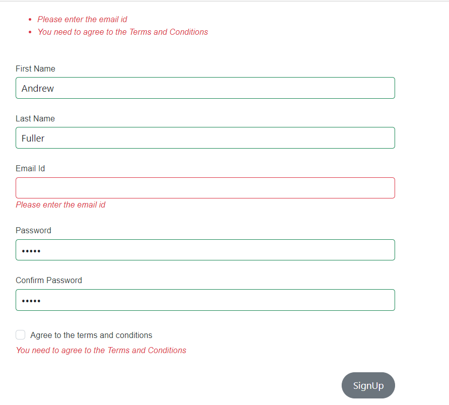
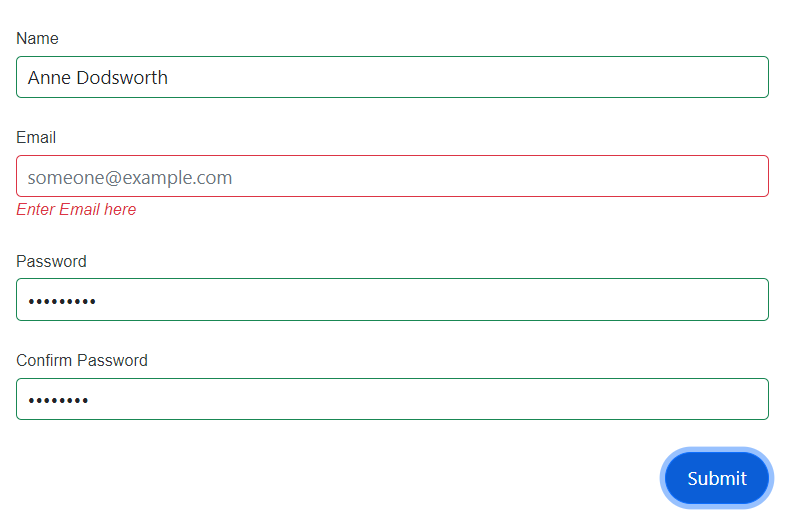

# Validation in DataForm component

DataForm provides the capability to utilize both standard and custom validators that are compatible with the [EditForm](https://learn.microsoft.com/en-us/dotnet/api/microsoft.aspnetcore.components.forms.editform?view=aspnetcore-7.0) component. Such as [DataAnnotationsValidator](https://learn.microsoft.com/en-us/dotnet/api/microsoft.aspnetcore.components.forms.dataannotationsvalidator?view=aspnetcore-7.0) , [ObjectGraphDataAnnotationsValidator ](https://learn.microsoft.com/en-us/aspnet/core/blazor/forms/validation?view=aspnetcore-8.0#nested-models-collection-types-and-complex-types) etc...We can specify the required validators inside `FormValidator` RenderFragment of the DataForm component , The following examples illustrate the procedures for setting up the component with various validators.

## Data annotations validation

`DataAnnotationsValidator` in DataForm component validates the fields based on the attributes bounded to the model properties. 









## Validation message display

Within the DataForm component, we have the option to showcase validation messages in two distinct styles: inline or via a tooltip. When applying inline display, the validation messages remain statically visible whenever validation occurs. On the other hand, tooltip display reveals validation messages to users upon request. Additionally, there is functionality to hide the validation messages as desired by using [ValidationDisplayMode](https://help.syncfusion.com/cr/blazor/Syncfusion.Blazor.DataForm.SfDataForm.html#Syncfusion_Blazor_DataForm_SfDataForm_ValidationDisplayMode) . The classifications of the respective property are outline below 

| FormValidationDisplay | Snapshot |
| ------------ | ----------------------- |
|[FormValidationDisplay.Inline](https://help.syncfusion.com/cr/blazor/Syncfusion.Blazor.DataForm.FormValidationDisplay.html#Syncfusion_Blazor_DataForm_FormValidationDisplay_Inline)||
|[FormValidationDisplay.Tooltip](https://help.syncfusion.com/cr/blazor/Syncfusion.Blazor.DataForm.FormValidationDisplay.html#Syncfusion_Blazor_DataForm_FormValidationDisplay_Tooltip)||
|[FormValidationDisplay.None](https://help.syncfusion.com/cr/blazor/Syncfusion.Blazor.DataForm.FormValidationDisplay.html#Syncfusion_Blazor_DataForm_FormValidationDisplay_None)||

The below example demonstrate , how to configure validation message presentation with DataForm component









## Complex model validation 

The `ObjectGraphDataAnnotationsValidator` within the DataForm component ensures the validation of the entire object graph of the bound model, including both collection and complex-type properties.In the below example  `ValidateComplexType` attribute is used  to validate the properties declared in the nested classes such as `ChildModel` and `GrandChildModel`.









## Fluent validation 

[FluentValidator](https://www.nuget.org/packages/Blazored.FluentValidation/) is a custom validator that validates beyond standard validation attributes. It allows for checking if field values conform to the credit card format, match a specific value, exceed or fall below a given value, or are equivalent to the value of another field within the same model.









N> We need to install the [Blazored.FluentValidation](https://www.nuget.org/packages/Blazored.FluentValidation/) Nuget package into the dataform FluentValidation.

## See also

  * [Custom Validation attributes](https://blazor.syncfusion.com/documentation/data-form/data-annotation-attributes#custom-validation)