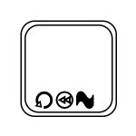
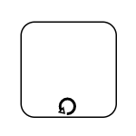

# BPMN Expanded Sub-Process in Blazor Diagram Component

An ExpandedSubProcess is used to frame a part of the diagram, shows that elements included in it are logically belong together and does not have any other semantics other than organizing elements. It is represented by a rounded rectangle.

To create a ExpandedSubProcess, you have to define the Shape property of the Node as `BpmnExpandedSubProcess` and enable allow drop property of the node.

The following code example explains how to create a BPMN Expanded Sub-Process.

```cshtml
@using Syncfusion.Blazor.Diagram

@* Initialize Diagram *@
<SfDiagramComponent Height="600px" Nodes="@nodes" />

@code
{
    // Initialize node collection with Node.
    DiagramObjectCollection<Node> nodes;

    protected override void OnInitialized()
    {
        nodes = new DiagramObjectCollection<Node>();
        Node node = new Node()
        {
            // Position of the node.
            OffsetX = 100,
            OffsetY = 100,
            // Size of the node.
            Width = 100,
            Height = 100,
            // Unique Id of the node.
            ID = "node1",
            // Sets shape to BpmnExpandedSubProcess.
            Shape = new BpmnExpandedSubProcess() 
            { 
                IsCall = true,
                IsCompensation = true, 
                Loop = BpmnLoopCharacteristic.Standard,
                IsAdhoc = true,
                SubProcessType = BpmnSubProcessTypes.Transaction
            }
        };
        nodes.Add(node);
    }
}
```



# Add BPMN Nodes into BPMN ExpandedSubProcess at runtime
You can add BPMN Nodes into the BPMN ExpandedSubProcess at runtime in two ways.

* Adding the Id of the Bpmn Node to the `Children` property which is a collection of string in BPMN ExpandedSubProcess.
* Drag and drop the BPMN Nodes to the BPMN ExpandedSubProcess.
While resizing or dragging the child element, if the child element bounds with in the ExpandedSubProcess bounds, the ExpandedSubProcess size will be updated along with that.

The following image shows how to add BPMNNode into the BPMN ExpandedSubProcess at runtime.


The following code example explains how to Add Bpmn Node to a BPMN Expanded Sub-Process using Children property.

```cshtml
@using Syncfusion.Blazor.Diagram

@* Initialize Diagram *@
<SfDiagramComponent Height="600px" Nodes="@nodes" />

@code
{
    // Initialize node collection with Node.
    DiagramObjectCollection<Node> nodes;

    protected override void OnInitialized()
    {
        nodes = new DiagramObjectCollection<Node>();
        Node node1 = new Node()
        {
            // Position of the node.
            OffsetX = 200,
            OffsetY = 300,
            // Size of the node.
            Width = 30,
            Height = 30,
            // Unique Id of the node.
            ID = "node1",
            Constraints = NodeConstraints.Default | NodeConstraints.AllowDrop,
            // Sets shape to Event.
            Shape = new BpmnEvent()
            {
                // Set the event type as End.
                EventType = BpmnEventType.End,
            }
        };
        nodes.Add(node1);
        Node node2 = new Node()
        {
             // Position of the node.
            OffsetX = 500,
            OffsetY = 500,
            // Size of the node.
            Width = 300,
            Height = 300,
            // Unique Id of the node.
            ID = "node1",
            Constraints = NodeConstraints.Default | NodeConstraints.AllowDrop,
            Shape = new BpmnExpandedSubProcess()
            {
                SubProcessType = BpmnSubProcessType.Call,
                Children = new DiagramObjectCollection<string> (){"node1"}
            }
        };
        nodes.Add(node2);
    }
}
```
### Loop

`LoopActivity` is a task that is internally being looped. The `LoopActivity` property of `BpmnExpandedSubProcess` allows you to define the type of loop. The default value for `LoopActivity` is **None**. You can define the LoopActivity property in Bpmn ExpandedSubProcess as shown in the following code.

```cshtml
@using Syncfusion.Blazor.Diagram

@* Initialize Diagram *@
<SfDiagramComponent Height="600px" Nodes="@nodes"/>

@code
{       
    // Initialize the node collection with node.
    DiagramObjectCollection<Node> nodes;

    protected override void OnInitialized()
    {
        nodes = new DiagramObjectCollection<Node>();
        Node node = new Node()
        {
            // Position of the node.
            OffsetX = 100,
            OffsetY = 100,
            // Size of the node.
            Width = 100,
            Height = 100,
            // Unique Id of the node.
            ID = "node1",
            // Defines the shape to Bpmn ExpandedSubProcess.
            Shape = new BpmnExpandedSubProcess()
            {
                Loop = BpmnLoopCharacteristic.Standard,
            }
        };
        nodes.Add(node);
    }
}
```

The following table contains various types of BPMN loops.

| LoopActivity | Image |
| -------- | -------- | 
| None |   | 
| Standard |   
| SequenceMultiInstance |  |
| ParallelMultiInstance |  |

### Compensation

`IsCompensationActivity` is triggered when the operation is partially failed and enabled it with the    `IsCompensationActivity` property of the ExpandedSubProcess.By default the `IsCompensationActivity` is set to false.

```cshtml
@using Syncfusion.Blazor.Diagram

@* Initialize Diagram *@
<SfDiagramComponent Height="600px" Nodes="@nodes" />

@code
{
    // Initialize the node collection with node.
    DiagramObjectCollection<Node> nodes;

    protected override void OnInitialized()
    {
        nodes = new DiagramObjectCollection<Node>();
        Node node1 = new Node()
        {
            // Position of the node.
            OffsetX = 100,
            OffsetY = 100,
            // Size of the node.
            Width = 100,
            Height = 100,
            // Unique id of the node.
            ID = "node1",
            // Defines the shape to Bpmn ExpandedSubProcess.
            Shape = new BpmnExpandedSubProcess()
            {
                IsCompensation = true,
                Loop = BpmnLoopCharacteristic.Standard,
            }
        };
        nodes.Add(node1);
    }
}
```

 
 
### Ad-Hoc

An ad-hoc ExpandedSubProcess is a group of tasks that are executed in any order or skipped in order to fulfill the end condition and set it with the `IsAdhocActivity` property of Expanded subprocess.

```cshtml
@using Syncfusion.Blazor.Diagram

@* Initialize Diagram *@
<SfDiagramComponent Height="600px" Nodes="@nodes" />

@code
{
    // Initialize the node collection with node.
    DiagramObjectCollection<Node> nodes;

    protected override void OnInitialized()
    {
        nodes = new DiagramObjectCollection<Node>();
        Node node = new Node()
        {
            // Position of the node.
            OffsetX = 100,
            OffsetY = 100,
            // Size of the node.
            Width = 100,
            Height = 100,
            // Unique id of the node.
            ID = "node1",
            // Defines shape to Bpmn ExpandedSubProcess
            Shape = new BpmnExpandedSubProcess()
            {
                IsAdhoc = true,
            }
        };
        nodes.Add(node);
    }
}
```

### SubProcessType

SubProcessType represents the type of task that is being processed. The `SubProcessType` property of ExpandedSubProcess allows you to define the type of SubProcessType. By default, it is set to **Default**.

```cshtml
@using Syncfusion.Blazor.Diagram

@* Initialize Diagram *@
<SfDiagramComponent Height="600px" Nodes="@nodes" />

@code
{
    // Initialize the node collection with node.
    DiagramObjectCollection<Node> nodes;

    protected override void OnInitialized()
    {
        nodes = new DiagramObjectCollection<Node>();
        Node node = new Node()
        {
            // Position of the node.
            OffsetX = 100,
            OffsetY = 100,
            // Size of the node.
            Width = 100,
            Height = 100,
            // Unique Id of the node.
            ID = "node1",
            // Sets shape to Bpmn ExpandedSubProcess.
            Shape = new BpmnExpandedSubProcess()
            {
                SubProcessType = BpmnSubProcessType.Call
            }
        };
        nodes.Add(node);
    }
}
```

The following table contains various types of BPMN SubProcess.

| SubProcessType | Image |
| -------- | -------- |
| Default |  |
| Call |  |
| Event |  |
| Transaction |  |


