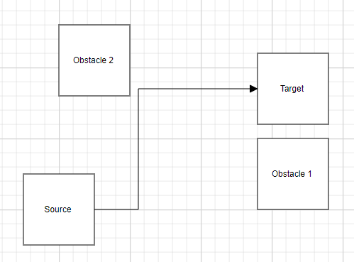
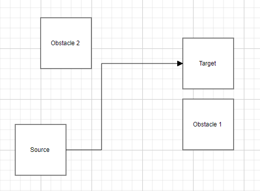

# Properties in Blazor Diagram Component

## Chunk Message

In the Blazor Diagram component, there is a need to calculate the bounds of paths, text, images, and SVG data from the server to the JavaScript side using JsInterop calls. When large data (greater than 32KB in size for a single incoming hub message) is sent and processed in a single JS call, connection disconnect issues can occur. To address this, we have introduced the EnableChunkMessage property in the Diagram component. This property helps to send large data in smaller chunks to the server, thus preventing connection disconnection issues. Chunk messages enable the measurement of paths, images, text, and SVG data without exceeding the maximum size of a single incoming hub message (MaximumReceiveMessageSize of 32KB) at the sample level. By default, the [EnableChunkMessage] property is set to false.

Here is an example demonstrating how to use the [EnableChunkMessage] property:

```cshtml
@using Syncfusion.Blazor.Diagram

<SfDiagramComponent Height="600px" Nodes="@nodes" EnableChunkMessage="true"/>

@code
{
    //Initialize the Nodes Collection.
    DiagramObjectCollection<Node> nodes = new DiagramObjectCollection<Node>();

    protected override void OnInitialized()
    {
        int offsetX = 100; int offsetY = 100; double count = 1;
        for(int i=1; i<=200; i++)
        {
            Node node = new Node()
                {
                    ID = "node" + i,
                    OffsetX = count * offsetX,
                    OffsetY = offsetY,
                    Width = 100,
                    Height = 100,
                    Annotations = new DiagramObjectCollection<ShapeAnnotation>() {
                        new ShapeAnnotation() { Content = "Annotation for the Node" + i.ToString() }
                    }
                };
                count += 1.5;
                if (i % 5 == 0)
                {
                    count = 1;
                    offsetX = 100;
                    offsetY = offsetY + 200;
                }
            nodes.Add(node);
        }
    }
}
```

You can download a complete working sample from [GitHub](https://github.com/SyncfusionExamples/Blazor-Diagram-Examples/tree/master/UG-Samples/)

## Line Routing Settings

The [LineRoutingSettings] class provides customization options for line routing within a diagram. This class enables you to set various properties related to line routing, such as the routing type and obstacle padding. It supports customization of how connectors navigate around obstacles within the diagram.

### Routing Type

Determines the routing strategy used for connectors in the diagram. It can be set to either [Classic] for faster routing or [Advanced] for more accurate routing with better obstacle avoidance.

#### Classic Routing

The [Classic] routing algorithm adds additional segments based on the position and dimensions of the obstacles in the path. This routing method prioritizes reducing the impact of obstacles over minimizing the geometry length and the number of bends. Use Classic routing when it's crucial to navigate around obstacles efficiently, even if it means having a longer path or more bends.


```cshtml
@using Syncfusion.Blazor.Diagram

<SfDiagramComponent Width="1000px" Height="500px" Connectors="@connectors" Nodes="@nodes" Constraints="@diagramConstraints">
    <LineRoutingSettings RoutingType ="@routingTypes"></LineRoutingSettings>
</SfDiagramComponent>
@code 
{
    // Set the type of the routing
    RoutingTypes routingTypes = RoutingTypes.Classic;
    // Enable routing constraints for diagram.
    DiagramConstraints diagramConstraints = DiagramConstraints.Default | DiagramConstraints.Routing;
    // Intialize the node collection.
    DiagramObjectCollection<Node> nodes = new DiagramObjectCollection<Node>();
    // Intialize the connector collection.
    DiagramObjectCollection<Connector> connectors = new DiagramObjectCollection<Connector>();
    
    protected override void OnInitialized()
    {
        nodes = new DiagramObjectCollection<Node>()
        {
            new Node() { ID = "node1", OffsetX = 100, OffsetY = 300, Width = 100, Height =100 },
            new Node() { ID = "node2", OffsetX = 600, OffsetY = 100, Width = 100, Height = 100 },
            new Node() { ID = "node3", OffsetX = 400, OffsetY = 250, Width = 100, Height = 100 }
        };
        connectors = new DiagramObjectCollection<Connector>(){
            new Connector()
            {
                ID = "connector1",
                SourceID = "node1", TargetID = "node2",
                Type = ConnectorSegmentType.Orthogonal
            }
        };
    }
}
```
You can download a complete working sample from [GitHub](https://github.com/SyncfusionExamples/Blazor-Diagram-Examples/tree/master/UG-Samples/)

#### Advanced Routing

The [Advanced] routing algorithm evaluates all possible geometrical paths for a connector, aiming to find the one with the minimal bends and the shortest length. Use Advanced routing when you need a more optimized path with the fewest bends and the shortest possible length, even if it means the path might get closer to obstacles.

```cshtml
@using Syncfusion.Blazor.Diagram

<SfDiagramComponent Width="1000px" Height="500px" Connectors="@connectors" Nodes="@nodes" Constraints="@diagramConstraints">
    <LineRoutingSettings RoutingType ="@routingTypes" ObstaclePadding="@padding"></LineRoutingSettings>
</SfDiagramComponent>
@code 
{
    // Set the type of the routing
    RoutingTypes routingTypes = RoutingTypes.Advanced;
    // Set the padding for the obstable
    double padding = 20;
    // Enable routing constraints for diagram.
    DiagramConstraints diagramConstraints = DiagramConstraints.Default | DiagramConstraints.Routing;
    // Intialize the node collection.
    DiagramObjectCollection<Node> nodes = new DiagramObjectCollection<Node>();
    // Intialize the connector collection.
    DiagramObjectCollection<Connector> connectors = new DiagramObjectCollection<Connector>();
    
    protected override void OnInitialized()
    {
        nodes = new DiagramObjectCollection<Node>()
        {
            new Node() { ID = "node1", OffsetX = 100, OffsetY = 300, Width = 100, Height =100 },
            new Node() { ID = "node2", OffsetX = 600, OffsetY = 100, Width = 100, Height = 100 },
            new Node() { ID = "node3", OffsetX = 400, OffsetY = 250, Width = 100, Height = 100 }
        };
        connectors = new DiagramObjectCollection<Connector>(){
            new Connector()
            {
                ID = "connector1",
                SourceID = "node1", TargetID = "node2",
                Type = ConnectorSegmentType.Orthogonal
            }
        };
    }
}
```

You can download a complete working sample from [GitHub](https://github.com/SyncfusionExamples/Blazor-Diagram-Examples/tree/master/UG-Samples/)

**Note:** Default value of [RoutingType] is Classic.

### ObstaclePadding

The [ObstaclePadding] defines the minimum distance between the connectors and obstacles when the advanced routing is enabled. This ensures connectors are routed with clear spacing around obstacles, improving diagram readability.

```cshtml
@using Syncfusion.Blazor.Diagram

<SfDiagramComponent Width="1000px" Height="500px" Connectors="@connectors" Nodes="@nodes" Constraints="@diagramConstraints">
    <LineRoutingSettings RoutingType ="@routingTypes" ObstaclePadding="@padding"></LineRoutingSettings>
</SfDiagramComponent>
@code 
{
    // Set the type of the routing
    RoutingTypes routingTypes = RoutingTypes.Advanced;
    // Set the padding for the obstable
    double padding = 20;
    // Enable routing constraints for diagram.
    DiagramConstraints diagramConstraints = DiagramConstraints.Default | DiagramConstraints.Routing;
    // Intialize the node collection.
    DiagramObjectCollection<Node> nodes = new DiagramObjectCollection<Node>();
    // Intialize the connector collection.
    DiagramObjectCollection<Connector> connectors = new DiagramObjectCollection<Connector>();
    
    protected override void OnInitialized()
    {
        nodes = new DiagramObjectCollection<Node>()
        {
            new Node() { ID = "node1", OffsetX = 100, OffsetY = 300, Width = 100, Height =100 },
            new Node() { ID = "node2", OffsetX = 600, OffsetY = 100, Width = 100, Height = 100 },
            new Node() { ID = "node3", OffsetX = 400, OffsetY = 250, Width = 100, Height = 100 }
        };
        connectors = new DiagramObjectCollection<Connector>(){
            new Connector()
            {
                ID = "connector1",
                SourceID = "node1", TargetID = "node2",
                Type = ConnectorSegmentType.Orthogonal
            }
        };
    }
}
```

You can download a complete working sample from [GitHub](https://github.com/SyncfusionExamples/Blazor-Diagram-Examples/tree/master/UG-Samples/)

The following table shows the various obstacle padding.

| ObstaclePadding values | Output |
|---|---|
| 12 |  |
| 20 |  |

**Note:** ObstaclePadding property is only applicable when the [RoutingType] property is set to [RoutingTypes.Advanced]. Default value of [ObstaclePadding] is 12.

For more information about the enable and disable the routing for the connectors and nodes, refer to [Connector routing](./connectors/interactions/#how-to-route-the-connectors).