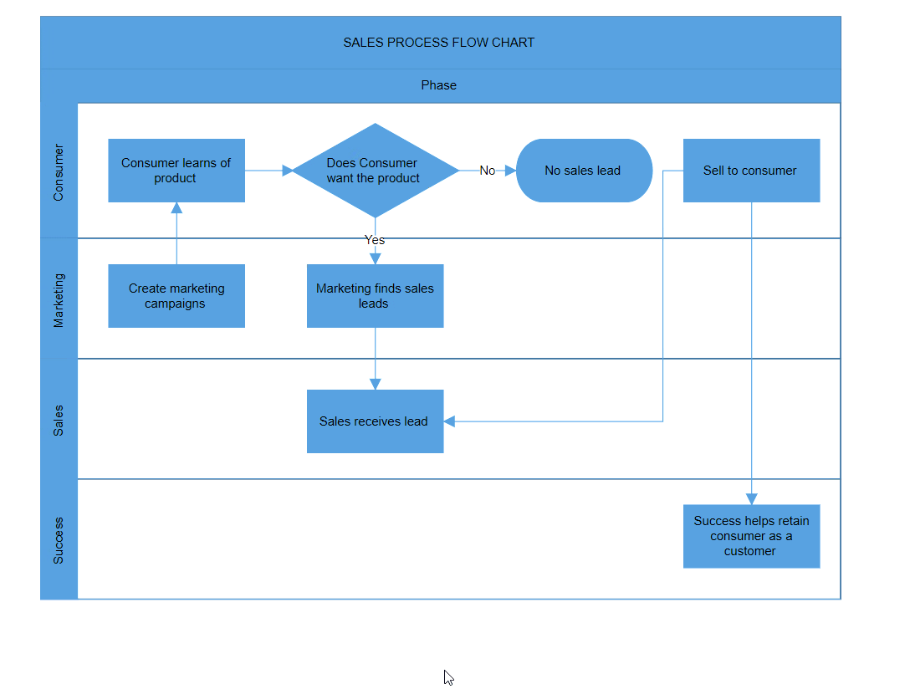

# Phase in Blazor Diagram Component

 The `Phase` is the subprocess which will split each lanes as horizontally or vertically based on the swimlane orientation. The multiple number of phase can be added to swimlane.

## Create an empty Phase

You can create the `Phase` and add into the `Phases` collection of the Swimlane.

>Note: For Horizontal Swimlane, you must set the `Width` of the Phase. For Vertical Swimlane, you must set `Height` of the Phase.

The following code example explains how to add phase at swimlane.

```cshtml
@using Syncfusion.Blazor.Diagram

<SfDiagramComponent Height="600px" Swimlanes="@SwimlaneCollections" />

@code
{
    //Define diagram's swimlane collection
    DiagramObjectCollection<Swimlane> SwimlaneCollections = new DiagramObjectCollection<Swimlane>();

    protected override void OnInitialized()
    {
        // A swimlane is created and stored in the swimlanes collection.
        Swimlane swimlane = new Swimlane()
            {
                Header = new SwimlaneHeader()
                {
                    Annotation = new ShapeAnnotation()
                    {
                        Content = "SALES PROCESS FLOW CHART"
                    },
                    Height = 50,
                },
                OffsetX = 400,
                OffsetY = 200,
                Height = 150,
                Width = 450,
                Phases = new DiagramObjectCollection<Phase>()
                {
                    new Phase()
                    {
                        Width = 450,
                        Header = new SwimlaneHeader()
                        {
                            Annotation = new ShapeAnnotation(){Content = "Phase 1"},
                            Height = 30
                        }
                    }
                }
            };
        // Add swimlane
        SwimlaneCollections.Add(swimlane);
    }
}
```

.

You can download a complete working sample from [GitHub]()


## Dynamically add phase to Swimlane

 You can add a phase at runtime by using the `Add` and `Remove` method of the `Swimlane.Phases` collection. The following code example explains how to add and remove phase at run time.

```cshtml
@using Syncfusion.Blazor.Diagram
@using Syncfusion.Blazor.Buttons

<SfButton Content="Add Phase" OnClick="@AddPhase" />
<SfButton Content="Remove Phase" OnClick="@RemovePhase" />
<SfDiagramComponent Height="600px" Swimlanes="@SwimlaneCollections" />

@code
{
    //Define diagram's swimlane collection
    DiagramObjectCollection<Swimlane> SwimlaneCollections = new DiagramObjectCollection<Swimlane>();

    protected override void OnInitialized()
    {
        // A swimlane is created and stored in the swimlanes collection.
        Swimlane swimlane = new Swimlane()
            {
                Header = new SwimlaneHeader()
                {
                    Annotation = new ShapeAnnotation()
                    {
                        Content = "SALES PROCESS FLOW CHART"
                    },
                    Height = 50,
                },
                OffsetX = 400,
                OffsetY = 200,
                Height = 150,
                Width = 450,
                Phases = new DiagramObjectCollection<Phase>()
                {
                    new Phase()
                    {
                        Width = 450,
                        Header = new SwimlaneHeader()
                        {
                            Annotation = new ShapeAnnotation(){Content = "Phase 1"},
                            Height = 30
                        }
                    }
                }
            };
        // Add swimlane
        SwimlaneCollections.Add(swimlane);
    }

    private void AddPhase()
    {
        Swimlane swimlane = SwimlaneCollections[0];
        Phase newPhase = new Phase()
            {
                Width = 100,
                Header = new SwimlaneHeader()
                {
                    Annotation = new ShapeAnnotation() { Content = "Phase " + (swimlane.Phases.Count + 1) },
                    Height = 30
                }
            };
        swimlane.Phases.Add(newPhase);
    }

    private void RemovePhase()
    {
        Swimlane swimlane = SwimlaneCollections[0];
        if (swimlane.Phases.Count > 1)
            swimlane.Phases.RemoveAt(swimlane.Phases.Count - 1);
    }
}
```


You can download a complete working sample from [GitHub]()

## Create the Phase Header and Header customization

* The `Header` property of Phase allows you to textually describe the phase and to customize the appearance of the description.
* The size of Phase header can be controlled by using the `Width` and `Height` properties of header.
* The appearance of Phase header can be customized by using the `Style` properties.

The following code example explains how to define a Phase header and its customization.

```cshtml
@using Syncfusion.Blazor.Diagram

<SfDiagramComponent Height="600px" Swimlanes="@SwimlaneCollections" />

@code
{
    //Define diagram's swimlane collection
    DiagramObjectCollection<Swimlane> SwimlaneCollections = new DiagramObjectCollection<Swimlane>();

    protected override void OnInitialized()
    {
        // A swimlane is created and stored in the swimlanes collection.
        Swimlane swimlane = new Swimlane()
            {
                Header = new SwimlaneHeader()
                {
                    Annotation = new ShapeAnnotation()
                    {
                        Content = "SALES PROCESS FLOW CHART"
                    },
                    Height = 50,
                },
                OffsetX = 400,
                OffsetY = 200,
                Height = 150,
                Width = 450,
                Phases = new DiagramObjectCollection<Phase>()
                {
                    new Phase()
                    {
                        Width = 450,
                        Header = new SwimlaneHeader()
                        {
                            Annotation = new ShapeAnnotation(){Content = "Phase 1", Style = new TextStyle(){ Color = "White"} },
                            Height = 30
                        },
                        Style = new TextStyle(){Fill = "Teal"},
                    }
                }
            };
        // Add swimlane
        SwimlaneCollections.Add(swimlane);
    }
}
```
.

You can download a complete working sample from [GitHub]()

## Header Selection and Resize

 * You can select the individual phase header by clicking on the header twice. On the first click, you can select the respective phase. 

 * You can able to resize the individual phase header. While resizing the phase, it will maintain 20px distances from Lane children.

  * When a element is resized, the [SizeChanging](https://help.syncfusion.com/cr/blazor/Syncfusion.Blazor.Diagram.SfDiagramComponent.html#Syncfusion_Blazor_Diagram_SfDiagramComponent_SizeChanging) and [SizeChanged](https://help.syncfusion.com/cr/blazor/Syncfusion.Blazor.Diagram.SfDiagramComponent.html#Syncfusion_Blazor_Diagram_SfDiagramComponent_SizeChanged) events get triggered.

 The following image shows how to select and resize the phase header.

.

## Phase header editing

The diagram provides support for editing phase headers at runtime. You can achieve header editing by using the double click event. Double-clicking the header label enables the editing of that specific header. 

The following image shows how to edit the phase header.


## Phase interaction

### Select

Phase can be selected by clicking (tap) the header of the phase.

### Resizing

* The phase can be resized by using its selector.
* You must click the phase header to enable the phase selection.
* Once the phase can be resized, the lane size will be updated automatically.

