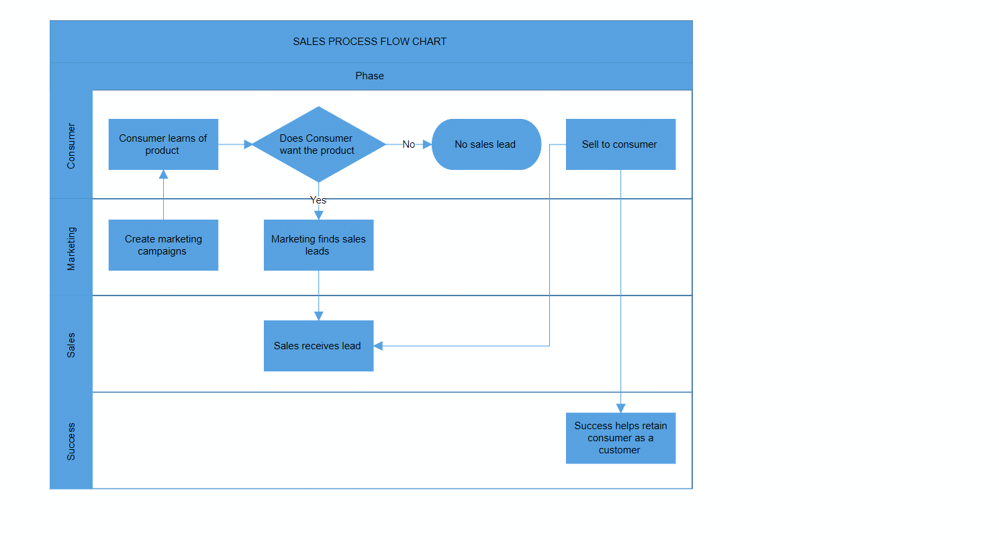

# Swimlane in Blazor Diagram Component

A `Swimlane` is a type of diagram nodes that is used to visualize the connection between a business process and its responsible department. It emphasizes logical relationships among activities, making it easier to understand the dynamics of the process and the associated departmental responsibilities.


## Create a swimlane
A swimlane can be created and added to the diagram, either programmatically or interactively. 

### Add Swimlane through the Swimlanes collection 

To create a swimlane, you have to define the swimlane object and add it to the `Swimlanes` collection of the diagram.

>Note: By default, if you create a swimlane, one lane and phase will be added.

```cshtml
@using Syncfusion.Blazor.Diagram

<SfDiagramComponent Height="600px" Swimlanes="@SwimlaneCollections" />

@code
{
    //Define diagram's swimlane collection
    DiagramObjectCollection<Swimlane> SwimlaneCollections = new DiagramObjectCollection<Swimlane>();

    protected override void OnInitialized()
    {
        // A swimlane is created and stored in the swimlanes collection.
        Swimlane swimlane = new Swimlane()
        {
            OffsetX = 400, OffsetY = 200, Height = 120, Width = 450,
        };
        // Add swimlane
        SwimlaneCollections.Add(swimlane);
    }
}
```

Now, the swimlane will be as follows.


You can download a complete working sample from [GitHub]()

>Note: We can't add swimlane elements such as phase, lane, and lane children at runtime by using the [AddDiagramElements](https://help.syncfusion.com/cr/blazor/Syncfusion.Blazor.Diagram.SfDiagramComponent.html#Syncfusion_Blazor_Diagram_SfDiagramComponent_AddDiagramElements_Syncfusion_Blazor_Diagram_DiagramObjectCollection_Syncfusion_Blazor_Diagram_NodeBase__) method.

### Swimlane Header

The Swimlane Header was the primary element for swimlanes. The `Header` property of swimlane allows you to define its textual description and to customize its appearance.

>Note: By using this header, swimlane interactions such as selection, dragging, and other functionalities will be performed.

The following code example explains how to define the swimlane header.

```cshtml
@using Syncfusion.Blazor.Diagram

<SfDiagramComponent Height="600px" Swimlanes="@SwimlaneCollections" />

@code
{
    //Define diagram's swimlane collection
    DiagramObjectCollection<Swimlane> SwimlaneCollections = new DiagramObjectCollection<Swimlane>();

    protected override void OnInitialized()
    {
        // A swimlane is created and stored in the swimlanes collection.
        Swimlane swimlane = new Swimlane()
        {
            Header = new SwimlaneHeader()
            {
                Annotation = new ShapeAnnotation()
                {
                    Content = "SALES PROCESS FLOW CHART"
                },
                Height = 50,
            },
            OffsetX = 400, OffsetY = 200, Height = 120, Width = 450,
        };
        // Add swimlane
        SwimlaneCollections.Add(swimlane);
    }
}
``` 


You can download a complete working sample from [GitHub]()

### Customization of headers

The height and width of swimlane header can be customized with the `Width` and `Height` properties of swimlane header. You can set the fill color of the header by using the `Style` property.

The following code example explains how to customize the swimlane header.

```cshtml
@using Syncfusion.Blazor.Diagram

<SfDiagramComponent Height="600px" Swimlanes="@SwimlaneCollections" />

@code
{
    //Define diagram's swimlane collection
    DiagramObjectCollection<Swimlane> SwimlaneCollections = new DiagramObjectCollection<Swimlane>();

    protected override void OnInitialized()
    {
        // A swimlane is created and stored in the swimlanes collection.
        Swimlane swimlane = new Swimlane()
        {
            Header = new SwimlaneHeader()
            {
                Annotation = new ShapeAnnotation()
                {
                    Content = "SALES PROCESS FLOW CHART",
                    Style = new TextStyle(){Color = "White", FontSize = 12, Bold = true, Italic = true, TextDecoration = TextDecoration.Underline}
                },
                Height = 50,
                Style = new TextStyle()
                {
                    Fill = "Teal"
                }
            },
            OffsetX = 400, OffsetY = 200, Height = 120, Width = 450,
        }
        // Add swimlane
        SwimlaneCollections.Add(swimlane);
    }
}
``` 


### Header editing

The diagram provides the support to edit swimlane headers at runtime. You can achieve the header editing by double clicking on it. Double clicking the header label will enables the editing mode.
The following image shows how to edit the swimlane header.

.

## Orientation

The orientation of swimlane can be customized with the `Orientation` property of the swimlane.

>Note: The swimlane orientation is set to horizontal by default.

The following code example explains how to set the orientation of the swimlane.

```cshtml
@using Syncfusion.Blazor.Diagram

<SfDiagramComponent Height="600px" Swimlanes="@SwimlaneCollections" />

@code
{
    //Define diagram's swimlane collection
    DiagramObjectCollection<Swimlane> SwimlaneCollections = new DiagramObjectCollection<Swimlane>();

    protected override void OnInitialized()
    {
        // A swimlane is created and stored in the swimlanes collection.
        Swimlane swimlane = new Swimlane()
        {
            OffsetX = 400, OffsetY = 200, Height = 120, Width = 450, 
            Orientation = Orientation.Horizontal,
        }
        // Add swimlane
        SwimlaneCollections.Add(swimlane);
    }
}
```

| Orientation | Output |
|---|---|
| Horizontal |  |
| Vertical |  |

## Interaction

### How to select the swimlane

Swimlane can be selected by clicking (tap) the header of the swimlane. Also, it can be selected at runtime by using the [Select](https://help.syncfusion.com/cr/blazor/Syncfusion.Blazor.Diagram.SfDiagramComponent.html#Syncfusion_Blazor_Diagram_SfDiagramComponent_Select_System_Collections_ObjectModel_ObservableCollection_Syncfusion_Blazor_Diagram_IDiagramObject__System_Nullable_System_Boolean__) method and clear the selection in the diagram by using the [ClearSelection](https://help.syncfusion.com/cr/blazor/Syncfusion.Blazor.Diagram.SfDiagramComponent.html#Syncfusion_Blazor_Diagram_SfDiagramComponent_ClearSelection)

### How to drag the swimlane  

* Selected object can be dragged by clicking and dragging the header of the swimlane. 

* When you drag the elements in the diagram, the [PositionChanging](https://help.syncfusion.com/cr/blazor/Syncfusion.Blazor.Diagram.SfDiagramComponent.html#Syncfusion_Blazor_Diagram_SfDiagramComponent_PositionChanging) and [PositionChanged](https://help.syncfusion.com/cr/blazor/Syncfusion.Blazor.Diagram.SfDiagramComponent.html#Syncfusion_Blazor_Diagram_SfDiagramComponent_PositionChanged) events get triggered and we can do customization on those events.





Please find the swimlane sample as follows.

You can download a complete working sample from [GitHub]()
