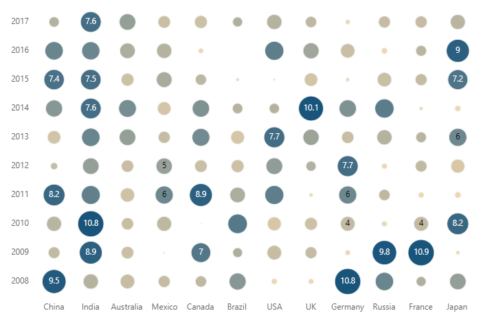
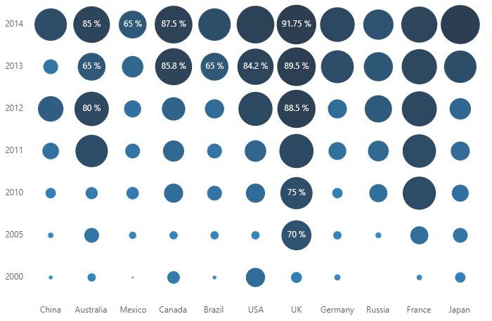
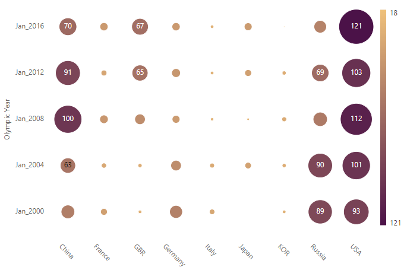
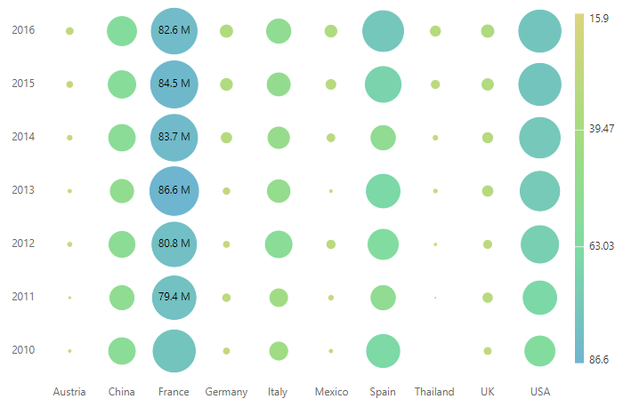

# Bubble Heat Map in Blazor HeatMap Chart Component

Data points represent the data source values with `Gradient` or `Fixed` colors in the heat map. You can customize the appearance of these data points by changing the `Color` and `Shape` attributes. The data points can be represented in color fill or bubble shape by defining the `TileType` property. By default, the data points are color filled with `Gradient` or `Fixed` and this depiction of data points is defined as `Rect` in the `TileType` property.

The cell customizations and color mapping for `Rect` tile type is defined in `Appearance` and `Palette` sections in detail.

## Bubble types

The data points can be represented in the bubble along with its attributes by setting the [TileType](https://help.syncfusion.com/cr/blazor/Syncfusion.Blazor.HeatMap.HeatMapCellSettings.html#Syncfusion_Blazor_HeatMap_HeatMapCellSettings_TileType) property to **Bubble**.

In bubble heat map, you can display the data points with bubble size, bubble colors, and sector attributes of the bubble.

### Bubble size

In this bubble heat map type, the size factor of the bubble is used to denote the data variations. The radius of the bubble varies according to data values. By default, the bubble with small size denotes the data value with small magnitude and the larger bubble size denotes the data value with larger magnitude. This behavior can be inversed by using the [IsInversedBubbleSize](https://help.syncfusion.com/cr/blazor/Syncfusion.Blazor.HeatMap.HeatMapCellSettings.html#Syncfusion_Blazor_HeatMap_HeatMapCellSettings_IsInversedBubbleSize) property.

To render a bubble heat map with size series, set the [BubbleType](https://help.syncfusion.com/cr/blazor/Syncfusion.Blazor.HeatMap.HeatMapCellSettings.html#Syncfusion_Blazor_HeatMap_HeatMapCellSettings_BubbleType) property to **Size**.

```cshtml

@using Syncfusion.Blazor.HeatMap

<SfHeatMap DataSource="@HeatMapData">
    <HeatMapTitleSettings Text="Sales Revenue per Employee (in 1000 US$)">
    </HeatMapTitleSettings>
    <HeatMapXAxis Labels="@XAxisLabels"></HeatMapXAxis>
    <HeatMapYAxis Labels="@YAxisLabels"></HeatMapYAxis>
    <HeatMapCellSettings ShowLabel="false" TileType="CellType.Bubble" BubbleType="BubbleType.Size"></HeatMapCellSettings>
    <HeatMapPaletteSettings Type="PaletteType.Gradient">
        <HeatMapPalettes>
            <HeatMapPalette Color="#C06C84"></HeatMapPalette>
            <HeatMapPalette Color="#6C5B7B"></HeatMapPalette>
            <HeatMapPalette Color="#355C7D"></HeatMapPalette>
        </HeatMapPalettes>
    </HeatMapPaletteSettings>
</SfHeatMap>

@code{
    int[,] GetDefaultData()
    {
        int[,] dataSource = new int[,]
        {
            {73, 39, 26, 39, 94, 0},
            {93, 58, 53, 38, 26, 68},
            {99, 28, 22, 4, 66, 90},
            {14, 26, 97, 69, 69, 3},
            {7, 46, 47, 47, 88, 6},
            {41, 55, 73, 23, 3, 79}
        };
        return dataSource;
    }
    string[] XAxisLabels = new string[] {"Nancy", "Andrew", "Janet", "Margaret", "Steven", "Michael", "Robert","Laura", "Anne", "Paul", "Karin", "Mario" };
    string[] YAxisLabels = new string[] { "Mon", "Tue", "Wed", "Thu", "Fri", "Sat" };
    public object HeatMapData { get; set; }
    protected override void OnInitialized()
    {
        HeatMapData = GetDefaultData();
    }
}


```


### Bubble color

In heat map, defined with this tile type, the data points will be represented with same sized bubbles and the data value variations are represented with the bubble colors.

To represent the data points with variations in bubble colors, set the [BubbleType](https://help.syncfusion.com/cr/blazor/Syncfusion.Blazor.HeatMap.HeatMapCellSettings.html#Syncfusion_Blazor_HeatMap_HeatMapCellSettings_BubbleType) property to **Color**.

```cshtml

@using Syncfusion.Blazor.HeatMap

<SfHeatMap DataSource="@HeatMapData">
    <HeatMapTitleSettings Text="Sales Revenue per Employee (in 1000 US$)">
    </HeatMapTitleSettings>
    <HeatMapXAxis Labels="@XAxisLabels"></HeatMapXAxis>
    <HeatMapYAxis Labels="@YAxisLabels"></HeatMapYAxis>
    <HeatMapCellSettings ShowLabel="true" TileType="CellType.Bubble" BubbleType="BubbleType.Color"></HeatMapCellSettings>
    <HeatMapPaletteSettings Type="PaletteType.Gradient">
        <HeatMapPalettes>
            <HeatMapPalette Color="#C06C84"></HeatMapPalette>
            <HeatMapPalette Color="#6C5B7B"></HeatMapPalette>
            <HeatMapPalette Color="#355C7D"></HeatMapPalette>
        </HeatMapPalettes>
    </HeatMapPaletteSettings>
</SfHeatMap>

@code{
    int[,] GetDefaultData()
    {
        int[,] dataSource = new int[,]
        {
            {73, 39, 26, 39, 94, 0},
            {93, 58, 53, 38, 26, 68},
            {99, 28, 22, 4, 66, 90},
            {14, 26, 97, 69, 69, 3},
            {7, 46, 47, 47, 88, 6},
            {41, 55, 73, 23, 3, 79}
        };
        return dataSource;
    }
    string[] XAxisLabels = new string[] {"Nancy", "Andrew", "Janet", "Margaret", "Steven", "Michael" };
    string[] YAxisLabels = new string[] { "Mon", "Tue", "Wed", "Thu", "Fri", "Sat" };
    public object HeatMapData { get; set; }
    protected override void OnInitialized()
    {
        HeatMapData = GetDefaultData();
    }
}

```


### Bubble sector

In this bubble heat map type, the sector of the bubble decides the magnitude of data point. If the sector is large, then the data point value will be high.

To render the data points with bubble sector, set the [BubbleType](https://help.syncfusion.com/cr/blazor/Syncfusion.Blazor.HeatMap.HeatMapCellSettings.html#Syncfusion_Blazor_HeatMap_HeatMapCellSettings_BubbleType) property to **Sector**.

```cshtml

@using Syncfusion.Blazor.HeatMap

<SfHeatMap DataSource="@HeatMapData">
    <HeatMapTitleSettings Text="Sales Revenue per Employee (in 1000 US$)">
    </HeatMapTitleSettings>
    <HeatMapXAxis Labels="@XAxisLabels"></HeatMapXAxis>
    <HeatMapYAxis Labels="@YAxisLabels"></HeatMapYAxis>
    <HeatMapCellSettings ShowLabel="true" TileType="CellType.Bubble" BubbleType="BubbleType.Sector"></HeatMapCellSettings>
    <HeatMapPaletteSettings Type="PaletteType.Gradient">
        <HeatMapPalettes>
            <HeatMapPalette Color="#C06C84"></HeatMapPalette>
            <HeatMapPalette Color="#6C5B7B"></HeatMapPalette>
            <HeatMapPalette Color="#355C7D"></HeatMapPalette>
        </HeatMapPalettes>
    </HeatMapPaletteSettings>
</SfHeatMap>

@code{
    int[,] GetDefaultData()
    {
        int[,] dataSource = new int[,]
        {
            {73, 39, 26, 39, 94, 0},
            {93, 58, 53, 38, 26, 68},
            {99, 28, 22, 4, 66, 90},
            {14, 26, 97, 69, 69, 3},
            {7, 46, 47, 47, 88, 6},
            {41, 55, 73, 23, 3, 79}
        };
        return dataSource;
    }
    string[] XAxisLabels = new string[] {"Nancy", "Andrew", "Janet", "Margaret", "Steven", "Michael" };
    string[] YAxisLabels = new string[] { "Mon", "Tue", "Wed", "Thu", "Fri", "Sat" };
    public object HeatMapData { get; set; }
    protected override void OnInitialized()
    {
        HeatMapData = GetDefaultData();
    }
}

```


### Bubble size and color

When the bubble HeatMap is rendered by setting the [BubbleType](https://help.syncfusion.com/cr/blazor/Syncfusion.Blazor.HeatMap.HeatMapCellSettings.html#Syncfusion_Blazor_HeatMap_HeatMapCellSettings_BubbleType) property as **SizeAndColor**, the bubble for the cells will be rendered with different sizes and colors. 

The following example illustrates the different data binding with size and color bubble types in the HeatMap.

#### Array binding 

The data is represented using array binding with the bubble type is **SizeAndColor** and the tile type is **Bubble** in the [HeatMapCellSettings](https://help.syncfusion.com/cr/blazor/Syncfusion.Blazor.HeatMap.HeatMapCellSettings.html).

##### Table

The following example illustrates the data with array table binding.

```cshtml

@using Syncfusion.Blazor.HeatMap;

<SfHeatMap DataSource="@HeatMapData">
    <HeatMapTitleSettings Text="GDP Growth Rate for Major Economies (in Percentage)">
        <HeatMapTitleTextStyle Size="15px" FontWeight="500" FontStyle="Normal" FontFamily="Segoe UI"></HeatMapTitleTextStyle>
    </HeatMapTitleSettings>
    <HeatMapXAxis Labels="@XAxisLabels"></HeatMapXAxis>
    <HeatMapYAxis Labels="@YAxisLabels"></HeatMapYAxis>
    <HeatMapCellSettings ShowLabel="true" TileType="CellType.Bubble" BubbleType="BubbleType.SizeAndColor"></HeatMapCellSettings>
    <HeatMapPaletteSettings Type="PaletteType.Gradient">
        <HeatMapPalettes>
            <HeatMapPalette Color="#F0D6AD" Value=-1></HeatMapPalette>
            <HeatMapPalette Color="#9da49a" Value=0></HeatMapPalette>
            <HeatMapPalette Color="#d7c7a7" Value=3.5></HeatMapPalette>
            <HeatMapPalette Color="#6e888f" Value=6.0></HeatMapPalette>
            <HeatMapPalette Color="#466f86" Value=7.5></HeatMapPalette>
            <HeatMapPalette Color="#19547B" Value=10></HeatMapPalette>
        </HeatMapPalettes>
    </HeatMapPaletteSettings>
    <HeatMapLegendSettings Visible="false"></HeatMapLegendSettings>
</SfHeatMap>

@code {
    double[,] GetDefaultData()
    {
        double[,] dataSource = new double[,]
            {

                {9.5, 2.2, 4.2, 8.2, -0.5, 3.2, 5.4, 7.4, 6.2, 1.4 },

                {4.3, 8.9, 10.8, 6.5, 5.1, 6.2, 7.6, 7.5, 6.1, 7.6 },

                {3.9, 2.7, 2.5, 3.7, 2.6, 5.1, 5.8, 2.9, 4.5, 5.1 },

                {2.4, -3.7, 4.1, 6.0, 5.0, 2.4, 3.3, 4.6, 4.3, 2.7 },

                {2.0, 7.0, -4.1, 8.9, 2.7, 5.9, 5.6, 1.9, -1.7, 2.9 },

                {5.4, 1.1, 6.9, 4.5, 2.9, 3.4, 1.5, -2.8, -4.6, 1.2 },

                {-1.3, 3.9, 3.5, 6.6, 5.2, 7.7, 1.4, -3.6, 6.6, 4.3 },

                {-1.6, 2.3, 2.9, -2.5, 1.3, 4.9, 10.1, 3.2, 4.8, 2.0 },

                {10.8, -1.6, 4.0, 6.0, 7.7, 2.6, 5.6, -2.5, 3.8, -1.9 },

                {6.2, 9.8, -1.5, 2.0, -1.5, 4.3, 6.7, 3.8, -1.2, 2.4 },

                {1.2, 10.9, 4.0, -1.4, 2.2, 1.6, -2.6, 2.3, 1.7, 2.4 },

                {5.1, -2.4, 8.2, -1.1, 3.5, 6.0, -1.3, 7.2, 9.0, 4.2 }
        };
        return dataSource;
    }
    string[] XAxisLabels = new string[] { "China", "India", "Australia", "Mexico", "Canada", "Brazil", "USA", "UK", "Germany", "Russia", "France", "Japan" };
    string[] YAxisLabels = new string[] { "2008", "2009", "2010", "2011", "2012", "2013", "2014", "2015", "2016", "2017" };
    public object HeatMapData { get; set; }
    protected override void OnInitialized()
    {
        HeatMapData = GetDefaultData();
    }
}

```



##### Cell

The following example illustrates the data with array cell binding.

```cshtml

@using Syncfusion.Blazor.HeatMap;

<SfHeatMap DataSource="@HeatMapData">
    <HeatMapTitleSettings Text="Percentage of Individuals Using Internet by Country">
        <HeatMapTitleTextStyle Size="15px" FontWeight="500" FontStyle="Normal" FontFamily="Segoe UI"></HeatMapTitleTextStyle>
    </HeatMapTitleSettings>
    <HeatMapXAxis Labels="@XAxisLabels"></HeatMapXAxis>
    <HeatMapYAxis Labels="@YAxisLabels"></HeatMapYAxis>
    <HeatMapLegendSettings Visible="false"></HeatMapLegendSettings>
    <HeatMapCellSettings Format="{value} %" TileType="CellType.Bubble" BubbleType="BubbleType.SizeAndColor">
        <HeatMapCellBorder Width="0">
        </HeatMapCellBorder>
        <HeatMapCellTextStyle Color="White"></HeatMapCellTextStyle>
    </HeatMapCellSettings>
    <HeatMapDataSourceSettings IsJsonData="false" AdaptorType="AdaptorType.Cell"></HeatMapDataSourceSettings>
    <HeatMapPaletteSettings Type="PaletteType.Gradient">
        <HeatMapPalettes>
            <HeatMapPalette Color="#3498DB"></HeatMapPalette>
            <HeatMapPalette Color="#2C3E50"></HeatMapPalette>
        </HeatMapPalettes>
    </HeatMapPaletteSettings>
</SfHeatMap>

@code {
    double[,] GetDefaultData()
    {
        double[,] dataSource = new double[,]
            {

                {0, 0, 10.75 }, {0, 1, 14.5 }, {0, 2, 25.5 }, {0, 3, 39.5 }, {0, 4, 59.75 }, {0, 5, 35.50 }, {0, 6, 75.5 },

                {1, 0, 20.75 }, {1, 1, 35.5 }, {1, 2, 29.5 }, {1, 3, 75.5 }, {1, 4, 80 }, {1, 5, 65 }, {1, 6, 85 },

                { 2, 0, 6}, {2, 1, 18.5 }, {2, 2, 30.05 }, {2, 3, 35.5 }, {2, 4, 40.75 }, {2, 5, 50.75 }, {2, 6, 65 },

                {3, 0, 30.5 }, {3, 1, 20.5 }, {3, 2, 45.30 }, {3, 3, 50 }, {3, 4, 55 }, {3, 5, 85.80 }, {3, 6, 87.5 },

                {4, 0, 10.5 }, {4, 1, 20.75 }, {4, 2, 35.5 }, {4, 3, 35.5 }, {4, 4, 45.5 }, {4, 5, 65}, {4, 6, 75.5 },

                {5, 0, 45.5 }, {5, 1, 20.75}, {5, 2, 45.5}, {5, 3, 50.75}, {5, 4, 79.30}, {5, 5, 84.20}, {5, 6, 87.36},

                {6, 0, 26.82 }, {6, 1, 70 }, {6, 2, 75 }, {6, 3, 79.5 }, {6, 4, 88.5 }, {6, 5, 89.5 }, {6, 6, 91.75 },

                {7, 0, 15.75 }, {7, 1, 20.75}, {7, 2, 25.5}, {7, 3, 42.35}, {7, 4, 45.15}, {7, 5, 76.5}, {7, 6, 80.5},

                {8, 0, 1.98 }, {8, 1, 15.23 }, {8, 2, 43 }, {8, 3, 49 }, {8, 4, 63.80 }, {8, 5, 67.97 }, {8, 6, 70.52 },

                {9, 0, 14.31 }, {9, 1, 42.87}, {9, 2, 77.28}, {9, 3, 77.82}, {9, 4, 81.44}, {9, 5, 81.92}, {9, 6, 83.75},

                {10, 0, 25.5 }, {10, 1, 35.5 }, {10, 2, 40.5 }, {10, 3, 45.05 }, {10, 4, 50.5 }, {10, 5, 75.5 }, {10, 6, 90.58 }
            };
        return dataSource;
    }
    string[] XAxisLabels = new string[] { "China", "Australia", "Mexico", "Canada", "Brazil", "USA", "UK" , "Germany", "Russia", "France", "Japan" };
    string[] YAxisLabels = new string[] { "2000", "2005", "2010", "2011", "2012", "2013", "2014" };
    public object HeatMapData { get; set; }
    protected override void OnInitialized()
    {
        HeatMapData = GetDefaultData();
    }
}

```



#### JSON binding

Similar to JSON, you can frame an object in C# and the data is represented using JSON binding with the bubble type is **SizeAndColor** and the tile type is **Bubble** in the [HeatMapCellSettings](https://help.syncfusion.com/cr/blazor/Syncfusion.Blazor.HeatMap.HeatMapCellSettings.html).

##### Table

The following example illustrates the data with JSON table binding.

```cshtml

@using Syncfusion.Blazor.HeatMap

<SfHeatMap DataSource="@HeatMapData">
    <HeatMapTitleSettings Text="Olympic Medal Achievements of most Successful Countries">
        <HeatMapTitleTextStyle Size="15px" FontWeight="500" FontStyle="Normal" FontFamily="Segoe UI"></HeatMapTitleTextStyle>
    </HeatMapTitleSettings>
    <HeatMapDataSourceSettings IsJsonData="true" AdaptorType="AdaptorType.Table" XDataMapping="Region"></HeatMapDataSourceSettings>
    <HeatMapXAxis Labels="@XLabels" LabelRotation="45" LabelIntersectAction="LabelIntersectAction.None"></HeatMapXAxis>
    <HeatMapYAxis Labels="@YLabels">
        <HeatMapYAxisTitle Text="Olympic Year"></HeatMapYAxisTitle>
    </HeatMapYAxis>
    <HeatMapPaletteSettings>
        <HeatMapPalettes>
            <HeatMapPalette Color="#F0C27B"></HeatMapPalette>
            <HeatMapPalette Color="#4B1248"></HeatMapPalette>
        </HeatMapPalettes>
    </HeatMapPaletteSettings>
    <HeatMapCellSettings TileType="CellType.Bubble" BubbleType="BubbleType.SizeAndColor">
        <HeatMapCellBorder Width="1" Radius="4" Color="White"></HeatMapCellBorder>
    </HeatMapCellSettings>
</SfHeatMap>

@code
{
    public string[] XLabels = new string[] { "China", "France", "GBR", "Germany", "Italy", "Japan", "KOR", "Russia", "USA" };
    public string[] YLabels = new string[] { "Jan_2000", "Jan_2004", "Jan_2008", "Jan_2012", "Jan_2016" };
    public class RegionalData
    {
        public string Region { get; set; }
        public int? Jan_2000 { get; set; }
        public int? Jan_2004 { get; set; }
        public int? Jan_2008 { get; set; }
        public int? Jan_2012 { get; set; }
        public int? Jan_2016 { get; set; }
    }
    public RegionalData[] HeatMapData = new RegionalData[]{
        new RegionalData {Region = "USA", Jan_2000 = 93,Jan_2004 = 101,Jan_2008 = 112,Jan_2012 = 103,Jan_2016 = 121 },
        new RegionalData {Region = "GBR", Jan_2000 = 28,Jan_2004 = 30,Jan_2008 = 49,Jan_2012 = 65,Jan_2016 = 67 },
        new RegionalData {Region = "China", Jan_2000 = 58,Jan_2004 = 63,Jan_2008 = 100,Jan_2012 = 91,Jan_2016 = 70 },
        new RegionalData {Region = "Russia", Jan_2000 = 89,Jan_2004 = 90,Jan_2008 = 60,Jan_2012 = 69,Jan_2016 = 55 },
        new RegionalData {Region = "Germany", Jan_2000 = 56,Jan_2004 = 49,Jan_2008 = 41,Jan_2012 = 44,Jan_2016 = 42 },
        new RegionalData {Region = "Japan", Jan_2000 = 18,Jan_2004 = 37,Jan_2008 = 25,Jan_2012 = 38,Jan_2016 = 41 },
        new RegionalData {Region = "France", Jan_2000 = 38,Jan_2004 = 33,Jan_2008 = 43,Jan_2012 = 35,Jan_2016 = 42 },
        new RegionalData {Region = "KOR", Jan_2000 = 28,Jan_2004 = 30,Jan_2008 = 32,Jan_2012 = 30,Jan_2016 = 21 },
        new RegionalData {Region = "Italy", Jan_2000 = 34,Jan_2004 = 32,Jan_2008 = 27,Jan_2012 = 28,Jan_2016 = 28 }
    };
}

```



##### Cell

The following example illustrates the data with JSON cell binding.

```cshtml

@using Syncfusion.Blazor.HeatMap

<SfHeatMap DataSource="@HeatMapData">
    <HeatMapTitleSettings Text="Most Visited Destinations by International Tourist Arrivals">
        <HeatMapTitleTextStyle Size="15px" FontWeight="500" FontStyle="Normal" FontFamily="Segoe UI"></HeatMapTitleTextStyle>
    </HeatMapTitleSettings>
    <HeatMapDataSourceSettings IsJsonData="true" AdaptorType="AdaptorType.Cell" XDataMapping="RowId" YDataMapping="ColumnId" ValueMapping="Value"></HeatMapDataSourceSettings>
    <HeatMapXAxis Labels="@XLabels"></HeatMapXAxis>
    <HeatMapYAxis Labels="@YLabels"></HeatMapYAxis>
    <HeatMapPaletteSettings>
        <HeatMapPalettes>
            <HeatMapPalette Color="#DCD57E"></HeatMapPalette>
            <HeatMapPalette Color="#A6DC7E"></HeatMapPalette>
            <HeatMapPalette Color="#7EDCA2"></HeatMapPalette>
            <HeatMapPalette Color="#6EB5D0"></HeatMapPalette>
        </HeatMapPalettes>
    </HeatMapPaletteSettings>
    <HeatMapCellSettings ShowLabel="true" Format="{value} M" TileType="CellType.Bubble" BubbleType="BubbleType.SizeAndColor">
        <HeatMapCellBorder Width="1" Radius="4" Color="White"></HeatMapCellBorder>
    </HeatMapCellSettings>
</SfHeatMap>

@code {
    public string[] XLabels = new string[] { "Austria", "China", "France", "Germany", "Italy", "Mexico", "Spain", "Thailand", "UK", "USA" };
    public string[] YLabels = new string[] { "2010", "2011", "2012", "2013", "2014", "2015", "2016" };
    public class SampleData
    {
        public string RowId { get; set; }
        public string ColumnId { get; set; }
        public string Value { get; set; }
    }
    public SampleData[] HeatMapData = new SampleData[] {
        new SampleData  { RowId= "France", ColumnId= "2010", Value= "77.6" },
        new SampleData  { RowId= "France", ColumnId= "2011", Value= "79.4" },
        new SampleData  { RowId= "France", ColumnId= "2012", Value= "80.8" },
        new SampleData  { RowId= "France", ColumnId= "2013", Value= "86.6" },
        new SampleData  { RowId= "France", ColumnId= "2014", Value= "83.7" },
        new SampleData  { RowId= "France", ColumnId= "2015", Value= "84.5" },
        new SampleData  { RowId= "France", ColumnId= "2016", Value= "82.6" },
        new SampleData  { RowId= "USA", ColumnId= "2010", Value= "60.6" },
        new SampleData  { RowId= "USA", ColumnId= "2014", Value= "75.3" },
        new SampleData  { RowId= "USA", ColumnId= "2011", Value= "65.4" },
        new SampleData  { RowId= "USA", ColumnId= "2012", Value= "70.8" },
        new SampleData  { RowId= "USA", ColumnId= "2012", Value= "70.8" },
        new SampleData  { RowId= "USA", ColumnId= "2013", Value= "73.8" },
        new SampleData  { RowId= "USA", ColumnId= "2014", Value= "75.3" },
        new SampleData  { RowId= "USA", ColumnId= "2015", Value= "77.5" },
        new SampleData  { RowId= "USA", ColumnId= "2016", Value= "77.6" },
        new SampleData  { RowId= "Spain", ColumnId= "2010", Value= "64.9" },
        new SampleData  { RowId= "Spain", ColumnId= "2011", Value= "52.6" },
        new SampleData  { RowId= "Spain", ColumnId= "2012", Value= "60.8" },
        new SampleData  { RowId= "Spain", ColumnId= "2013", Value= "65.6" },
        new SampleData  { RowId= "Spain", ColumnId= "2014", Value= "52.6" },
        new SampleData  { RowId= "Spain", ColumnId= "2015", Value= "68.5" },
        new SampleData  { RowId= "Spain", ColumnId= "2016", Value= "75.6" },
        new SampleData  { RowId= "China", ColumnId= "2010", Value= "55.6" },
        new SampleData  { RowId= "China", ColumnId= "2011", Value= "52.3" },
        new SampleData  { RowId= "China", ColumnId= "2012", Value= "54.8" },
        new SampleData  { RowId= "China", ColumnId= "2013", Value= "51.1" },
        new SampleData  { RowId= "China", ColumnId= "2014", Value= "55.6" },
        new SampleData  { RowId= "China", ColumnId= "2015", Value= "56.9" },
        new SampleData  { RowId= "China", ColumnId= "2016", Value= "59.3" },
        new SampleData  { RowId= "Italy", ColumnId= "2010", Value= "43.6" },
        new SampleData  { RowId= "Italy", ColumnId= "2011", Value= "43.2" },
        new SampleData  { RowId= "Italy", ColumnId= "2012", Value= "55.8" },
        new SampleData  { RowId= "Italy", ColumnId= "2013", Value= "50.1" },
        new SampleData  { RowId= "Italy", ColumnId= "2014", Value= "48.5" },
        new SampleData  { RowId= "Italy", ColumnId= "2015", Value= "50.7" },
        new SampleData  { RowId= "Italy", ColumnId= "2016", Value= "52.4" },
        new SampleData  { RowId= "UK", ColumnId= "2010", Value= "28.2" },
        new SampleData  { RowId= "UK", ColumnId= "2011", Value= "31.6" },
        new SampleData  { RowId= "UK", ColumnId= "2012", Value= "29.8" },
        new SampleData  { RowId= "UK", ColumnId= "2013", Value= "33.1" },
        new SampleData  { RowId= "UK", ColumnId= "2014", Value= "32.6" },
        new SampleData  { RowId= "UK", ColumnId= "2015", Value= "34.4" },
        new SampleData  { RowId= "UK", ColumnId= "2016", Value= "35.8" },
        new SampleData  { RowId= "Germany", ColumnId= "2010", Value= "26.8" },
        new SampleData  { RowId= "Germany", ColumnId= "2011", Value= "29" },
        new SampleData  { RowId= "Germany", ColumnId= "2012", Value= "26.8" },
        new SampleData  { RowId= "Germany", ColumnId= "2013", Value= "27.6" },
        new SampleData  { RowId= "Germany", ColumnId= "2014", Value= "33" },
        new SampleData  { RowId= "Germany", ColumnId= "2015", Value= "35" },
        new SampleData  { RowId= "Germany", ColumnId= "2016", Value= "35.6" },
        new SampleData  { RowId= "Mexico", ColumnId= "2010", Value= "23.2" },
        new SampleData  { RowId= "Mexico", ColumnId= "2011", Value= "24.9" },
        new SampleData  { RowId= "Mexico", ColumnId= "2012", Value= "30.1" },
        new SampleData  { RowId= "Mexico", ColumnId= "2013", Value= "22.2" },
        new SampleData  { RowId= "Mexico", ColumnId= "2014", Value= "29.3" },
        new SampleData  { RowId= "Mexico", ColumnId= "2015", Value= "32.1" },
        new SampleData  { RowId= "Mexico", ColumnId= "2016", Value= "35" },
        new SampleData  { RowId= "Thailand", ColumnId= "2010", Value= "15.9" },
        new SampleData  { RowId= "Thailand", ColumnId= "2011", Value= "19.8" },
        new SampleData  { RowId= "Thailand", ColumnId= "2012", Value= "21.8" },
        new SampleData  { RowId= "Thailand", ColumnId= "2013", Value= "23.5" },
        new SampleData  { RowId= "Thailand", ColumnId= "2014", Value= "24.8" },
        new SampleData  { RowId= "Thailand", ColumnId= "2015", Value= "29.9" },
        new SampleData  { RowId= "Thailand", ColumnId= "2016", Value= "32.6" },
        new SampleData  { RowId= "Austria", ColumnId= "2010", Value= "22" },
        new SampleData  { RowId= "Austria", ColumnId= "2011", Value= "21.3" },
        new SampleData  { RowId= "Austria", ColumnId= "2012", Value= "24.2" },
        new SampleData  { RowId= "Austria", ColumnId= "2013", Value= "23.2" },
        new SampleData  { RowId= "Austria", ColumnId= "2014", Value= "25" },
        new SampleData  { RowId= "Austria", ColumnId= "2015", Value= "26.7" },
        new SampleData  { RowId= "Austria", ColumnId= "2016", Value= "28.1" }
    };
}

```




## Bubble size and color attributes

When the bubble HeatMap is rendered with **SizeAndColor** bubble type, the bubbles for the cells have varying sizes and colors. The size and color of the cells in the bubble HeatMap can be rendered based on the data from the `DataSource` using the `Size` and `Color` properties in the `HeatMapBubbleDataMapping` tag.

>The `HeatMapBubbleDataMapping` class supports only for the JSON data binding with **Cell** adaptor type.

```cshtml

@using Syncfusion.Blazor.HeatMap

<SfHeatMap DataSource="@HeatMapData" Width="700px" Height="500px">
                <HeatMapEvents TooltipRendering="@TooltipRendering"></HeatMapEvents>
                <HeatMapXAxis Labels="@XLabels"></HeatMapXAxis>
                <HeatMapYAxis Labels="@YLabels"></HeatMapYAxis>
                <HeatMapDataSourceSettings IsJsonData="true" AdaptorType="AdaptorType.Cell" XDataMapping="Year" YDataMapping="Months">
                    <HeatMapBubbleDataMapping Size="Accidents" Color="Fatalities"></HeatMapBubbleDataMapping>
                </HeatMapDataSourceSettings>
                <HeatMapCellSettings ShowLabel="false" TileType="CellType.Bubble" BubbleType="BubbleType.SizeAndColor">
                    <HeatMapCellBorder Width="0"></HeatMapCellBorder>
                </HeatMapCellSettings>
                <HeatMapPaletteSettings Type="PaletteType.Gradient">
                    <HeatMapPalettes>
                        <HeatMapPalette Color="#C06C84"></HeatMapPalette>
                        <HeatMapPalette Color="#355C7D"></HeatMapPalette>
                    </HeatMapPalettes>
                </HeatMapPaletteSettings>
                <HeatMapLegendSettings Visible="true"></HeatMapLegendSettings>
                <HeatMapTooltipSettings Enable="true">
                    <HeatMapFont Size="12px" FontWeight="500"></HeatMapFont>
                </HeatMapTooltipSettings>
            </SfHeatMap>

@code{
    public string[] XLabels = new string[] { "2017", "2016", "2015", "2014", "2013", "2012" };
    public string[] YLabels = new string[] { "Jan-Feb", "Mar-Apr", "May-Jun", "Jul-Aug", "Sep-Oct", "Nov-Dec" };
    public void TooltipRendering(TooltipEventArgs args)
    {
        int dataIndex = 0;
        for (int i = 0; i < HeatMapData.Count; i++)
        {
            if (HeatMapData[i].Year == args.XLabel && HeatMapData[i].Months == args.YLabel)
            {
                dataIndex = i;
                break;
            }
        }
        args.Content = new string[] { "Year " + " : " + args.XLabel + "<br/>" + "Months " + " : " + args.YLabel + "<br/>" + "Accidents " + " : " + HeatMapData[dataIndex].Accidents +
        "<br/>" + "Fatalities " + " : " + HeatMapData[dataIndex].Fatalities };
    }
    public List<BubbleDataSource> HeatMapData { get; set; }
    public class BubbleDataSource
    {
        public string Year { get; set; }
        public string Months { get; set; }
        public Nullable<int> Accidents { get; set; }
        public Nullable<int> Fatalities { get; set; }
        public static List<BubbleDataSource> GetData()
        {
            List<BubbleDataSource> HeatMapData = new List<BubbleDataSource>()
            {
                new BubbleDataSource { Year = "2017", Months = "Jan-Feb", Accidents=4, Fatalities=39 },
                new BubbleDataSource { Year = "2017", Months = "Mar-Apr", Accidents=3, Fatalities=8 },
                new BubbleDataSource { Year = "2017", Months = "May-Jun", Accidents=1, Fatalities=3 },
                new BubbleDataSource { Year = "2017", Months = "Jul-Aug", Accidents=1, Fatalities=0 },
                new BubbleDataSource { Year = "2017", Months = "Sep-Oct", Accidents=4, Fatalities=4 },
                new BubbleDataSource { Year = "2017", Months = "Nov-Dec", Accidents=2, Fatalities=15 },
                new BubbleDataSource { Year = "2016", Months = "Jan-Feb", Accidents=4, Fatalities=28 },
                new BubbleDataSource { Year = "2016", Months = "Mar-Apr", Accidents=5, Fatalities=92 },
                new BubbleDataSource { Year = "2016", Months = "May-Jun", Accidents=5, Fatalities=73 },
                new BubbleDataSource { Year = "2016", Months = "Jul-Aug", Accidents=3, Fatalities=1 },
                new BubbleDataSource { Year = "2016", Months = "Sep-Oct", Accidents=3, Fatalities=4 },
                new BubbleDataSource { Year = "2016", Months = "Nov-Dec", Accidents=4, Fatalities=126 },
                new BubbleDataSource { Year = "2015", Months = "Jan-Feb", Accidents=1, Fatalities=45 },
                new BubbleDataSource { Year = "2015", Months = "Mar-Apr", Accidents=5, Fatalities=152 },
                new BubbleDataSource { Year = "2015", Months = "May-Jun", Accidents=0, Fatalities=0 },
                new BubbleDataSource { Year = "2015", Months = "Jul-Aug", Accidents=4, Fatalities=54 },
                new BubbleDataSource { Year = "2015", Months = "Sep-Oct", Accidents=5, Fatalities=243 },
                new BubbleDataSource { Year = "2015", Months = "Nov-Dec", Accidents=2, Fatalities=45 },
                new BubbleDataSource { Year = "2014", Months = "Jan-Feb", Accidents=2, Fatalities=18 },
                new BubbleDataSource { Year = "2014", Months = "Mar-Apr", Accidents=3, Fatalities=239 },
                new BubbleDataSource { Year = "2014", Months = "May-Jun", Accidents=0, Fatalities=0 },
                new BubbleDataSource { Year = "2014", Months = "Jul-Aug", Accidents=4, Fatalities=501 },
                new BubbleDataSource { Year = "2014", Months = "Sep-Oct", Accidents=1, Fatalities=2 },
                new BubbleDataSource { Year = "2014", Months = "Nov-Dec", Accidents=4, Fatalities=162 },
                new BubbleDataSource { Year = "2013", Months = "Jan-Feb", Accidents=2, Fatalities=68 },
                new BubbleDataSource { Year = "2013", Months = "Mar-Apr", Accidents=3, Fatalities=7 },
                new BubbleDataSource { Year = "2013", Months = "May-Jun", Accidents=2, Fatalities=12 },
                new BubbleDataSource { Year = "2013", Months = "Jul-Aug", Accidents=4, Fatalities=15 },
                new BubbleDataSource { Year = "2013", Months = "Sep-Oct", Accidents=2, Fatalities=64 },
                new BubbleDataSource { Year = "2013", Months = "Nov-Dec", Accidents=3, Fatalities=83 },
                new BubbleDataSource { Year = "2012", Months = "Jan-Feb", Accidents=0, Fatalities=0 },
                new BubbleDataSource { Year = "2012", Months = "Mar-Apr", Accidents=2, Fatalities=158 },
                new BubbleDataSource { Year = "2012", Months = "May-Jun", Accidents=5, Fatalities=90 },
                new BubbleDataSource { Year = "2012", Months = "Jul-Aug", Accidents=0, Fatalities=0 },
                new BubbleDataSource { Year = "2012", Months = "Sep-Oct", Accidents=3, Fatalities=33 },
                new BubbleDataSource { Year = "2012", Months = "Nov-Dec", Accidents=4, Fatalities=42 }
            };
            return HeatMapData;
        }
    }
    protected override void OnInitialized()
    {
        this.HeatMapData = BubbleDataSource.GetData();
        
    }
}

```


