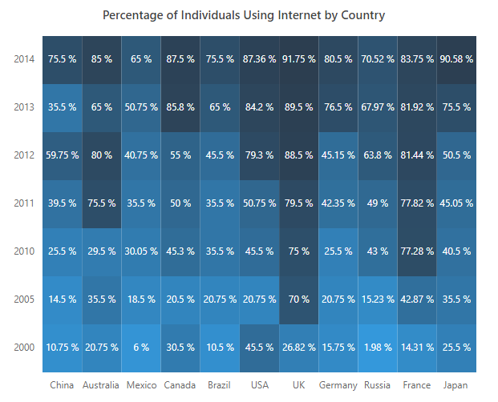
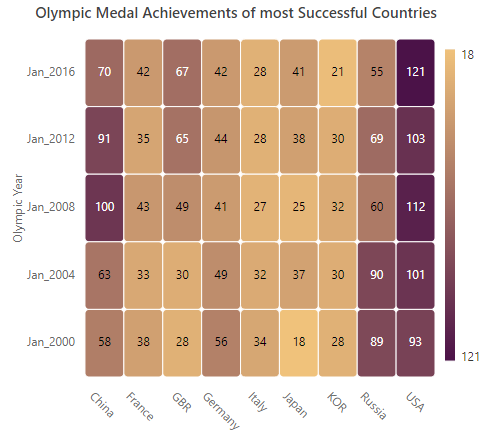
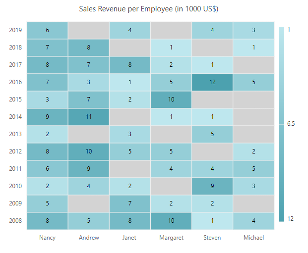

# Working with data in Blazor HeatMap Chart Component

This section shows how to bind data to the HeatMap component. The below video demonstrates the same.



HeatMap visualizes the JSON data and two-dimensional array data. Using the data adaptor support, data can be bound to the HeatMap.

## Data adaptor

HeatMap supports the following types of data binding with the adaptor support.

1. Array 
    * Table binding
    * Cell binding
2. Object data
    * Table binding
    * Cell binding

### Array - table binding

This data type is a collection of array of numbers, where each array represents data points for an X-axis data label. This is the default data binding type for HeatMap. You can also directly bind the array of numbers to the [DataSource](https://help.syncfusion.com/cr/blazor/Syncfusion.Blazor.HeatMap.SfHeatMap-1.html#Syncfusion_Blazor_HeatMap_SfHeatMap_1_DataSource) property.

```cshtml

@using Syncfusion.Blazor.HeatMap

<SfHeatMap DataSource="@HeatMapData">
    <HeatMapTitleSettings Text="GDP Growth Rate for Major Economies (in Percentage)">
    </HeatMapTitleSettings>
    <HeatMapXAxis Labels="@XAxisLabels"></HeatMapXAxis>
    <HeatMapYAxis Labels="@YAxisLabels"></HeatMapYAxis>
    <HeatMapPaletteSettings Type="PaletteType.Gradient">
        <HeatMapPalettes>
            <HeatMapPalette Color="#F0D6AD" Value=-1></HeatMapPalette>
            <HeatMapPalette Color="#9da49a" Value=0></HeatMapPalette>
            <HeatMapPalette Color="#d7c7a7" Value=3.5></HeatMapPalette>
            <HeatMapPalette Color="#6e888f" Value=6.0></HeatMapPalette>
            <HeatMapPalette Color="#466f86" Value=7.5></HeatMapPalette>
            <HeatMapPalette Color="#19547B" Value=10></HeatMapPalette>
        </HeatMapPalettes>
    </HeatMapPaletteSettings>
</SfHeatMap>

@code{
    double[,] GetDefaultData()
    {
        double[,] dataSource = new double[6, 10]
            {
                {9.5, 2.2, 4.2, 8.2, -0.5, 3.2, 5.4, 7.4, 6.2, 1.4 },
                {4.3, 8.9, 10.8, 6.5, 5.1, 6.2, 7.6, 7.5, 6.1, 7.6},
                {3.9, 2.7, 2.5, 3.7, 2.6, 5.1, 5.8, 2.9, 4.5, 5.1},
                {2.4, -3.7, 4.1, 6.0, 5.0, 2.4, 3.3, 4.6, 4.3, 2.7},
                {2.0, 7.0, -4.1, 8.9, 2.7, 5.9, 5.6, 1.9, -1.7, 2.9},
                {5.4, 1.1, 6.9, 4.5, 2.9, 3.4, 1.5, -2.8, -4.6, 1.2}
            };
            return dataSource;
    }
    string[] XAxisLabels = new string[] { "China", "India", "Australia", "Mexico", "Canada", "Brazil" };
    string[] YAxisLabels = new string[] { "2008", "2009", "2010", "2011", "2012", "2013", "2014", "2015", "2016", "2017" };
    public object HeatMapData { get; set; }
    protected override void OnInitialized()
    {
        HeatMapData = GetDefaultData();
    }
}

```


### Array - cell binding

This data type is a collection of array objects that contain information about the row index, column index, and data value for each cell. You can bind the data to HeatMap using the [DataSource](https://help.syncfusion.com/cr/blazor/Syncfusion.Blazor.HeatMap.SfHeatMap-1.html#Syncfusion_Blazor_HeatMap_SfHeatMap_1_DataSource)property and setting the [AdaptorType](https://help.syncfusion.com/cr/blazor/Syncfusion.Blazor.HeatMap.HeatMapDataSourceSettings.html#Syncfusion_Blazor_HeatMap_HeatMapDataSourceSettings_AdaptorType) property to **Cell**.


```cshtml

@using Syncfusion.Blazor.HeatMap

<SfHeatMap DataSource="@HeatMapData">
    <HeatMapTitleSettings Text="Percentage of Individuals Using Internet by Country">
        <HeatMapTitleTextStyle Size="15px" FontWeight="500" FontStyle="Normal" FontFamily="Segoe UI"></HeatMapTitleTextStyle>
    </HeatMapTitleSettings>
    <HeatMapXAxis Labels="@XAxisLabels"></HeatMapXAxis>
    <HeatMapYAxis Labels="@YAxisLabels"></HeatMapYAxis>
    <HeatMapLegendSettings Visible="false"></HeatMapLegendSettings>
    <HeatMapCellSettings Format="{value} %">
        <HeatMapCellBorder Width="0">
        </HeatMapCellBorder>
        <HeatMapCellTextStyle Color="White"></HeatMapCellTextStyle>
    </HeatMapCellSettings>
    <HeatMapDataSourceSettings IsJsonData="false" AdaptorType="AdaptorType.Cell"></HeatMapDataSourceSettings>
    <HeatMapPaletteSettings Type="PaletteType.Gradient">
        <HeatMapPalettes>
            <HeatMapPalette Color="#3498DB"></HeatMapPalette>
            <HeatMapPalette Color="#2C3E50"></HeatMapPalette>
        </HeatMapPalettes>
    </HeatMapPaletteSettings>
</SfHeatMap>

@code {
    double[,] GetDefaultData()
    {
        double[,] dataSource = new double[,]
            {

                {0, 0, 10.75 }, {0, 1, 14.5 }, {0, 2, 25.5 }, {0, 3, 39.5 }, {0, 4, 59.75 }, {0, 5, 35.50 }, {0, 6, 75.5 },

                {1, 0, 20.75 }, {1, 1, 35.5 }, {1, 2, 29.5 }, {1, 3, 75.5 }, {1, 4, 80 }, {1, 5, 65 }, {1, 6, 85 },

                { 2, 0, 6}, {2, 1, 18.5 }, {2, 2, 30.05 }, {2, 3, 35.5 }, {2, 4, 40.75 }, {2, 5, 50.75 }, {2, 6, 65 },

                {3, 0, 30.5 }, {3, 1, 20.5 }, {3, 2, 45.30 }, {3, 3, 50 }, {3, 4, 55 }, {3, 5, 85.80 }, {3, 6, 87.5 },

                {4, 0, 10.5 }, {4, 1, 20.75 }, {4, 2, 35.5 }, {4, 3, 35.5 }, {4, 4, 45.5 }, {4, 5, 65}, {4, 6, 75.5 },

                {5, 0, 45.5 }, {5, 1, 20.75}, {5, 2, 45.5}, {5, 3, 50.75}, {5, 4, 79.30}, {5, 5, 84.20}, {5, 6, 87.36},

                {6, 0, 26.82 }, {6, 1, 70 }, {6, 2, 75 }, {6, 3, 79.5 }, {6, 4, 88.5 }, {6, 5, 89.5 }, {6, 6, 91.75 },

                {7, 0, 15.75 }, {7, 1, 20.75}, {7, 2, 25.5}, {7, 3, 42.35}, {7, 4, 45.15}, {7, 5, 76.5}, {7, 6, 80.5},

                {8, 0, 1.98 }, {8, 1, 15.23 }, {8, 2, 43 }, {8, 3, 49 }, {8, 4, 63.80 }, {8, 5, 67.97 }, {8, 6, 70.52 },

                {9, 0, 14.31 }, {9, 1, 42.87}, {9, 2, 77.28}, {9, 3, 77.82}, {9, 4, 81.44}, {9, 5, 81.92}, {9, 6, 83.75},

                {10, 0, 25.5 }, {10, 1, 35.5 }, {10, 2, 40.5 }, {10, 3, 45.05 }, {10, 4, 50.5 }, {10, 5, 75.5 }, {10, 6, 90.58 }
            };
        return dataSource;
    }
    string[] XAxisLabels = new string[] { "China", "Australia", "Mexico", "Canada", "Brazil", "USA", "UK" , "Germany", "Russia", "France", "Japan" };
    string[] YAxisLabels = new string[] { "2000", "2005", "2010", "2011", "2012", "2013", "2014" };
    public object HeatMapData { get; set; }
    protected override void OnInitialized()
    {
        HeatMapData = GetDefaultData();
    }
}

```



### JSON data - table binding

In JSON table data binding, each JSON object contains an X-axis data point as row header and all the corresponding Y-axis data values.
You can bind the JSON table data to the HeatMap using the [DataSource](https://help.syncfusion.com/cr/blazor/Syncfusion.Blazor.HeatMap.SfHeatMap-1.html#Syncfusion_Blazor_HeatMap_SfHeatMap_1_DataSource). To achieve this, you should enable the [IsJsonData](https://help.syncfusion.com/cr/blazor/Syncfusion.Blazor.HeatMap.HeatMapDataSourceSettings.html#Syncfusion_Blazor_HeatMap_HeatMapDataSourceSettings_IsJsonData) property and define the [AdaptorType](https://help.syncfusion.com/cr/blazor/Syncfusion.Blazor.HeatMap.HeatMapDataSourceSettings.html#Syncfusion_Blazor_HeatMap_HeatMapDataSourceSettings_AdaptorType) property as **Table**. The [XDataMapping](https://help.syncfusion.com/cr/blazor/Syncfusion.Blazor.HeatMap.HeatMapDataSourceSettings.html#Syncfusion_Blazor_HeatMap_HeatMapDataSourceSettings_XDataMapping) property is used to map the row header in JSON data.

```cshtml

@using Syncfusion.Blazor.HeatMap

<SfHeatMap DataSource="@HeatMapData">
    <HeatMapTitleSettings Text="Olympic Medal Achievements of most Successful Countries">
        <HeatMapTitleTextStyle Size="15px" FontWeight="500" FontStyle="Normal" FontFamily="Segoe UI"></HeatMapTitleTextStyle>
    </HeatMapTitleSettings>
    <HeatMapDataSourceSettings IsJsonData="true" AdaptorType="AdaptorType.Table" XDataMapping="Region"></HeatMapDataSourceSettings>
    <HeatMapXAxis Labels="@XLabels" LabelRotation="45" LabelIntersectAction="LabelIntersectAction.None"></HeatMapXAxis>
    <HeatMapYAxis Labels="@YLabels">
        <HeatMapYAxisTitle Text="Olympic Year"></HeatMapYAxisTitle>
    </HeatMapYAxis>
    <HeatMapPaletteSettings>
        <HeatMapPalettes>
            <HeatMapPalette Color="#F0C27B"></HeatMapPalette>
            <HeatMapPalette Color="#4B1248"></HeatMapPalette>
        </HeatMapPalettes>
    </HeatMapPaletteSettings>
    <HeatMapCellSettings>
        <HeatMapCellBorder Width="1" Radius="4" Color="White"></HeatMapCellBorder>
    </HeatMapCellSettings>
</SfHeatMap>

@code
{
    public string[] XLabels = new string[] { "China", "France", "GBR", "Germany", "Italy", "Japan", "KOR", "Russia", "USA" };
    public string[] YLabels = new string[] { "Jan_2000", "Jan_2004", "Jan_2008", "Jan_2012", "Jan_2016" };
    public class RegionalData
    {
        public string Region { get; set; }
        public int? Jan_2000 { get; set; }
        public int? Jan_2004 { get; set; }
        public int? Jan_2008 { get; set; }
        public int? Jan_2012 { get; set; }
        public int? Jan_2016 { get; set; }
    }
    public RegionalData[] HeatMapData = new RegionalData[]{
        new RegionalData {Region = "USA", Jan_2000 = 93,Jan_2004 = 101,Jan_2008 = 112,Jan_2012 = 103,Jan_2016 = 121 },
        new RegionalData {Region = "GBR", Jan_2000 = 28,Jan_2004 = 30,Jan_2008 = 49,Jan_2012 = 65,Jan_2016 = 67 },
        new RegionalData {Region = "China", Jan_2000 = 58,Jan_2004 = 63,Jan_2008 = 100,Jan_2012 = 91,Jan_2016 = 70 },
        new RegionalData {Region = "Russia", Jan_2000 = 89,Jan_2004 = 90,Jan_2008 = 60,Jan_2012 = 69,Jan_2016 = 55 },
        new RegionalData {Region = "Germany", Jan_2000 = 56,Jan_2004 = 49,Jan_2008 = 41,Jan_2012 = 44,Jan_2016 = 42 },
        new RegionalData {Region = "Japan", Jan_2000 = 18,Jan_2004 = 37,Jan_2008 = 25,Jan_2012 = 38,Jan_2016 = 41 },
        new RegionalData {Region = "France", Jan_2000 = 38,Jan_2004 = 33,Jan_2008 = 43,Jan_2012 = 35,Jan_2016 = 42 },
        new RegionalData {Region = "KOR", Jan_2000 = 28,Jan_2004 = 30,Jan_2008 = 32,Jan_2012 = 30,Jan_2016 = 21 },
        new RegionalData {Region = "Italy", Jan_2000 = 34,Jan_2004 = 32,Jan_2008 = 27,Jan_2012 = 28,Jan_2016 = 28 }
    };
}

```



### JSON data - cell binding

In JSON cell data binding, each JSON object consists a value for each cell along with a mapping value for row and column. You can bind the JSON cell data having information for each cell to the HeatMap using the [DataSource](https://help.syncfusion.com/cr/blazor/Syncfusion.Blazor.HeatMap.SfHeatMap-1.html#Syncfusion_Blazor_HeatMap_SfHeatMap_1_DataSource). To achieve this, you should define the [AdaptorType](https://help.syncfusion.com/cr/blazor/Syncfusion.Blazor.HeatMap.HeatMapDataSourceSettings.html#Syncfusion_Blazor_HeatMap_HeatMapDataSourceSettings_AdaptorType) property as **Cell**, and enable the [IsJsonData](https://help.syncfusion.com/cr/blazor/Syncfusion.Blazor.HeatMap.HeatMapDataSourceSettings.html#Syncfusion_Blazor_HeatMap_HeatMapDataSourceSettings_IsJsonData) property. Now, map the fields of data by using the [ValueMapping](https://help.syncfusion.com/cr/blazor/Syncfusion.Blazor.HeatMap.HeatMapDataSourceSettings.html#Syncfusion_Blazor_HeatMap_HeatMapDataSourceSettings_ValueMapping), [XDataMapping](https://help.syncfusion.com/cr/blazor/Syncfusion.Blazor.HeatMap.HeatMapDataSourceSettings.html#Syncfusion_Blazor_HeatMap_HeatMapDataSourceSettings_XDataMapping) and [YDataMapping](https://help.syncfusion.com/cr/blazor/Syncfusion.Blazor.HeatMap.HeatMapDataSourceSettings.html#Syncfusion_Blazor_HeatMap_HeatMapDataSourceSettings_YDataMapping) properties.

```cshtml

@using Syncfusion.Blazor.HeatMap

<SfHeatMap DataSource="@HeatMapData">
    <HeatMapTitleSettings Text="Most Visited Destinations by International Tourist Arrivals">
        <HeatMapTitleTextStyle Size="15px" FontWeight="500" FontStyle="Normal" FontFamily="Segoe UI"></HeatMapTitleTextStyle>
    </HeatMapTitleSettings>
    <HeatMapDataSourceSettings IsJsonData="true" AdaptorType="AdaptorType.Cell" XDataMapping="RowId" YDataMapping="ColumnId" ValueMapping="Value"></HeatMapDataSourceSettings>
    <HeatMapXAxis Labels="@XLabels"></HeatMapXAxis>
    <HeatMapYAxis Labels="@YLabels"></HeatMapYAxis>
    <HeatMapPaletteSettings>
        <HeatMapPalettes>
            <HeatMapPalette Color="#DCD57E"></HeatMapPalette>
            <HeatMapPalette Color="#A6DC7E"></HeatMapPalette>
            <HeatMapPalette Color="#7EDCA2"></HeatMapPalette>
            <HeatMapPalette Color="#6EB5D0"></HeatMapPalette>
        </HeatMapPalettes>
    </HeatMapPaletteSettings>
    <HeatMapCellSettings ShowLabel="true" Format="{value} M">
        <HeatMapCellBorder Width="1" Radius="4" Color="White"></HeatMapCellBorder>
    </HeatMapCellSettings>
</SfHeatMap>

@code {
    public string[] XLabels = new string[] { "Austria", "China", "France", "Germany", "Italy", "Mexico", "Spain", "Thailand", "UK", "USA" };
    public string[] YLabels = new string[] { "2010", "2011", "2012", "2013", "2014", "2015", "2016" };
    public class SampleData
    {
        public string RowId { get; set; }
        public string ColumnId { get; set; }
        public string Value { get; set; }
    }
    public SampleData[] HeatMapData = new SampleData[] {
        new SampleData  { RowId= "France", ColumnId= "2010", Value= "77.6" },
        new SampleData  { RowId= "France", ColumnId= "2011", Value= "79.4" },
        new SampleData  { RowId= "France", ColumnId= "2012", Value= "80.8" },
        new SampleData  { RowId= "France", ColumnId= "2013", Value= "86.6" },
        new SampleData  { RowId= "France", ColumnId= "2014", Value= "83.7" },
        new SampleData  { RowId= "France", ColumnId= "2015", Value= "84.5" },
        new SampleData  { RowId= "France", ColumnId= "2016", Value= "82.6" },
        new SampleData  { RowId= "USA", ColumnId= "2010", Value= "60.6" },
        new SampleData  { RowId= "USA", ColumnId= "2014", Value= "75.3" },
        new SampleData  { RowId= "USA", ColumnId= "2011", Value= "65.4" },
        new SampleData  { RowId= "USA", ColumnId= "2012", Value= "70.8" },
        new SampleData  { RowId= "USA", ColumnId= "2012", Value= "70.8" },
        new SampleData  { RowId= "USA", ColumnId= "2013", Value= "73.8" },
        new SampleData  { RowId= "USA", ColumnId= "2014", Value= "75.3" },
        new SampleData  { RowId= "USA", ColumnId= "2015", Value= "77.5" },
        new SampleData  { RowId= "USA", ColumnId= "2016", Value= "77.6" },
        new SampleData  { RowId= "Spain", ColumnId= "2010", Value= "64.9" },
        new SampleData  { RowId= "Spain", ColumnId= "2011", Value= "52.6" },
        new SampleData  { RowId= "Spain", ColumnId= "2012", Value= "60.8" },
        new SampleData  { RowId= "Spain", ColumnId= "2013", Value= "65.6" },
        new SampleData  { RowId= "Spain", ColumnId= "2014", Value= "52.6" },
        new SampleData  { RowId= "Spain", ColumnId= "2015", Value= "68.5" },
        new SampleData  { RowId= "Spain", ColumnId= "2016", Value= "75.6" },
        new SampleData  { RowId= "China", ColumnId= "2010", Value= "55.6" },
        new SampleData  { RowId= "China", ColumnId= "2011", Value= "52.3" },
        new SampleData  { RowId= "China", ColumnId= "2012", Value= "54.8" },
        new SampleData  { RowId= "China", ColumnId= "2013", Value= "51.1" },
        new SampleData  { RowId= "China", ColumnId= "2014", Value= "55.6" },
        new SampleData  { RowId= "China", ColumnId= "2015", Value= "56.9" },
        new SampleData  { RowId= "China", ColumnId= "2016", Value= "59.3" },
        new SampleData  { RowId= "Italy", ColumnId= "2010", Value= "43.6" },
        new SampleData  { RowId= "Italy", ColumnId= "2011", Value= "43.2" },
        new SampleData  { RowId= "Italy", ColumnId= "2012", Value= "55.8" },
        new SampleData  { RowId= "Italy", ColumnId= "2013", Value= "50.1" },
        new SampleData  { RowId= "Italy", ColumnId= "2014", Value= "48.5" },
        new SampleData  { RowId= "Italy", ColumnId= "2015", Value= "50.7" },
        new SampleData  { RowId= "Italy", ColumnId= "2016", Value= "52.4" },
        new SampleData  { RowId= "UK", ColumnId= "2010", Value= "28.2" },
        new SampleData  { RowId= "UK", ColumnId= "2011", Value= "31.6" },
        new SampleData  { RowId= "UK", ColumnId= "2012", Value= "29.8" },
        new SampleData  { RowId= "UK", ColumnId= "2013", Value= "33.1" },
        new SampleData  { RowId= "UK", ColumnId= "2014", Value= "32.6" },
        new SampleData  { RowId= "UK", ColumnId= "2015", Value= "34.4" },
        new SampleData  { RowId= "UK", ColumnId= "2016", Value= "35.8" },
        new SampleData  { RowId= "Germany", ColumnId= "2010", Value= "26.8" },
        new SampleData  { RowId= "Germany", ColumnId= "2011", Value= "29" },
        new SampleData  { RowId= "Germany", ColumnId= "2012", Value= "26.8" },
        new SampleData  { RowId= "Germany", ColumnId= "2013", Value= "27.6" },
        new SampleData  { RowId= "Germany", ColumnId= "2014", Value= "33" },
        new SampleData  { RowId= "Germany", ColumnId= "2015", Value= "35" },
        new SampleData  { RowId= "Germany", ColumnId= "2016", Value= "35.6" },
        new SampleData  { RowId= "Mexico", ColumnId= "2010", Value= "23.2" },
        new SampleData  { RowId= "Mexico", ColumnId= "2011", Value= "24.9" },
        new SampleData  { RowId= "Mexico", ColumnId= "2012", Value= "30.1" },
        new SampleData  { RowId= "Mexico", ColumnId= "2013", Value= "22.2" },
        new SampleData  { RowId= "Mexico", ColumnId= "2014", Value= "29.3" },
        new SampleData  { RowId= "Mexico", ColumnId= "2015", Value= "32.1" },
        new SampleData  { RowId= "Mexico", ColumnId= "2016", Value= "35" },
        new SampleData  { RowId= "Thailand", ColumnId= "2010", Value= "15.9" },
        new SampleData  { RowId= "Thailand", ColumnId= "2011", Value= "19.8" },
        new SampleData  { RowId= "Thailand", ColumnId= "2012", Value= "21.8" },
        new SampleData  { RowId= "Thailand", ColumnId= "2013", Value= "23.5" },
        new SampleData  { RowId= "Thailand", ColumnId= "2014", Value= "24.8" },
        new SampleData  { RowId= "Thailand", ColumnId= "2015", Value= "29.9" },
        new SampleData  { RowId= "Thailand", ColumnId= "2016", Value= "32.6" },
        new SampleData  { RowId= "Austria", ColumnId= "2010", Value= "22" },
        new SampleData  { RowId= "Austria", ColumnId= "2011", Value= "21.3" },
        new SampleData  { RowId= "Austria", ColumnId= "2012", Value= "24.2" },
        new SampleData  { RowId= "Austria", ColumnId= "2013", Value= "23.2" },
        new SampleData  { RowId= "Austria", ColumnId= "2014", Value= "25" },
        new SampleData  { RowId= "Austria", ColumnId= "2015", Value= "26.7" },
        new SampleData  { RowId= "Austria", ColumnId= "2016", Value= "28.1" }
    };
}

```


## Empty points

The data points that use the `null` or `undefined` or empty string as value are considered as empty points. Empty data points are ignored and not displayed in the HeatMap, and these points are rendered with default palette. You can customize the empty data point color value using the [EmptyPointColor](https://help.syncfusion.com/cr/blazor/Syncfusion.Blazor.HeatMap.HeatMapPaletteSettings.html#Syncfusion_Blazor_HeatMap_HeatMapPaletteSettings_EmptyPointColor) property.

```cshtml

@using Syncfusion.Blazor.HeatMap

<SfHeatMap DataSource="@HeatMapData">
    <HeatMapTitleSettings Text="Sales Revenue per Employee (in 1000 US$)">
    </HeatMapTitleSettings>
    <HeatMapXAxis Labels="@XAxisLabels"></HeatMapXAxis>
    <HeatMapYAxis Labels="@YAxisLabels"></HeatMapYAxis>
</SfHeatMap>

@code{
        int?[,] GetDefaultData()
        {
            int?[,] dataSource = new int?[6, 12]
            {
                {8, 5, 2, 6, 8, 2, 9, 3, 7, 8, 7, 6},
                {5, null, 4, 9, 10, null, 11, 7, 3, 7, 8, null},
                {8, 7, 2, null, 5, 3, null, 2, 1, 8, null, 4},
                {10, 2, null, 4, 5, null, 1, 10, 5, 2, 1, null},
                {1, 2, 9, 4, null, 5, 1, null, 12, 1, null, 4},
                {4, null, 3, 5, 2, null, null, null, 5, null, 1, 3},
            };
            return dataSource;
        }
    string[] XAxisLabels = new string[] {"Nancy", "Andrew", "Janet", "Margaret", "Steven", "Michael", "Robert","Laura", "Anne", "Paul", "Karin", "Mario" };
    string[] YAxisLabels = new string[] { "2008", "2009", "2010", "2011", "2012", "2013", "2014", "2015", "2016", "2017", "2018", "2019" };
    public object HeatMapData { get; set; }
    protected override void OnInitialized()
    {
        HeatMapData = GetDefaultData();
    }
}

```

