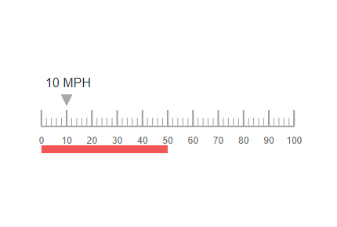

# Animation in Blazor Linear Gauge Component

By setting the [AnimationDuration](https://help.syncfusion.com/cr/blazor/Syncfusion.Blazor.LinearGauge.SfLinearGauge.html#Syncfusion_Blazor_LinearGauge_SfLinearGauge_AnimationDuration) property, all of the elements in the Linear Gauge, such as the axis lines, ticks, labels, ranges, pointers and annotations, can be animated sequentially. When the `AnimationDuration` property is set to a value in milliseconds, the animation for the Linear Gauge is started, providing a smooth rendering effect for the component. The animation effect will not be started if the property is set to **0**, which is the default value. If this animation is enabled, the component will exhibit the following behavior.

1. At the same time, the axis line, ticks, labels, and ranges will be animated.
2. Pointers will be animated next if they are available.
3. Annotations will be animated if they are available.

The animation of the Linear Gauge is demonstrated in the example below.

```cshtml

@using Syncfusion.Blazor.LinearGauge;

<SfLinearGauge Orientation="Orientation.Horizontal" AnimationDuration="3000">
        <LinearGaugeAxes>
            <LinearGaugeAxis>
                <LinearGaugeAxisLabelStyle Offset="48">
                    <LinearGaugeAxisLabelFont FontFamily="inherit"></LinearGaugeAxisLabelFont>
                </LinearGaugeAxisLabelStyle>
                <LinearGaugeMajorTicks Color="#9E9E9E" Interval="10" Height="20" />
                <LinearGaugeMinorTicks Color="#9E9E9E" Interval="2" Height="10" />
                <LinearGaugeAnnotations>
                    <LinearGaugeAnnotation AxisIndex="0" AxisValue="10" X="10" Y="-70" ZIndex="1">
                        <ContentTemplate>
                            <div style="width: 70px;margin-left: -53%;margin-top: 5%;font-size: 16px;">10 MPH</div>
                        </ContentTemplate>
                    </LinearGaugeAnnotation>
                </LinearGaugeAnnotations>
                <LinearGaugePointers>
                    <LinearGaugePointer PointerValue="10" Height="15" Width="15" Placement="Placement.Near" Offset="-40" MarkerType="MarkerType.Triangle" />
                </LinearGaugePointers>
            <LinearGaugeRanges>
                <LinearGaugeRange Start="0" End="50" StartWidth="10" EndWidth="10" Color="#F45656" Offset="35" />
            </LinearGaugeRanges>
            </LinearGaugeAxis>
        </LinearGaugeAxes>
    </SfLinearGauge>

```



