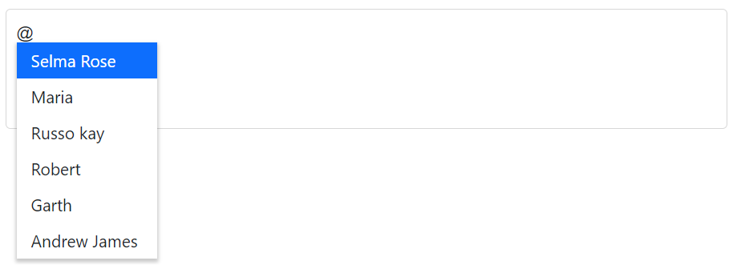

# Filtering data in Blazor Mention Component

The Mention component has built-in support for filtering data items, which allows you to easily narrow down the list of mention suggestions based on user input. The filter operation begins as soon as the user starts typing characters in the Mention element, and it is designed to quickly and efficiently search through the available data items to find matches based on the entered characters.

## Limit the minimum filter character

The [MinLength](https://help.syncfusion.com/cr/blazor/Syncfusion.Blazor.DropDowns.SfMention-1.html#Syncfusion_Blazor_DropDowns_SfMention_1_MinLength) property that allows you to control the minimum length of user input required to initiate the search action. By default, the `MinLength` property is set to `0`, which means that the suggestion list will open as soon as the user inputs the mention character.

For example, if you set `MinLength` to `3`, the suggestion list will only open when the user has entered at least three characters.

In the following example, the remote request does not fetch the search data until the search key contains three characters.







## Change the filter type

The [FilterType](https://help.syncfusion.com/cr/blazor/Syncfusion.Blazor.DropDowns.SfMention-1.html#Syncfusion_Blazor_DropDowns_SfMention_1_FilterType) property allows you to specify the type of filter to use when filtering data items. By default, the FilterType property is set to `Contains`, which means that the Mention component will search for items that contain the entered search string as a substring. The FilterType property supports below three different filter types.

* `StartsWith` - This filter type searches for items that start with the entered characters.
* `Contains` - This filter type searches for items that contain the entered characters as a substring.
* `EndsWith` - This filter type searches for items that end with the entered characters.







## Allow spacing between search

The [AllowSpaces](https://help.syncfusion.com/cr/blazor/Syncfusion.Blazor.DropDowns.SfMention-1.html#Syncfusion_Blazor_DropDowns_SfMention_1_AllowSpaces) property is used to control whether spaces are allowed in the middle of the mention or not. If `AllowSpaces` is set to `true`, the Mention component will allow spaces in the middle of the mention and the data source will be filtered accordingly. If `AllowSpaces` is set to `false`, the Mention component will not allow spaces in the middle of the mention and the data source will not be filtered on space key press.

> By default, the `AllowSpaces` property is disabled, and the space ends the Mention component search.







## Customize the suggestion item count

The [SuggestionCount](https://help.syncfusion.com/cr/blazor/Syncfusion.Blazor.DropDowns.SfMention-1.html#Syncfusion_Blazor_DropDowns_SfMention_1_SuggestionCount) property allows you to specify the number of list items that should be displayed in the suggestion list. By default, the `SuggestionCount` property is set to `25`, which means that the Mention component will display up to `25` list items in the suggestion list. The `SuggestionCount` property can be set to any integer value.







## See also

* [Templates](./templates)