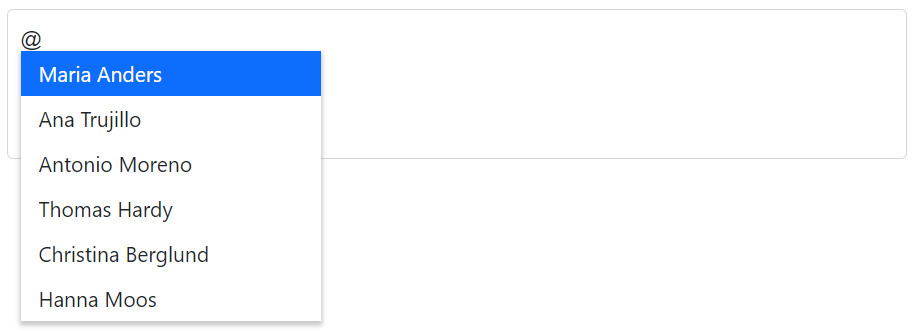

# Working with Data in Mention

The DropDownList loads the data either from the local data sources or remote data services. Using the [DataSource](https://help.syncfusion.com/cr/blazor/Syncfusion.Blazor.DropDowns.SfDropDownBase-1.html#Syncfusion_Blazor_DropDowns_SfDropDownBase_1_DataSource) property,  bind the local data or using the [DataManager](https://help.syncfusion.com/cr/blazor/Syncfusion.Blazor.DataManager.html), bind the remote data.

* **TItem** - Specifies the type of the datasource of the Mention component.

## Binding local data

### Simple data

The Mention has provided support to load an array of primitive data such as strings and numbers. Here, both the value and text fields act the same







## JSON data

The Mention can generate its list of items through an array of JSON data. Therefore the appropriate columns should be mapped to the `Fields` property.

In the following example, ID column and Game column from complex data have been mapped to the `MentionFieldSettings.Value` field and `MentionFieldSettings.Text` field, respectively.







### Complex data type

The Mention can generate its list items through an array of complex data. For this, the appropriate columns should be mapped to the `Fields` property.

In the following example, the `Code.ID` column and `Country.CountryID` column from complex data have been mapped to the `MentionFieldSettings.Value` and  `MentionFieldSettings.Text` respectively.







## Binding remote data

The Mention supports the retrieval of data from the remote data services with the help of the [DataManager](https://blazor.syncfusion.com/documentation/data/getting-started) control. The [Query](https://help.syncfusion.com/cr/blazor/Syncfusion.Blazor.DropDowns.SfDropDownBase-1.html#Syncfusion_Blazor_DropDowns_SfDropDownBase_1_Query) property is used to fetch data from the database and bind it to the Mention.

### OData v4 adaptor - Binding OData v4 service

The [OData v4 Adaptor](https://blazor.syncfusion.com/documentation/data/adaptors#odatav4-adaptor) is an improved version of OData protocols, and the `DataManager` can also retrieve and consume OData v4 services.

The following sample displays the first 6 contacts from `Customers` table of the `Northwind` Data Service.







### Web API adaptor

The [Web Api Adaptor](https://blazor.syncfusion.com/documentation/data/adaptors#web-api-adaptor) is used to interact with Web API created under OData standards. The `WebApiAdaptor` is extended from the [ODataAdaptor](https://blazor.syncfusion.com/documentation/data/adaptors#odata-adaptor). Hence to use the `WebApiAdaptor`, the endpoint should understand the OData formatted queries sent along with the request. 







## See also

* [Customization](./customization)
* [How to perform filtering](./filtering-data)