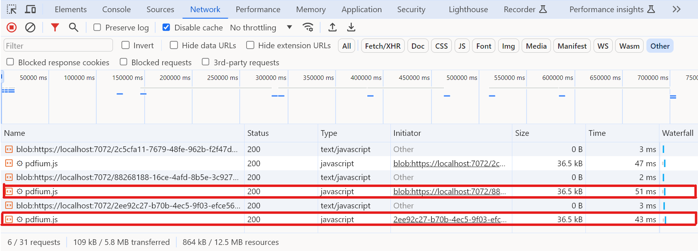

# Improve the performance using CDN in Blazor SfPdfViewer component

When all the JavaScript files in the sample are referenced from the application's hosted location or NuGet location, each time we fetch them from that location, causing delays in fetching the script files. This delay can potentially slow down component rendering. To mitigate this performance issue, you can reference the script from a **CDN**. If the file is not available in the browser cache, it will be retrieved only from the hosted location. Subsequent fetches will retrieve the script file from the browser cache unless the file has been modified.

The Syncfusion's Blazor SfPdfViewer component allows to improve performance by referring the below **CDN** link in **~/Pages/Layout.cshtml** or **~/Pages/_Host.cshtml** file.


```html

<head>
    <!-- Syncfusion Blazor PDF Viewer (Next Gen) control's theme style sheet -->
    <link href="https://cdn.syncfusion.com/blazor/25.1.35/styles/bootstrap5.css" rel="stylesheet" />
    <!-- Syncfusion Blazor PDF Viewer (Next Gen) control's scripts -->
    <script src="https://cdn.syncfusion.com/blazor/25.1.35/syncfusion-blazor-sfpdfviewer.min.js" type="text/javascript"></script>
</head>

```

We have a file named pdfium.js in our source. Whenever that file is fetched, it is downloaded from the hosted location while referring to the script from the NuGet. Below is a clear image that illustrates this process.



When referencing the script from the **CDN**, it is initially fetched from the hosted location. Subsequently, it is retrieved from the browser cache. The image below provides a clear illustration of this process.

