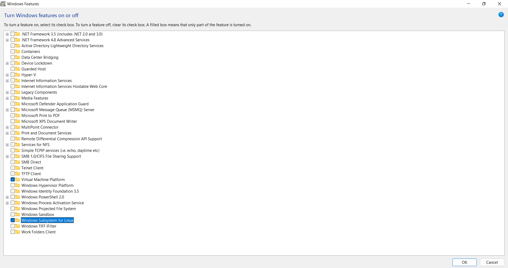
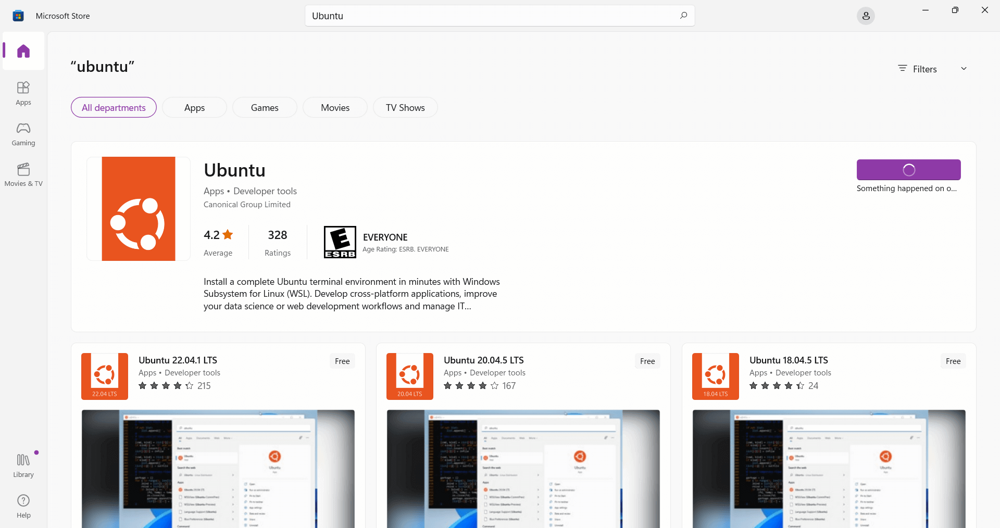
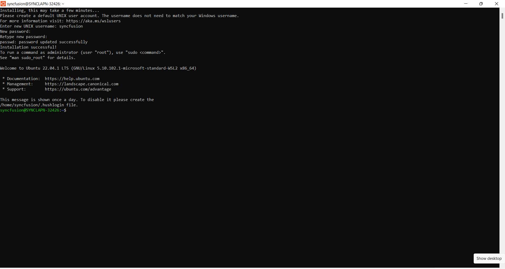
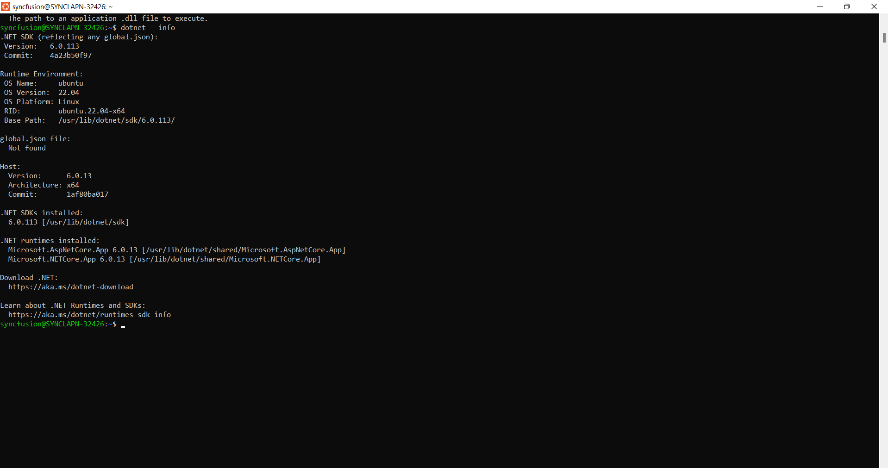
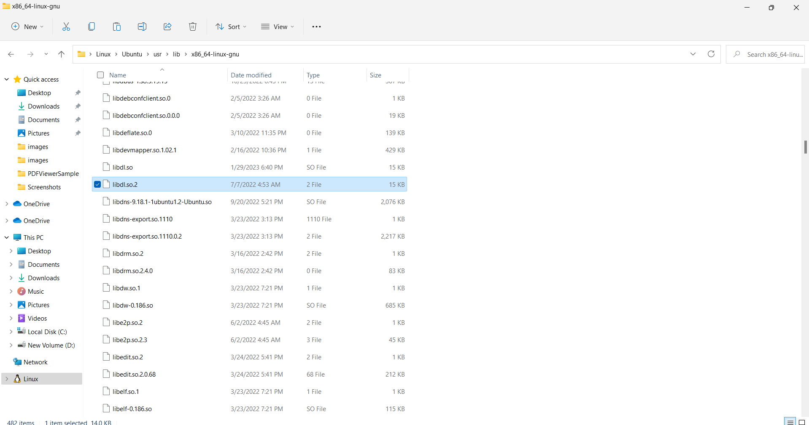
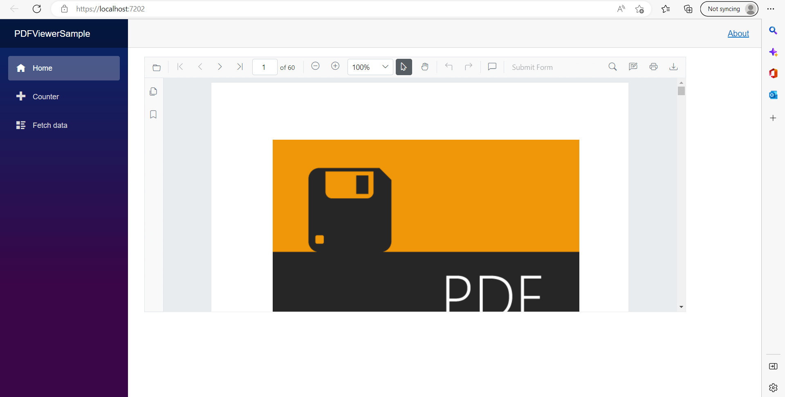

# Getting Started with Blazor PDF Viewer Component in WSL mode

To run the Syncfusion Blazor PDF Viewer in WSL (Windows Subsystem for Linux) mode, follow these steps:

**Step 1:** Enable the Windows Subsystem for Linux and the Virtual Machine Platform.



To enable the Windows Subsystem for Linux (WSL) and the Virtual Machine Platform on Windows, follow these steps:

Open the Start menu and search for `Control Panel`. Click on `Programs`, then click on `Turn Windows features on or off`. Scroll down and check the box next to `Windows Subsystem for Linux` and `Virtual Machine Platform`. Click `OK` and restart your machine.

After your computer restarts, you will be able to install a Linux distribution from the Microsoft Store, such as Ubuntu, and run Linux commands directly in Windows.

**Step 2:** Install the `Ubuntu`



Ubuntu can be installed on a Windows machine through the Microsoft Store. Here are the steps to do so:

Open the Start menu and search for `Control Panel`. Click on `Programs`, then click on `Turn Windows features on or off`. Scroll down and check the boxes next to `Windows Subsystem for Linux` and `Virtual Machine Platform`. Click `OK` and restart your machine.

Once the installation is complete, open the Windows search. In the terminal, type `Ubuntu` and press enter. This will launch the Ubuntu terminal inside of Windows.

On Ubuntu, create a new user with a username and password. 



**Step 3:** Install the dotnet framework for running the WSL (Windows Subsystem for Linux) in the project by running the following code one by one. 

```
    wget https://packages.microsoft.com/config/ubuntu/22.10/packages-microsoft-prod.deb -O packages-microsoft-prod.deb

    sudo dpkg -i packages-microsoft-prod.deb

    rm packages-microsoft-prod.deb

    sudo apt-get update && \
    sudo apt-get install -y dotnet-sdk-6.0

```

Check the comment dotnet --info and it should come like below



If the above result is not shown, Please run the comments below or follow the steps in the link below to uninstall and reinstall dotnet. 
```
    sudo apt remove dotnet*
    sudo apt remove aspnetcore*
    sudo apt remove netstandard*
    sudo apt-get remove dotnet-host
    sudo apt autoremove
    sudo apt autoremove -y dotnet-sdk-6.0
    sudo apt-get update
    dotnet
    sudo apt-get install -y dotnet-sdk-6.0
    dotnet
    dotnet --info

```
**Step 4:** Run the sample in WSL (Windows Subsystem for Linux) mode and it will run our Blazor PDF Viewer.

N> Facing any issue while running in WSL (Windows Subsystem for Linux) mode use the following instruction to resolve the issue.

If the sample does not load the PDF file and throws an exception


Use the following codes to install the dependence need for our Blazor PDF Viewer run to fix the issue.

Open the Ubuntu comment window and type the following comments.

```
    sudo cp -u /lib/x86_64-linux-gnu/libdl.so.2 /lib/x86_64-linux-gnu/libdl.so
```
Blazor PDF Viewer uses libdl.so. It has a different name in different WSL Linux versions. need to check its presence in the
\wsl.localhost\Ubuntu\usr\lib\x86_64-linux-gnu location like below.



If it’s in different name like libdl.so.4 then change the comment like below.

```
sudo cp -u /lib/x86_64-linux-gnu/libdl.so.4 /lib/x86_64-linux-gnu/libdl.so
```

Then, in the Ubuntu command window, run the following commands one by one to install all necessary Blazor PDF Viewer dependencies for a Linux run. 

```
    sudo apt-get install libfontconfig1
    sudo apt-get update && apt-get install -y --allow-unauthenticated libgdiplus libc6-dev libx11-dev
    sudo apt-get update
    sudo apt install libgdiplus

```

Close the project, reopen it, and run it in WSL mode. It will run properly.

