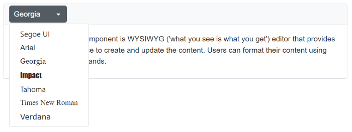
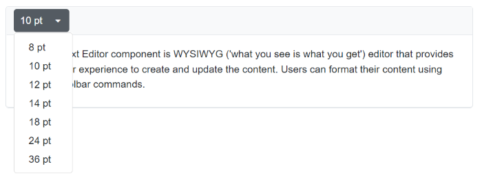
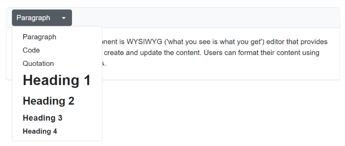
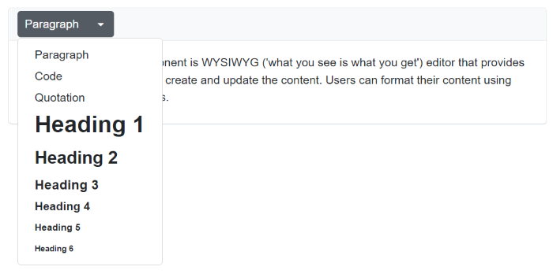
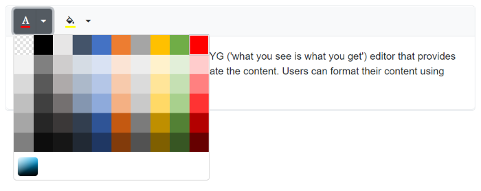
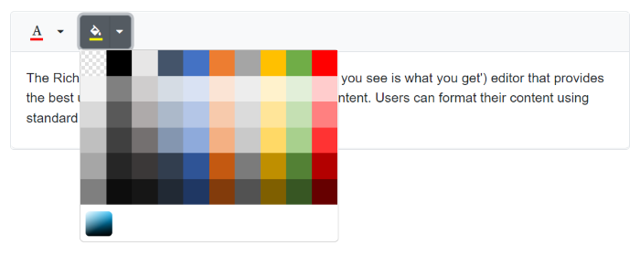
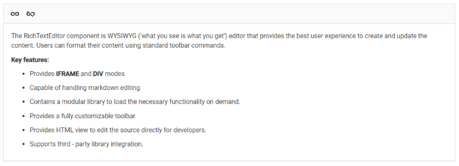
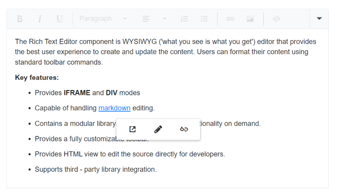
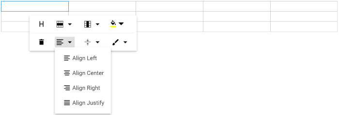

# Tools in Blazor RichTextEditor

## Build-in Tools

The following table lists the tools available in the toolbar.

<table>
<tr>
<td><b>Name</b></td>
<td><b>Icons</b></td>
<td><b>Summary</b></td>
<td><b>Initialization</b></td>
</tr>

<tr>
<td><p>Undo</p></td>
<td></td>
<td><p>Allows you to undo the actions.</p></td>
<td>
 
public List&lt;ToolbarItemModel&gt; Items = new List&lt;ToolbarItemModel&gt;() {<br>&nbsp;&nbsp;&nbsp;&nbsp;new ToolbarItemModel() { Command = ToolbarCommand.Undo } <br> };
</td>
</tr>

<tr>
<td><p>Redo</p></td>
<td></td>
<td><p>Allows you to redo the actions.</p></td>
<td>
 
public List&lt;ToolbarItemModel&gt; Items = new List&lt;ToolbarItemModel&gt;() {<br>&nbsp;&nbsp;&nbsp;&nbsp;new ToolbarItemModel() { Command = ToolbarCommand.Redo } <br> };
</td>
</tr>

<tr>
<td><p>Alignment</p></td>
<td></td>
<td><p>Aligns the content with the left, center, and right margins.</p></td>
<td>
 
public List&lt;ToolbarItemModel&gt; Items = new List&lt;ToolbarItemModel&gt;() {<br>&nbsp;&nbsp;&nbsp;&nbsp;new ToolbarItemModel() { Command = ToolbarCommand.Alignments } <br> };
</td>
</tr>

<tr>
<td><p>OrderedList</p></td>
<td></td>
<td><p>Creates a new list item(numbered).</p></td>
<td>
 
public List&lt;ToolbarItemModel&gt; Items = new List&lt;ToolbarItemModel&gt;() {<br>&nbsp;&nbsp;&nbsp;&nbsp;new ToolbarItemModel() { Command = ToolbarCommand.OrderedList } <br> };
</td>
</tr>

<tr>
<td><p>UnorderedList</p></td>
<td></td>
<td><p>Creates a new list item(bulleted).</p></td>
<td>
 
public List&lt;ToolbarItemModel&gt; Items = new List&lt;ToolbarItemModel&gt;() {<br>&nbsp;&nbsp;&nbsp;&nbsp;new ToolbarItemModel() { Command = ToolbarCommand.UnorderedList } <br> };
</td>
</tr>

<tr>
<td><p>Indent</p></td>
<td></td>
<td><p>Allows you to increase the content's indentation level. </p></td>
<td>
 
public List&lt;ToolbarItemModel&gt; Items = new List&lt;ToolbarItemModel&gt;() {<br>&nbsp;&nbsp;&nbsp;&nbsp;new ToolbarItemModel() { Command = ToolbarCommand.Indent } <br> };
</td>
</tr>

<tr>
<td><p>Outdent</p></td>
<td></td>
<td><p>Allows you to decrease the content's indentation level.</p></td>
<td>
 
public List&lt;ToolbarItemModel&gt; Items = new List&lt;ToolbarItemModel&gt;() {<br>&nbsp;&nbsp;&nbsp;&nbsp;new ToolbarItemModel() { Command = ToolbarCommand.Outdent } <br> };
</td>
</tr>

<tr>
<td><p>Hyperlink</p></td>
<td></td>
<td><p>Creates a hyperlink from a text or image to a specific location in the content.</p></td>
<td>
 
public List&lt;ToolbarItemModel&gt; Items = new List&lt;ToolbarItemModel&gt;() {<br>&nbsp;&nbsp;&nbsp;&nbsp;new ToolbarItemModel() { Command = ToolbarCommand.CreateLink } <br> };
</td>
</tr>

<tr>
<td><p>Images</p></td>
<td></td>
<td><p>Inserts an image from an online source or local computer.</p></td>
<td>
 
public List&lt;ToolbarItemModel&gt; Items = new List&lt;ToolbarItemModel&gt;() {<br>&nbsp;&nbsp;&nbsp;&nbsp;new ToolbarItemModel() { Command = ToolbarCommand.Image } <br> };
</td>
</tr>

<tr>
<td><p>LowerCase</p></td>
<td></td>
<td><p>Change the selected content to lower case.</p></td>
<td>
 
public List&lt;ToolbarItemModel&gt; Items = new List&lt;ToolbarItemModel&gt;() {<br>&nbsp;&nbsp;&nbsp;&nbsp;new ToolbarItemModel() { Command = ToolbarCommand.LowerCase } <br> };
</td>
</tr>

<tr>
<td><p>UpperCase</p></td>
<td></td>
<td><p>Change the selected content to upper case</p></td>
<td>
 
public List&lt;ToolbarItemModel&gt; Items = new List&lt;ToolbarItemModel&gt;() {<br>&nbsp;&nbsp;&nbsp;&nbsp;new ToolbarItemModel() { Command = ToolbarCommand.UpperCase } <br> };
</td>
</tr>

<tr>
<td><p>SubScript</p></td>
<td></td>
<td><p> Makes the selected text as subscript (lower).</p></td>
<td>
 
public List&lt;ToolbarItemModel&gt; Items = new List&lt;ToolbarItemModel&gt;() {<br>&nbsp;&nbsp;&nbsp;&nbsp;new ToolbarItemModel() { Command = ToolbarCommand.SubScript } <br> };
</td>
</tr>

<tr>
<td><p>SuperScript</p></td>
<td></td>
<td><p> Makes the selected text as superscript (higher).</p></td>
<td>
 
public List&lt;ToolbarItemModel&gt; Items = new List&lt;ToolbarItemModel&gt;() {<br>&nbsp;&nbsp;&nbsp;&nbsp;new ToolbarItemModel() { Command = ToolbarCommand.SuperScript } <br> };
</td>
</tr>

<tr>
<td><p>Print</p></td>
<td></td>
<td><p>Allows the editor's content to be printed. </p></td>
<td>
 
public List&lt;ToolbarItemModel&gt; Items = new List&lt;ToolbarItemModel&gt;() {<br>&nbsp;&nbsp;&nbsp;&nbsp;new ToolbarItemModel() { Command = ToolbarCommand.Print } <br> };
</td>
</tr>

<tr>
<td><p>FontName</p></td>
<td></td>
<td><p>Defines the fonts that appear in the Rich Text Editor's Font Family DropDownList.</p></td>
<td>
 
public List&lt;ToolbarItemModel&gt; Items = new List&lt;ToolbarItemModel&gt;() {<br>&nbsp;&nbsp;&nbsp;&nbsp;new ToolbarItemModel() { Command = ToolbarCommand.FontName } <br> };
</td>
</tr>

<tr>
<td><p>FontSize</p></td>
<td></td>
<td><p>Defines the font sizes that appear under the Font Size DropDownList from the Rich Text Editor's toolbar.</p></td>
<td>
 
public List&lt;ToolbarItemModel&gt; Items = new List&lt;ToolbarItemModel&gt;() {<br>&nbsp;&nbsp;&nbsp;&nbsp;new ToolbarItemModel() { Command = ToolbarCommand.FontSize } <br> };
</td>
</tr>

<tr>
<td><p>FontColor</p></td>
<td></td>
<td><p>Specifies an array of colors that can be used in the color popup for the font color.</p></td>
<td>
 
public List&lt;ToolbarItemModel&gt; Items = new List&lt;ToolbarItemModel&gt;() {<br>&nbsp;&nbsp;&nbsp;&nbsp;new ToolbarItemModel() { Command = ToolbarCommand.FontColor } <br> };
</td>
</tr>

<tr>
<td><p>BackgroundColor</p></td>
<td></td>
<td><p>Specifies an array of colors that can be used in the color popup for the background color.</p></td>
<td>
 
public List&lt;ToolbarItemModel&gt; Items = new List&lt;ToolbarItemModel&gt;() {<br>&nbsp;&nbsp;&nbsp;&nbsp;new ToolbarItemModel() { Command = ToolbarCommand.BackgroundColor } <br> }; 
</td>
</tr>

<tr>
<td><p>Format</p></td>
<td></td>
<td><p>An Object with the options that will appear in the Paragraph Format dropdown from the toolbar.</p></td>
<td>
 
public List&lt;ToolbarItemModel&gt; Items = new List&lt;ToolbarItemModel&gt;() {<br>&nbsp;&nbsp;&nbsp;&nbsp;new ToolbarItemModel() { Command = ToolbarCommand.Formats } <br> };
</td>
</tr>

<tr>
<td><p>StrikeThrough</p></td>
<td></td>
<td><p>Applies double line strike through formatting for the selected text.</p></td>
<td>
 
public List&lt;ToolbarItemModel&gt; Items = new List&lt;ToolbarItemModel&gt;() {<br>&nbsp;&nbsp;&nbsp;&nbsp;new ToolbarItemModel() { Command = ToolbarCommand.StrikeThrough } <br> };
</td>
</tr>

<tr>
<td><p>ClearFormat</p></td>
<td></td>
<td><p>The clear format tool is useful for removing all formatting styles from currently selected text, such as bold, italic, underline, color, superscript, subscript, and more. As a result, all the text formatting will be cleared and returned to its default styles.</p></td>
<td>
 
public List&lt;ToolbarItemModel&gt; Items = new List&lt;ToolbarItemModel&gt;() {<br>&nbsp;&nbsp;&nbsp;&nbsp;new ToolbarItemModel() { Command = ToolbarCommand.ClearFormat } <br> };
</td>
</tr>

<tr>
<td><p>FullScreen</p></td>
<td></td>
<td><p>Stretches the editor to the maximum width and height of the browser window.</p></td>
<td>
 
public List&lt;ToolbarItemModel&gt; Items = new List&lt;ToolbarItemModel&gt;() {<br>&nbsp;&nbsp;&nbsp;&nbsp;new ToolbarItemModel() { Command = ToolbarCommand.FullScreen } <br> };
</td>
</tr>

<tr>
<td><p>SourceCode</p></td>
<td></td>
<td><p>The Rich Text Editor allows users to directly edit HTML code via "Source View." If you make any modifications in the source view directly, synchronise with the design view.</p></td>
<td>
 
public List&lt;ToolbarItemModel&gt; Items = new List&lt;ToolbarItemModel&gt;() {<br>&nbsp;&nbsp;&nbsp;&nbsp;new ToolbarItemModel() { Command = ToolbarCommand.SourceCode } <br> }; 
</td>
</tr>

<tr>
<td><p>NumberFormatList</p></td>
<td></td>
<td><p>Allows to create list items with various list style types(numbered). </p></td>
<td>
 
public List&lt;ToolbarItemModel&gt; Items = new List&lt;ToolbarItemModel&gt;() {<br>&nbsp;&nbsp;&nbsp;&nbsp;new ToolbarItemModel() { Command = ToolbarCommand.NumberFormatList } <br> };
</td>
</tr>

<tr>
<td><p>BulletFormatList</p></td>
<td></td>
<td><p>Allows to create list items with various list style types(bulleted).</p></td>
<td>
 
public List&lt;ToolbarItemModel&gt; Items = new List&lt;ToolbarItemModel&gt;() {<br>&nbsp;&nbsp;&nbsp;&nbsp;new ToolbarItemModel() { Command = ToolbarCommand.BulletFormatList } <br> };
</td>
</tr>
</table>

The tools order can be customized as your application requirement. If you are not specifying any tools order, the editor will create the toolbar with default items.

### Removing built-in tool from Toolbar

Remove the build-in tools from the toolbar by using the [RichTextEditorToolbarSettings.Items](https://help.syncfusion.com/cr/blazor/Syncfusion.Blazor.RichTextEditor.RichTextEditorToolbarSettings.html#Syncfusion_Blazor_RichTextEditor_RichTextEditorToolbarSettings_Items) property.




<SfRichTextEditor>
    <RichTextEditorToolbarSettings Items="@Tools" />
    <p>The Rich Text Editor component is WYSIWYG ('what you see is what you get') editor that provides the best user experience to create and update the content. Users can format their content using standard toolbar commands.</p>
</SfRichTextEditor>

@code {
    private List<ToolbarItemModel> Tools = new List<ToolbarItemModel>()
    {
        new ToolbarItemModel() { Command = ToolbarCommand.Bold },
        new ToolbarItemModel() { Command = ToolbarCommand.Italic },
        new ToolbarItemModel() { Command = ToolbarCommand.FontName },
        new ToolbarItemModel() { Command = ToolbarCommand.FontSize },
        new ToolbarItemModel() { Command = ToolbarCommand.CreateLink },
        new ToolbarItemModel() { Command = ToolbarCommand.Image },
        new ToolbarItemModel() { Command = ToolbarCommand.CreateTable },
        new ToolbarItemModel() { Command = ToolbarCommand.Undo },
        new ToolbarItemModel() { Command = ToolbarCommand.Redo }
    };
}





## Styling Tools

### Font family

By default, the editor is initialized with the default items of the font family. To change it, select a different font family from the drop-down menu in the editor’s toolbar.

To apply a different font style to a section of the content, select the text that you would like to change and select a required font style from the drop-down to apply the changes to the selected text.

### Buil-in font family

The following table lists the default font name and width of the `FontName` dropdown and the available list of font names.

| Default Key | Default Value |
|-----|--------------------------------------|
| Default | null |
| Width | 65px |
| Items | new List&lt;DropDownItemModel&gt;()<br>{<br>&nbsp;&nbsp;&nbsp;&nbsp;new DropDownItemModel() { Text = "Segoe UI", Value = "Segoe UI" },<br>&nbsp;&nbsp;&nbsp;&nbsp;new DropDownItemModel() { Text = "Arial", Value = "Arial,Helvetica,sans-serif" },<br>&nbsp;&nbsp;&nbsp;&nbsp;new DropDownItemModel() { Text = "Georgia", Value = "Georgia,serif" },<br>&nbsp;&nbsp;&nbsp;&nbsp;new DropDownItemModel() { Text = "Impact", Value = "Impact,Charcoal,sans-serif" },<br>&nbsp;&nbsp;&nbsp;&nbsp;new DropDownItemModel() { Text = "Tahoma", Value = "Tahoma,Geneva,sans-serif" },<br>&nbsp;&nbsp;&nbsp;&nbsp;new DropDownItemModel() { Text = "Times New Roman", Value = "Times New Roman,Times,serif" },<br>&nbsp;&nbsp;&nbsp;&nbsp;new DropDownItemModel() { Text = "Verdana", Value = "Verdana,Geneva,sans-serif"}<br>}; |











### Custom font family

The Rich Text Editor provides support for custom fonts with an existing list.
If you want to add additional font names and font sizes to the font drop-down, pass the font information as `List<DropDownItemModel>` data to the [RichTextEditorFontFamily.Items](https://help.syncfusion.com/cr/blazor/Syncfusion.Blazor.RichTextEditor.RichTextEditorFontFamily.html#Syncfusion_Blazor_RichTextEditor_RichTextEditorFontFamily_Items) property.










### Google font support

To use web fonts in the Rich Text Editor, the web fonts do not need to be present on the local machine. To add the web fonts to the Rich Text Editor, refer to the web font links and add the font names in the [RichTextEditorFontFamily](https://help.syncfusion.com/cr/blazor/Syncfusion.Blazor.RichTextEditor.RichTextEditorFontFamily.html) tag.

The following font style links are referred in the page.

### Blazor Server App

* For **.NET 6** app, refer style in the `<head>` of the **~/Pages/_Layout.cshtml** file.

* For **.NET 5 and .NET 3.X** app, refer style in the `<head>` of the **~/Pages/_Host.cshtml** file.




<head>
    <link rel="stylesheet" href="http://fonts.googleapis.com/css?family=Roboto">
    <link rel="stylesheet" href="http://fonts.googleapis.com/css?family=Great+Vibes">
</head>





<head>
    <link rel="stylesheet" href="http://fonts.googleapis.com/css?family=Roboto">
    <link rel="stylesheet" href="http://fonts.googleapis.com/css?family=Great+Vibes">
</head>




### Blazor WebAssembly App

For Blazor WebAssembly App, refer style in the `<head>` of the **~/index.html** file.




<head>
    <link rel="stylesheet" href="http://fonts.googleapis.com/css?family=Roboto">
    <link rel="stylesheet" href="http://fonts.googleapis.com/css?family=Great+Vibes">
</head>













### Font size

By default, the editor is initialized with default items for font size. To change it, select a different font size from the drop-down menu in the editor’s toolbar.

To apply a different font style to a section of the content, select the text that you would like to change and select a required font style from the drop-down to apply the changes to the selected text.

### Build-in font size

The following table lists the default font size and width of the [FontSize](https://help.syncfusion.com/cr/blazor/Syncfusion.Blazor.RichTextEditor.RichTextEditorFontSize.html) dropdown and the available list of the font size.

| Default Key | Default Value |
|-----|--------------------------------------|
| Default | null |
| Width | 35px.|
| Items | new List&lt;DropDownItemModel&gt;()<br>{<br>&nbsp;&nbsp;&nbsp;&nbsp;new DropDownItemModel() { Text = "8 pt", Value = "8pt" },<br>&nbsp;&nbsp;&nbsp;&nbsp;new DropDownItemModel() { Text = "10 pt", Value = "10pt" },<br>&nbsp;&nbsp;&nbsp;&nbsp;new DropDownItemModel() { Text = "12 pt", Value = "12pt" },<br>&nbsp;&nbsp;&nbsp;&nbsp;new DropDownItemModel() { Text = "14 pt", Value = "14pt" },<br>&nbsp;&nbsp;&nbsp;&nbsp;new DropDownItemModel() { Text = "18 pt", Value = "18pt" },<br>&nbsp;&nbsp;&nbsp;&nbsp;new DropDownItemModel() { Text = "24 pt", Value = "24pt" },<br>&nbsp;&nbsp;&nbsp;&nbsp;new DropDownItemModel() { Text = "36 pt", Value = "36pt" }<br>}; |











### Custom font size

The Rich Text Editor provides support for customizing the font size with the existing list. If you want to add additional font sizes to the font drop-down, pass the font information as `List<DropDownItemModel>` data to the [RichTextEditorFontSize.Items](https://help.syncfusion.com/cr/blazor/Syncfusion.Blazor.RichTextEditor.RichTextEditorFontSize.html#Syncfusion_Blazor_RichTextEditor_RichTextEditorFontSize_Items) property.










### Formats

By default, the editor is initialized with default items of formats. To change it, select a different format from the drop-down in the editor’s toolbar.

To apply different format styles for sections of the content, select the required format from the drop-down and then apply the changes to the selection.

### Build-in formats

The following table list the default format name and width of the  [Format](https://help.syncfusion.com/cr/blazor/Syncfusion.Blazor.RichTextEditor.RichTextEditorFormat.html#properties) dropdown and the available list of format names.

| Default Key | Default Value |
|-----|--------------------------------------|
| Default | null |
| Width | 65px|
| Items | new List&lt;DropDownItemModel&gt;()<br>{<br>&nbsp;&nbsp;&nbsp;&nbsp;new DropDownItemModel() { Text = "Paragraph", Value = "P" },<br>&nbsp;&nbsp;&nbsp;&nbsp;new DropDownItemModel() { Text = "Code", Value = "Pre" },<br>&nbsp;&nbsp;&nbsp;&nbsp;new DropDownItemModel() { Text = "Quotation", Value = "BlockQuote" },<br>&nbsp;&nbsp;&nbsp;&nbsp;new DropDownItemModel() { Text = "Heading 1", Value = "H1" },<br>&nbsp;&nbsp;&nbsp;&nbsp;new DropDownItemModel() { Text = "Heading 2", Value = "H2" },<br>&nbsp;&nbsp;&nbsp;&nbsp;new DropDownItemModel() { Text = "Heading 3", Value = "H3" },<br>&nbsp;&nbsp;&nbsp;&nbsp;new DropDownItemModel() { Text = "Heading 4", Value = "H4" }<br>}; |











### Custom format

The Rich Text Editor provides support for custom formats with an existing list. If you want to add additional formats to the format drop-down, pass the format information as `List<DropDownItemModel>` data to the [RichTextEditorFormat.Items](https://help.syncfusion.com/cr/blazor/Syncfusion.Blazor.RichTextEditor.RichTextEditorFormat.html#Syncfusion_Blazor_RichTextEditor_RichTextEditorFormat_Items) property.











### Font and background color

To apply the font color or background color for a selected content of RTE, use the font color and background color tools.

The Rich Text Editor supports providing custom font color and background color with an existing list through the [ColorCode](https://help.syncfusion.com/cr/blazor/Syncfusion.Blazor.RichTextEditor.ColorItemBase.html#Syncfusion_Blazor_RichTextEditor_ColorItemBase_ColorCode) field of the [RichTextEditorFontColor](https://help.syncfusion.com/cr/blazor/Syncfusion.Blazor.RichTextEditor.RichTextEditorFontColor.html) and [RichTextEditorBackgroundColor](https://help.syncfusion.com/cr/blazor/Syncfusion.Blazor.RichTextEditor.RichTextEditorBackgroundColor.html).

The `RichTextEditorFontColor` and `RichTextEditorBackgroundColor` tag has two mode of `Picker` and `Palette`. The `Palette` mode has a predefined set of the `ColorCode`, and in the `Picker` mode, more colors have been provided. Through the `ModeSwitcher`, switch between these two options.













### Build-in editor content styles

By default, the content styles of the Rich Text Editor are not returned while retrieving the HTML value from the editor. So, the styles are not applied when using the HTML value outside the editor. To get the styles from the Rich Text Editor’s content for your application, copy and use the following styles directly in your application. The styles listed are used in the UI elements of the Rich Text Editor.

> Make sure to add a CSS class `e-rte-content` to the content container.

```css

.e-rte-content p {
  margin: 0 0 10px;
  margin-bottom: 10px;
}

.e-rte-content li {
  margin-bottom: 10px;
}

.e-rte-content h1 {
  font-size: 2.17em;
  font-weight: 400;
  line-height: 1;
  margin: 10px 0;
}

.e-rte-content h2 {
  font-size: 1.74em;
  font-weight: 400;
  margin: 10px 0;
}

.e-rte-content h3 {
  font-size: 1.31em;
  font-weight: 400;
  margin: 10px 0;
}

.e-rte-content h4 {
  font-size: 1em;
  font-weight: 400;
  margin: 0;
}

.e-rte-content h5 {
  font-size: 00.8em;
  font-weight: 400;
  margin: 0;
}

.e-rte-content h6 {
  font-size: 00.65em;
  font-weight: 400;
  margin: 0;
}

.e-rte-content blockquote {
  margin: 10px 0;
  margin-left: 0;
  padding-left: 5px;
}

.e-rte-content pre {
  background-color: inherit;
  border: 0;
  border-radius: 0;
  color: #333;
  font-size: inherit;
  line-height: inherit;
  margin: 0 0 10px;
  overflow: visible;
  padding: 0;
  white-space: pre-wrap;
  word-break: inherit;
  word-wrap: break-word;
}

.e-rte-content strong, .e-rte-content b {
  font-weight: 700;
}

.e-rte-content a {
  text-decoration: none;
  -webkit-user-select: auto;
  -ms-user-select: auto;
  user-select: auto;
}

.e-rte-content a:hover {
  text-decoration: underline;
}

.e-rte-content h3 + h4,
.e-rte-content h4 + h5,
.e-rte-content h5 + h6 {
  margin-top: 00.6em;
}

.e-rte-content .e-rte-image.e-imgbreak {
  border: 0;
  cursor: pointer;
  display: block;
  float: none;
  margin: 5px auto;
  max-width: 100%;
  position: relative;
}

.e-rte-content .e-rte-image {
  border: 0;
  cursor: pointer;
  display: block;
  float: none;
  margin: auto;
  max-width: 100%;
  position: relative;
}

.e-rte-content .e-rte-image.e-imginline {
  display: inline-block;
  float: none;
  margin-left: 5px;
  margin-right: 5px;
  max-width: calc(100% - (2 * 5px));
  vertical-align: bottom;
}

.e-rte-content .e-rte-image.e-imgcenter {
  cursor: pointer;
  display: block;
  float: none;
  margin: 5px auto;
  max-width: 100%;
  position: relative;
}

.e-rte-content .e-rte-image.e-imgleft {
  float: left;
  margin: 0 5px 0 0;
  text-align: left;
}

.e-rte-content .e-rte-image.e-imgright {
  float: right;
  margin: 0 0 0 5px;
  text-align: right;
}

.e-rte-content .e-rte-img-caption {
  display: inline-block;
  margin: 5px auto;
  max-width: 100%;
  position: relative;
}

.e-rte-content .e-rte-img-caption.e-caption-inline {
  display: inline-block;
  margin: 5px auto;
  margin-left: 5px;
  margin-right: 5px;
  max-width: calc(100% - (2 * 5px));
  position: relative;
  text-align: center;
  vertical-align: bottom;
}

.e-rte-content .e-rte-img-caption.e-imgcenter {
  display: block;
}

.e-rte-content .e-rte-img-caption .e-rte-image.e-imgright,
.e-rte-content .e-rte-img-caption .e-rte-image.e-imgleft {
  float: none;
  margin: 0;
}

.e-rte-content .e-rte-table {
  border-collapse: collapse;
  empty-cells: show;
}

.e-rte-content .e-rte-table td,
.e-rte-content .e-rte-table th {
  border: 1px solid #bdbdbd;
  height: 20px;
  min-width: 20px;
  padding: 2px 5px;
  vertical-align: middle;
}

.e-rte-content .e-rte-table.e-dashed-border td,
.e-rte-content .e-rte-table.e-dashed-border th {
  border-style: dashed;
}

.e-rte-content .e-rte-img-caption .e-img-inner {
  box-sizing: border-box;
  display: block;
  font-size: 16px;
  font-weight: initial;
  margin: auto;
  opacity: .9;
  position: relative;
  text-align: center;
  width: 100%;
}

.e-rte-content .e-rte-img-caption .e-img-wrap {
  display: inline-block;
  margin: auto;
  padding: 0;
  width: 100%;
}

.e-rte-content blockquote {
  border-left: solid 2px #333;
}

.e-rte-content a {
  color: #2e2ef1;
}

.e-rte-content .e-rte-table th {
  background-color: #e0e0e0;
}

```
### Number and bullet format lists

This feature allows users to change the appearance of the Numbered and Bulleted lists. Users can also apply different numbering or bullet formats lists such as lowercase greek, upper Alpha, square, and circles. Also, customize the style type of the lists to be populated in the dropdown from the toolbar by using the [NumberFormatList](https://help.syncfusion.com/cr/blazor/Syncfusion.Blazor.RichTextEditor.RichTextEditorNumberFormatList.html) and [BulletFormatList](https://help.syncfusion.com/cr/blazor/Syncfusion.Blazor.RichTextEditor.RichTextEditorBulletFormatList.html) properties in the Rich Text Editor.










### Code block

Configure code block formatting as a separate toolbar button by adding the `InsertCode` Command within the  [RichTextEditorToolbarSettings.Items](https://help.syncfusion.com/cr/blazor/Syncfusion.Blazor.RichTextEditor.RichTextEditorToolbarSettings.html#Syncfusion_Blazor_RichTextEditor_RichTextEditorToolbarSettings_Items) property. The `InsertCode` button has a toggle state to apply code block formatting to the editor and remove code block formatting from the editor. 

The following code will configure the InsertCode button in the toolbar and set the background color to `pre` tag for highlighting the code block.










## Insert image

### Insert image from web

To insert an image from an online source like Google, Ping, and more, enable the images tool on the editor’s toolbar. By default, the images tool opens an image dialog that allows inserting an image from the online source.


### Upload and insert image

Through the `browse` option in the image dialog, select the image from the local machine and insert it into the Rich Text Editor content.

If the path field is not specified in [RichTextEditorImageSettings](https://help.syncfusion.com/cr/blazor/Syncfusion.Blazor.RichTextEditor.RichTextEditorImageSettings.html), the image will be converted to `base64`, and a `blob` url for the image will be created, and the generated url will set as the `src` property of the `` tag as follows:

The image has been loaded from the local machine and it will be saved in the given location.

```


```
> If you want to insert many tiny images in the editor and don't want a specific physical location for saving images, opt to save the format as `Base64`.

#### Restrict image upload based on size

By using the Rich Text Editor's [RichTextEditorEvents.OnImageUploading](https://help.syncfusion.com/cr/blazor/Syncfusion.Blazor.RichTextEditor.RichTextEditorEvents.html#Syncfusion_Blazor_RichTextEditor_RichTextEditorEvents_OnImageUploadSuccess) event, you can get the image size before uploading and restrict the image to upload when the given image size is greater than the allowed size.

In the following code, the image size has been validated before uploading and it has been determined whether the image has been uploaded or not.




@using Syncfusion.Blazor.RichTextEditor

<SfRichTextEditor>
    <RichTextEditorImageSettings SaveUrl="https://aspnetmvc.syncfusion.com/services/api/uploadbox/Save" Path="./Images/" />
    <RichTextEditorEvents BeforeUploadImage="@BeforeUploadImage" />
</SfRichTextEditor>

@code {
    private void BeforeUploadImage(ImageUploadingEventArgs args)
    {
        var sizeInBytes = args.FilesData[0].Size;
        var imgSize = 500000;
        if (imgSize < sizeInBytes) {
            args.Cancel = true;
        }
    }
}




> You can't restrict while uploading an image as a hyperlink in the insert image dialog. When inserting images using the link, the editor does not allow you to limit the image size. You could not identify the image file size when the image was provided as a link.

#### Server side action

The selected image can be uploaded to the required destination using the controller action below. Map this method name into [RichTextEditorImageSettings.SaveUrl](https://help.syncfusion.com/cr/blazor/Syncfusion.Blazor.RichTextEditor.RichTextEditorImageSettings.html#Syncfusion_Blazor_RichTextEditor_RichTextEditorImageSettings_SaveUrl) and provide required destination path through [RichTextEditorImageSettings.Path](https://help.syncfusion.com/cr/blazor/Syncfusion.Blazor.RichTextEditor.RichTextEditorImageSettings.html#Syncfusion_Blazor_RichTextEditor_RichTextEditorImageSettings_Path) property.

> The following code block shows saving the image file uploaded to the Rich Text Editor using the `Blazor Server App` project. The runnable Blazor Server app demo is available in this [Github](https://github.com/SyncfusionExamples/blazor-richtexteditor-image-upload) repository.




@using Syncfusion.Blazor.RichTextEditor

<SfRichTextEditor>
    <RichTextEditorImageSettings SaveUrl="api/Image/Save" Path="./Images/" />
</SfRichTextEditor>




`ImageController.cs`

```csharp

using System;
using System.IO;
using System.Net.Http.Headers;
using Microsoft.AspNetCore.Mvc;
using Microsoft.AspNetCore.Http;
using System.Collections.Generic;
using Microsoft.AspNetCore.Hosting;
using Microsoft.AspNetCore.Http.Features;

namespace ImageUpload.Controllers
{
    [ApiController]
    public class ImageController : ControllerBase
    {
        private readonly IWebHostEnvironment hostingEnv;

        public ImageController(IWebHostEnvironment env)
        {
            this.hostingEnv = env;
        }

        [HttpPost("[action]")]
        [Route("api/Image/Save")]
        public void Save(IList<IFormFile> UploadFiles)
        {
            try
            {
                foreach (var file in UploadFiles)
                {
                    if (UploadFiles != null)
                    {
                        string targetPath = hostingEnv.ContentRootPath + "\\wwwroot\\Images";
                        string filename = ContentDispositionHeaderValue.Parse(file.ContentDisposition).FileName.Trim('"');

                        // Create a new directory, if it does not exists
                        if (!Directory.Exists(targetPath))
                        {
                            Directory.CreateDirectory(targetPath);
                        }

                        // Name which is used to save the image
                        filename = targetPath + $@"\{filename}";

                        if (!System.IO.File.Exists(filename))
                        {
                            // Upload a image, if the same file name does not exist in the directory
                            using (FileStream fs = System.IO.File.Create(filename))
                            {
                                file.CopyTo(fs);
                                fs.Flush();
                            }
                            Response.StatusCode = 200;
                        }
                        else
                        {
                            Response.StatusCode = 204;
                        }
                    }
                }
            }
            catch (Exception e)
            {
                Response.Clear();
                Response.ContentType = "application/json; charset=utf-8";
                Response.HttpContext.Features.Get<IHttpResponseFeature>().ReasonPhrase = e.Message;
            }
        }
    }
}

```


#### Save image in application path

Using the [RichTextEditorImageSettings.Path](https://help.syncfusion.com/cr/blazor/Syncfusion.Blazor.RichTextEditor.RichTextEditorImageSettings.html#Syncfusion_Blazor_RichTextEditor_RichTextEditorImageSettings_Path) property, save the uploaded image in your application path. Also, change the path of the image by creating a folder structure as per your requirements under the folder `wwwroot`. You can’t create a path outside the `wwwroot` folder since any files, including HTML files, CSS files, image files, and JavaScript files, sent to the user's browser should be stored inside the `wwwroot` folder.




@using Syncfusion.Blazor.RichTextEditor

<SfRichTextEditor> 
    <RichTextEditorImageSettings SaveUrl="api/Image/Save" Path="./mnt/momfiles/WEB/NoticeBoard/Image/"></RichTextEditorImageSettings>
</SfRichTextEditor>




`ImageController.cs`

```csharp

public class ImageController : ControllerBase 
    { 
        private readonly IWebHostEnvironment hostingEnv; 
 
        public ImageController(IWebHostEnvironment env) 
        { 
            this.hostingEnv = env; 
        } 
 
        [HttpPost("[action]")] 
        [Route("api/Image/Save")] 
        public void Save(IList<IFormFile> UploadFiles) 
        { 
            try 
            { 
                foreach (var file in UploadFiles) 
                { 
                    if (UploadFiles != null) 
                    { 
                        string targetPath = hostingEnv.ContentRootPath + \\wwwroot\\mnt\\momfiles\\WEB\\NoticeBoard\\Image; 
                        string filename = ContentDispositionHeaderValue.Parse(file.ContentDisposition).FileName.Trim('"'); 
 
                        // Create a new directory, if it does not exists 
                        if (!Directory.Exists(targetPath)) 
                        { 
                            Directory.CreateDirectory(targetPath); 
                        } 
 
                        // Name which is used to save the image 
                        filename = targetPath + $@"\{filename}"; 
 
                        if (!System.IO.File.Exists(filename)) 
                        { 
                            // Upload a image, if the same file name does not exist in the directory 
                            using (FileStream fs = System.IO.File.Create(filename)) 
                            { 
                                file.CopyTo(fs); 
                                fs.Flush(); 
                            } 
                            Response.StatusCode = 200; 
                        } 
                        else 
                        { 
                            Response.StatusCode = 204; 
                        } 
                    } 
                } 
            } 
            catch (Exception e) 
            { 
                Response.Clear(); 
                Response.ContentType = "application/json; charset=utf-8"; 
                Response.HttpContext.Features.Get<IHttpResponseFeature>().ReasonPhrase = e.Message; 
            } 
        } 
    } 
```
#### Image save format

By default, the Rich Text Editor inserts the images in [Blob](https://help.syncfusion.com/cr/blazor/Syncfusion.Blazor.RichTextEditor.SaveFormat.html#Syncfusion_Blazor_RichTextEditor_SaveFormat_Blob) format, but you can also change the save format by setting the [RichTextEditorImageSettings.SaveFormat](https://help.syncfusion.com/cr/blazor/Syncfusion.Blazor.RichTextEditor.RichTextEditorImageSettings.html#Syncfusion_Blazor_RichTextEditor_RichTextEditorImageSettings_SaveFormat) property as `SaveFormat.Base64`.




@using Syncfusion.Blazor.RichTextEditor

<SfRichTextEditor> 
    <RichTextEditorImageSettings SaveFormat="SaveFormat.Base64"></RichTextEditorImageSettings> 
</SfRichTextEditor> 




### Delete image 

To remove an image from the Rich Text Editor content, select the image and click the "Remove" tool from the quick toolbar. It will delete the image from the Rich Text Editor content.

After selecting the image from the local machine, the URL for the image will be generated. From there also, remove the image from the service location by clicking the cross icon as in the following image.


### Dimension

Sets the default width and height of the image when it is inserted in the Rich Text Editor using the [RichTextEditorImageSettings.Width](https://help.syncfusion.com/cr/blazor/Syncfusion.Blazor.RichTextEditor.RichTextEditorImageSettings.html#Syncfusion_Blazor_RichTextEditor_RichTextEditorImageSettings_Width) and [RichTextEditorImageSettings.Height](https://help.syncfusion.com/cr/blazor/Syncfusion.Blazor.RichTextEditor.RichTextEditorImageSettings.html#Syncfusion_Blazor_RichTextEditor_RichTextEditorImageSettings_Height) property.

Through the quickToolbar, also change the width and height using the `Change Size` option. After clicking the option, the image size will open as follows. In that, specify the width and height of the image in pixels.


### Caption and alt text

The image caption and alternative text can be specified for the inserted image in the Rich Text Editor using the [RichTextEditorQuickToolbarSettings](https://help.syncfusion.com/cr/blazor/Syncfusion.Blazor.RichTextEditor.RichTextEditorQuickToolbarSettings.html) options such as `Image Caption` and `Alternative Text`.

Through the `Alternative Text` option, set the alternative text for the image when the image is not successfully uploaded into the Rich Text Editor.

When you click the `Image Caption` button, the image is wrapped in an image element with a caption. Then, type the caption content inside the Rich Text Editor.

### Display position

Sets the default display for an image when it is inserted in the Rich Text Editor using the [RichTextEditorImageSettings.Display](https://help.syncfusion.com/cr/blazor/Syncfusion.Blazor.RichTextEditor.RichTextEditorImageSettings.html#Syncfusion_Blazor_RichTextEditor_RichTextEditorImageSettings_Display) property.

> It has two possible options: `Inline` and `Break`.




@using Syncfusion.Blazor.RichTextEditor

<SfRichTextEditor>
    <RichTextEditorImageSettings Display="ImageDisplay.Inline" />
    <p>The Rich Text Editor allows you to insert images from the online source as well as the local computer where you want to insert the image in your content.</p>
    <p><b>Get started with Quick Toolbar to click on the image</b></p>
    <p>It is possible to add a custom style on the selected image inside the Rich Text Editor through the quick toolbar.</p>
    
</SfRichTextEditor>




### Image with link

The hyperlink itself can be an image in the Rich Text Editor. If the image is given as a hyperlink, the remove, edit, and open links will be added to the quick toolbar of the image as follows. For further details about the link, refer to the [link documentation](#link-manipulation).


### Resize image

The Rich Text Editor has built-in image inserting support. The resize points will appear on each corner of the image when focused. So, users can easily resize the image using mouse points or their thumbs through the resize points. Also, the resize calculation will be done based on the aspect ratio.


### Rename images before inserting

By using the `RichTextEditorImageSettings` property, the server handler can be specified to upload and rename the selected image. Then, the `OnImageUploadSuccess` event could be bound, to receive the modified file name from the server and update it in the Rich Text Editor's insert image dialog.
 
> [View sample in Github.](https://github.com/SyncfusionExamples/blazor-richtexteditor-rename-image)




@using Syncfusion.Blazor.RichTextEditor

<SfRichTextEditor>
    <RichTextEditorImageSettings SaveUrl="[SERVICE_HOSTED_PATH]/api/Image/Rename" Path="./Images/" />
    <RichTextEditorEvents OnImageUploadSuccess="@ImageUploadSuccess" />
</SfRichTextEditor>

@code {
    public string[] header { get; set; }
    private void ImageUploadSuccess(ImageSuccessEventArgs args)
    {
        var headers = args.Response.Headers.ToString();
        header = headers.Split("name: ");
        header = header[1].Split("\r");

        // Update the modified image name to display a image in the editor.
        args.File.Name = header[0];
    }
}
 



To configure the server-side handler in the Web API service, refer the below code.

```csharp

using System;
using System.IO;
using System.Net.Http.Headers;
using Microsoft.AspNetCore.Mvc;
using Microsoft.AspNetCore.Http;
using System.Collections.Generic;
using Microsoft.AspNetCore.Hosting;
using Microsoft.AspNetCore.Http.Features;

namespace RenameImage.Controllers
{
    [ApiController]
    public class ImageController : ControllerBase
    {
        private double x;
        private string imageFileName;
        private readonly IWebHostEnvironment hostingEnv;

        public ImageController(IWebHostEnvironment env)
        {
            this.hostingEnv = env;
        }

        [HttpPost("[action]")]
        [Route("api/Image/Rename")]
        public void Rename(IList<IFormFile> UploadFiles)
        {
            try
            {
                foreach (IFormFile file in UploadFiles)
                {
                    if (UploadFiles != null)
                    {
                        string targetPath = hostingEnv.ContentRootPath + "\\wwwroot\\Images";
                        string filename = ContentDispositionHeaderValue.Parse(file.ContentDisposition).FileName.Trim('"');

                        // Create a new directory, if it does not exists
                        if (!Directory.Exists(targetPath))
                        {
                            Directory.CreateDirectory(targetPath);
                        }

                        imageFileName = filename;
                        string path = hostingEnv.WebRootPath + "\\Images" + $@"\{filename}";

                        // Rename a uploaded image file name
                        while (System.IO.File.Exists(path))
                        {
                            imageFileName = "rteImage" + x + "-" + filename;
                            path = hostingEnv.WebRootPath + "\\Images" + $@"\rteImage{x}-{filename}";
                            x++;
                        }

                        if (!System.IO.File.Exists(path))
                        {
                            using (FileStream fs = System.IO.File.Create(path))
                            {
                                file.CopyTo(fs);
                                fs.Flush();
                                fs.Close();
                            }

                            // Modified file name shared through response header by adding custom header
                            Response.Headers.Add("name", imageFileName);
                            Response.StatusCode = 200;
                            Response.ContentType = "application/json; charset=utf-8";
                        }
                    }
                }
            }
            catch (Exception e)
            {
                Response.Clear();
                Response.ContentType = "application/json; charset=utf-8";
                Response.HttpContext.Features.Get<IHttpResponseFeature>().ReasonPhrase = e.Message;
            }
        }
    }
}

```

## Link Manipulation

The hyperlink can be inserted into the editor for quick access to the related information. The hyperlink itself can be text or an image.

### Insert link

Point the cursor anywhere within the editor where you want to insert the link. It is also possible to select a text or an image within the editor that can be converted to the hyperlink. Click the insert hyperLink tool on the toolbar. The insert link dialog will open. The dialog has the following options.


| Options | Description |
|----------------|--------------------------------------|
| Web Address | Types or pastes the destination for the link you are creating |
| Display Text | Types or edits the required text that you want to display text for the link|
| Tooltip | Displays additional helpful information when you place the pointer on the hyperlink, type the required text in the "Tooltip" field. |
| Open | Specifies whether the given link will open in new window or not |

> The Rich Text Editor link tool validates the URLs as you type them in the Web Address. URLs considered invalid will be highlighted with the red color by clicking the insert button in the [Insert Link](https://help.syncfusion.com/cr/blazor/Syncfusion.Blazor.RichTextEditor.ToolbarCommand.html#Syncfusion_Blazor_RichTextEditor_ToolbarCommand_CreateLink) dialog.











### Auto link

When you type URL and enter key to the Rich Text Editor, the typed URL will be automatically changed into the hyperlink.

### Auto URL

When the [EnableAutoUrl](https://help.syncfusion.com/cr/blazor/Syncfusion.Blazor.RichTextEditor.SfRichTextEditor.html#Syncfusion_Blazor_RichTextEditor_SfRichTextEditor_EnableAutoUrl) property is enabled, it will accept the given URL (relative or absolute) without validating it for hyperlinks. Otherwise, the given URL will be automatically converted to absolute path URL by prefixing https:// for hyperlinks, and it defaults to false.

### Edit and remove link

Add the custom tools on the selected link inside the Rich Text Editor through the quick toolbar.












## Table Manipulation

The Rich Text Editor allows you to insert the table of content in the edit panel and provide options to add, edit, and remove the table as well as to perform other table-related actions. For inserting the table into the Rich Text Editor, the following list of options has been provided in the [RichTextEditorTableSettings](https://help.syncfusion.com/cr/blazor/Syncfusion.Blazor.RichTextEditor.RichTextEditorTableSettings.html).

| Options | Description | Default Value |
|----------------|---------|-----------------------------|
| [MinWidth](https://help.syncfusion.com/cr/blazor/Syncfusion.Blazor.RichTextEditor.RichTextEditorTableSettings.html#Syncfusion_Blazor_RichTextEditor_RichTextEditorTableSettings_MinWidth) | Sets the default minWidth of the table. | 0 |
| [MaxWidth](https://help.syncfusion.com/cr/blazor/Syncfusion.Blazor.RichTextEditor.RichTextEditorTableSettings.html#Syncfusion_Blazor_RichTextEditor_RichTextEditorTableSettings_MaxWidth) | Sets the default maxWidth of the table. | null |
| [EnableResize](https://help.syncfusion.com/cr/blazor/Syncfusion.Blazor.RichTextEditor.RichTextEditorTableSettings.html#Syncfusion_Blazor_RichTextEditor_RichTextEditorTableSettings_EnableResize) | Enables resize feature in table.| true |
| [Styles](https://help.syncfusion.com/cr/blazor/Syncfusion.Blazor.RichTextEditor.RichTextEditorTableSettings.html#Syncfusion_Blazor_RichTextEditor_RichTextEditorTableSettings_Styles) | This is an array of key value pair, on each pair, key should be name of styling and value is class name. This list will be shown on quick toolbar options to change the styles of table on designing like dashed, double bordered. | `List<DropDownItemModel>` |
| [Width](https://help.syncfusion.com/cr/blazor/Syncfusion.Blazor.RichTextEditor.RichTextEditorTableSettings.html#Syncfusion_Blazor_RichTextEditor_RichTextEditorTableSettings_Width) | Sets the default width of the table. | 100% |

### Insert table

Using the [ToolbarCommand.CreateTable](https://help.syncfusion.com/cr/blazor/Syncfusion.Blazor.RichTextEditor.ToolbarCommand.html#Syncfusion_Blazor_RichTextEditor_ToolbarCommand_CreateTable) toolbar option, select a number of rows and columns to be inserted over the table grid and insert the table into the Rich Text Editor content using the mouse. Tables can also be inserted through the option in the pop-up where the number of rows and columns can be provided manually, and this is the default way in devices.










### Quick Toolbar

The quick toolbar is opened by clicking the table. It has different sets of commands to be performed on the table, which increases the feasibility of editing the table easily.

> For more details about quick toolbar, refer to this documentation [section](./toolbar.md/#quick-toolbar).

### Table properties

Sets the default width of the table when it is inserted in the Rich Text Editor using the width of the `RichTextEditorTableSettings`.

Using the quick toolbar, users can change the width, cell padding, and cell spacing in the selected table using the [TableToolbarCommand.TableEditProperties](https://help.syncfusion.com/cr/blazor/Syncfusion.Blazor.RichTextEditor.TableToolbarCommand.html#Syncfusion_Blazor_RichTextEditor_TableToolbarCommand_TableEditProperties) command dialog action.

The [TableToolbarCommand.TableCell](https://help.syncfusion.com/cr/blazor/Syncfusion.Blazor.RichTextEditor.TableToolbarCommand.html#Syncfusion_Blazor_RichTextEditor_TableToolbarCommand_TableCell) item should be configured in the Table `QuickToolbarSettings` property to show the merge or split icons while selecting the table cells.


### Cell merge and split

The Rich Text Editor allows users to change the appearance of the tables by splitting or merging the table cells.

The `TableCell` item should be configured in the Table [quickToolbarSettings](./toolbar.md/###Table-quick-Toolbar) property to show the merge or split icons while selecting the table cells.

### Cell merging

The table cell merge feature allows the merging of two or more rows and columns of cells into a single cell with its contents.


### Cell splitting

The table cell split feature allows the selected cell to be split both horizontally and vertically.


### Table header

The [TableToolbarCommand.TableHeader](https://help.syncfusion.com/cr/blazor/Syncfusion.Blazor.RichTextEditor.TableToolbarCommand.html#Syncfusion_Blazor_RichTextEditor_TableToolbarCommand_TableHeader) command is available with the quick toolbar option through which the header row can be added or removed from the inserted table. The following image illustrates the table header.


### Insert rows

The [TableCommandsArgs.Rows](https://help.syncfusion.com/cr/blazor/Syncfusion.Blazor.RichTextEditor.TableCommandsArgs.html#Syncfusion_Blazor_RichTextEditor_TableCommandsArgs_Rows) can be inserted above or under the required table cell through the quick toolbar. Also, the focused row can be deleted.


### Insert columns

The [TableCommandsArgs.Columns](https://help.syncfusion.com/cr/blazor/Syncfusion.Blazor.RichTextEditor.TableCommandsArgs.html#Syncfusion_Blazor_RichTextEditor_TableCommandsArgs_Columns) can be inserted to the left or right side of the required table cell through the quick toolbar. Also, the focused column can be deleted. The following screenshot shows the available options of the column item.


### Vertical align

The text inside the table can be aligned to the top, middle, or bottom using the [TableToolbarCommand.TableCellVerticalAlign](https://help.syncfusion.com/cr/blazor/Syncfusion.Blazor.RichTextEditor.TableToolbarCommand.html#Syncfusion_Blazor_RichTextEditor_TableToolbarCommand_TableCellVerticalAlign) command of the quick toolbar.


### Horizontal align

The text inside the table can be aligned left, right, or center using the `TableCellHorizontalAlign` command of the quick toolbar.



### Border Styles

Table styles provided for the class name should be appended to a table element. It helps to design the table in specific CSS styles when inserted in the editor.

By default, it provides `Dashed border` and `Alternate rows`.

`Dashed border`: Applies the dashed border to the table.

`Alternate border`: Applies the alternative background to the table.


### Custom Styles

The Rich Text Editor provides support to custom styles for tables. If you want to add additional styles, pass the styles information as `List<DropDownItemModel>` data to the [RichTextEditorTableSettings.Styles](https://help.syncfusion.com/cr/blazor/Syncfusion.Blazor.RichTextEditor.RichTextEditorTableSettings.html#Syncfusion_Blazor_RichTextEditor_RichTextEditorTableSettings_Styles)  property.










## Cell Color

The background color can be set for each table cell through the [TableToolbarCommand.BackgroundColor](https://help.syncfusion.com/cr/blazor/Syncfusion.Blazor.RichTextEditor.TableToolbarCommand.html#Syncfusion_Blazor_RichTextEditor_TableToolbarCommand_BackgroundColor) command available with the quick toolbar.


## Add custom tool to Toolbar

The Rich Text Editor allows you to configure your own tools to its toolbar using the [RichTextEditorCustomToolbarItems](https://help.syncfusion.com/cr/blazor/Syncfusion.Blazor.RichTextEditor.RichTextEditorCustomToolbarItems.html) tag directive within a [RichTextEditorToolbarSettings](https://help.syncfusion.com/cr/blazor/Syncfusion.Blazor.RichTextEditor.RichTextEditorToolbarSettings.html). The tools can be plain text, icon, or HTML template. Also, define the order and group where the tool should be included.

This sample shows how to add your tools to the toolbar of the Rich Text Editor. The `Ω` command is added to insert special characters in the editor.

Refer to the following code sample for the custom tool with the tooltip text, which will be included in the [RichTextEditorToolbarSettings.Items](https://help.syncfusion.com/cr/blazor/Syncfusion.Blazor.RichTextEditor.RichTextEditorToolbarSettings.html#Syncfusion_Blazor_RichTextEditor_RichTextEditorToolbarSettings_Items) property.




@using Syncfusion.Blazor.Buttons
@using Syncfusion.Blazor.RichTextEditor

<SfRichTextEditor>
    <RichTextEditorToolbarSettings Items="@Tools">
        <RichTextEditorCustomToolbarItems>
            <RichTextEditorCustomToolbarItem Name="Symbol">
                <Template>
                    <SfButton @onclick="ClickHandler">Ω</SfButton>
                </Template>
            </RichTextEditorCustomToolbarItem>
        </RichTextEditorCustomToolbarItems>
    </RichTextEditorToolbarSettings>
    <p>The Rich Text Editor component is the WYSIWYG ('what you see is what you get') editor that provides the best user experience to create and update the content. Users can format their content using the standard toolbar commands.</p>
</SfRichTextEditor>

@code {
    private List<ToolbarItemModel> Tools = new List<ToolbarItemModel>()
    {
        new ToolbarItemModel() { Command = ToolbarCommand.Bold },
        new ToolbarItemModel() { Command = ToolbarCommand.Italic },
        new ToolbarItemModel() { Command = ToolbarCommand.Underline },
        new ToolbarItemModel() { Command = ToolbarCommand.Separator },
        new ToolbarItemModel() { Name = "Symbol", TooltipText = "Insert Symbol" },
        new ToolbarItemModel() { Command = ToolbarCommand.SourceCode },
        new ToolbarItemModel() { Command = ToolbarCommand.FullScreen }
    };
    private void ClickHandler()
    {
        //Perform your action here
    }
}





> Refer to the [Blazor Rich Text Editor](https://www.syncfusion.com/blazor-components/blazor-wysiwyg-rich-text-editor) feature tour page for its groundbreaking feature representations. Also, explore the [Blazor Rich Text Editor](https://blazor.syncfusion.com/demos/rich-text-editor/overview?theme=bootstrap4) example to know how to render and configure the rich text editor tools.

## See also

* [How to edit the quick toolbar settings](./toolbar.md/##Quick-Toolbar)
* [How to insert link editing option in the toolbar items](./toolbar.md/###Link-quick-Toolbar)
* [How to insert image editing option in the toolbar items](./toolbar.md/###Image-quick-Toolbar)
