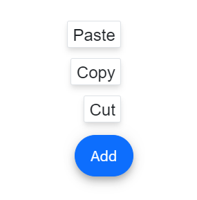

# Positions in Blazor SpeedDial Component

This section explains the different positions of SpeedDial.

## Target

The [Target](https://help.syncfusion.com/cr/blazor/Syncfusion.Blazor.Buttons.SfSpeedDial.html#Syncfusion_Blazor_Buttons_SfSpeedDial_Target) property defines the selector for the element in which the speed dial will be positioned. If the Target is not defined, then Speed Dial is positioned based on the browser viewport.




@using Syncfusion.Blazor.Buttons

<div id="target" style="min-height:200px; position:relative; width:300px; border:1px solid;">
    <SfSpeedDial Target="#target" Content="Edit">
        <SpeedDialItems>
            <SpeedDialItem Text="Cut"/>
            <SpeedDialItem Text="Copy"/>
            <SpeedDialItem Text="Paste"/>
        </SpeedDialItems>
    </SfSpeedDial>
</div>





## Built-in positions

The SpeedDial Component can be positioned in the pre-defined positions using the [Position](https://help.syncfusion.com/cr/blazor/Syncfusion.Blazor.Buttons.SfSpeedDial.html#Syncfusion_Blazor_Buttons_SfSpeedDial_Position) property.

The built-in position values of SpeedDial are as follows:

* TopLeft
* TopCenter
* TopRight
* MiddleLeft
* MiddleCenter
* MiddleRight
* BottomLeft
* BottomCenter
* BottomRight

```cshtml

@using Syncfusion.Blazor.Buttons

<SfSpeedDial Content="Add" Position="FabPosition.BottomLeft">
    <SpeedDialItems>
        <SpeedDialItem Text="Cut"/>
        <SpeedDialItem Text="Copy"/>
        <SpeedDialItem Text="Paste"/>
    </SpeedDialItems>
</SfSpeedDial>

```


## Custom Positioning

You can define the custom position for the SpeedDial by overriding the `top`, `left`, `right`, and `bottom` CSS properties using [CssClass](https://help.syncfusion.com/cr/blazor/Syncfusion.Blazor.Buttons.SfSpeedDial.html#Syncfusion_Blazor_Buttons_SfSpeedDial_CssClass).

```cshtml

@using Syncfusion.Blazor.Buttons

<SfSpeedDial Content="Add" CssClass="custom-position">
    <SpeedDialItems>
        <SpeedDialItem Text="Cut"/>
        <SpeedDialItem Text="Copy"/>
        <SpeedDialItem Text="Paste"/>
    </SpeedDialItems>
</SfSpeedDial>

<style>

    .e-fab.e-btn.custom-position {
        left: 325px;
        top: 170px;
        bottom: unset;
        right: unset;
    }

    .e-speeddial-popup.e-speeddial-right.e-speeddial-linear {
        left: 315px;   
    }

    .e-speeddial-popup.e-speeddial-bottom.e-speeddial-linear {
        top: 50px;
    }

</style>

```



N> You can use the [RefreshPositionAsync](https://help.syncfusion.com/cr/blazor/Syncfusion.Blazor.Buttons.SfSpeedDial.html#Syncfusion_Blazor_Buttons_SfSpeedDial_RefreshPositionAsync) method when the `Target` position is resized.