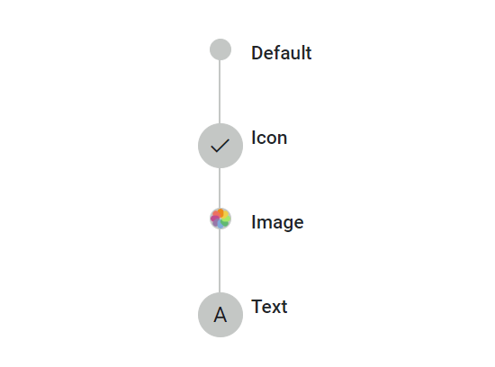

# Items in Blazor Timeline component

The Blazor Timeline allows you to add items in the Timeline component using [TimelineItem]() tag directive in Timeline. It is responsible for providing the data that will be displayed as individual timeline entries where each item can be customized using various properties.

## Defining Content

You can specify the main content or information that is displayed within the timeline item using the [Content]() tag directive as a child to `TimelineItem` directive.

### String-based Content

You can directly provide a simple, static content that describes the timeline item.

```cshtml

@using Syncfusion.Blazor.Layouts

<div class="container" style="height: 350px">
    <SfTimeline>
        <TimelineItems>
            @foreach (var item in timelineItems)
            {
                <TimelineItem>
                    <Content> @item.Content </Content>
                </TimelineItem>
            }
        </TimelineItems>
    </SfTimeline>
</div>

@code {
    public class TimelineItemModel
    {
        public string Content { get; set; }
    }
    private List<TimelineItemModel> timelineItems = new List<TimelineItemModel>()
    {
        new TimelineItemModel() { Content = "Shipped" },
        new TimelineItemModel() { Content = "Departed" },
        new TimelineItemModel() { Content = "Arrived" },
        new TimelineItemModel() { Content = "Out for Delivery" }
    };
}

```


### Template-based Content

This allows you to have greater control over the content displayed in each item which enables you to define item content using HTML elements.

```cshtml

@using Syncfusion.Blazor.Layouts

<div class="container" style="height: 400px">
    <SfTimeline>
        <ChildContent>
            <TimelineItems>
                @foreach (var item in timelineItems)
                {
                    <TimelineItem>
                        <Content>
                            <div class="content-container">
                                <div class="title">
                                    @item.Title
                                </div>
                                <div class="description">
                                    @item.Description
                                </div>
                                <div class="info">
                                    @item.Info
                                </div>
                            </div>
                        </Content>
                    </TimelineItem>
                }
                <TimelineItem>
                    <Content> Out for Delivery </Content>
                </TimelineItem>
            </TimelineItems>
        </ChildContent>
    </SfTimeline>
</div>

<style>
    .content-container {
        position: relative;
        width: 180px;
        padding: 10px;
        margin-left: 5px;
        box-shadow: rgba(9, 30, 66, 0.25) 0px 4px 8px -2px, rgba(9, 30, 66, 0.08) 0px 0px 0px 1px;
        background-color: ghostwhite;
    }

    .content-container::before {
        content: '';
        position: absolute;
        left: -8px;
        transform: translateY(-50%);
        width: 0;
        height: 0;
        border-top: 5px solid transparent;
        border-bottom: 5px solid transparent;
        border-right: 8px solid silver;
    }

    .content-container .title {
        font-size: 16px;
    }

    .content-container .description {
        color: #999999;
        font-size: 12px;
    }

    .content-container .info {
        color: #999999;
        font-size: 10px;
    }
</style>

@code {
    public class TimelineItemModel
    {
        public string Title { get; set; }
        public string Description{ get; set; }
        public string Info { get; set; }
    }
    private List<TimelineItemModel> timelineItems = new List<TimelineItemModel>()
    {
        new TimelineItemModel() { Title = "Shipped", Description = "Package details received", Info = "- Awaiting dispatch" },
        new TimelineItemModel() { Title = "Departed", Description = "In-transit", Info = "(International warehouse)" },
        new TimelineItemModel() { Title = "Arrived", Description = "Package arrived at nearest hub", Info = "(New york - US)" },
    };
}

```


## Adding Opposite Content

You can also define additional content that appears opposite to the main content within the timeline item using the [OppositeContent]() tag directive as a child to `TimelineItem` directive.. Similar to the `Content`, you can also define opposite content as either a `string` or a `template`.

```cshtml

@using Syncfusion.Blazor.Layouts

<div class="container" style="height: 250px">
    <SfTimeline>
        <TimelineItems>
            @foreach (var item in timelineItems)
            {
                <TimelineItem>
                    <Content>
                        @item.Content
                    </Content>
                    <OppositeContent>
                        @item.OppositeContent
                    </OppositeContent>
                </TimelineItem>
            }
        </TimelineItems>
    </SfTimeline>
</div>

@code {
    public class TimelineItemModel
    {
        public string Content { get; set; }
        public string OppositeContent { get; set; }
    }
    private List<TimelineItemModel> timelineItems = new List<TimelineItemModel>()
    {
        new TimelineItemModel() { Content = "Breakfast", OppositeContent = "8:00 AM" },
        new TimelineItemModel() { Content = "Lunch", OppositeContent = "1:00 PM" },
        new TimelineItemModel() { Content = "Dinner", OppositeContent = "8:00 PM" },
    };
}

```


## Defining Dot item

The [dotCss]() property in the `TimelineItem` allows you to specify a class to personalize the appearance of the dot associated with each timeline item.

### Displaying Icons

By using the `dotCss` property, you can define an Icon CSS class to render an icon in the timeline item.

### Adding Images

You can use the `dotCss` property to specify a class and set background image for it which embeds an image in the timeline item.

### Including Text

You can also define a class using the `dotCss` property and utilize the pseudo-selector to define the content property within the CSS to showcase text directly in timeline item.

```cshtml

@using Syncfusion.Blazor.Layouts

<div class="container" style="height: 250px">
    <SfTimeline>
        <ChildContent>
            <TimelineItems>
                @foreach (var item in timelineItems)
                {
                    <TimelineItem DotCss=@item.DotCss>
                        <Content>
                            @item.Content
                        </Content>
                    </TimelineItem>
                }
            </TimelineItems>
        </ChildContent>
    </SfTimeline>
</div>

<style>
    .e-dot.custom-image {
        background-image: url('images/dot-image.png');
    }

    .e-dot.custom-text::before {
        content: 'A';
    }
</style>

@code {

    public class TimelineItemModel
    {
        public string Content { get; set; }
        public string DotCss { get; set; }
    }
    private List<TimelineItemModel> timelineItems = new List<TimelineItemModel>()
    {
        new TimelineItemModel() { Content = "Default" },
        new TimelineItemModel() { Content = "Icon", DotCss = "e-icons e-check" },
        new TimelineItemModel() { Content = "Image", DotCss = "custom-image" },
        new TimelineItemModel() { Content = "Text", DotCss = "custom-text" },
    };
}

```



## Disabled Item

The [disabled]() property determines whether the timeline item is active or inactive. When set to `true`, the item is disabled and may appear grayed out, indicating that it is not currently accessible.

```cshtml

@using Syncfusion.Blazor.Layouts

<div class="container" style="height: 250px">
    <SfTimeline>
        <ChildContent>
            <TimelineItems>
                @foreach (var item in timelineItems)
                {
                    <TimelineItem Disabled=@item.Disabled>
                        <Content>
                            @item.Content
                        </Content>
                    </TimelineItem>
                }
            </TimelineItems>
        </ChildContent>
    </SfTimeline>
</div>

@code {

    public class TimelineItemModel
    {
        public string Content { get; set; }
        public bool Disabled { get; set; }
    }
    private List<TimelineItemModel> timelineItems = new List<TimelineItemModel>()
    {
        new TimelineItemModel() { Content = "Eat" },
        new TimelineItemModel() { Content = "Code" },
        new TimelineItemModel() { Content = "Repeat", Disabled = true },
    };
}

```


## CSS class

The [cssClass]() property allows you to define a custom class to modify the appearance of the timeline item.