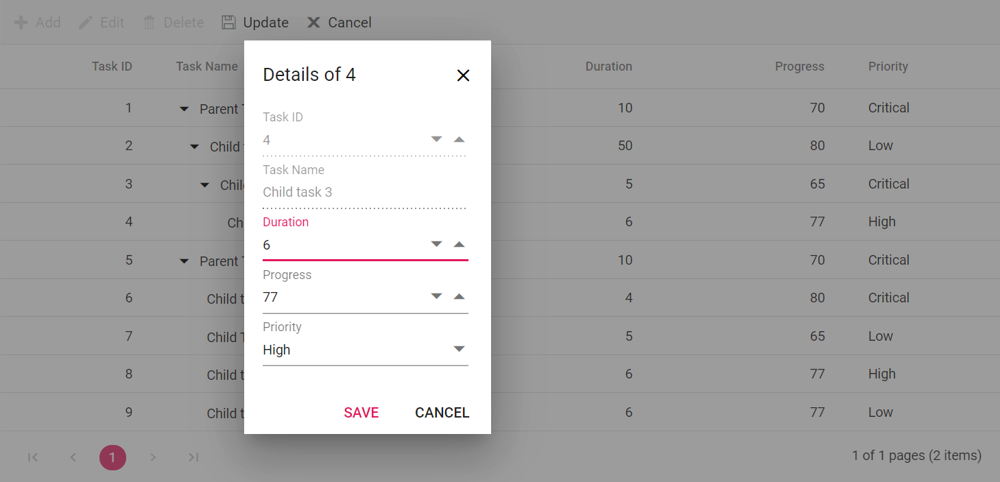
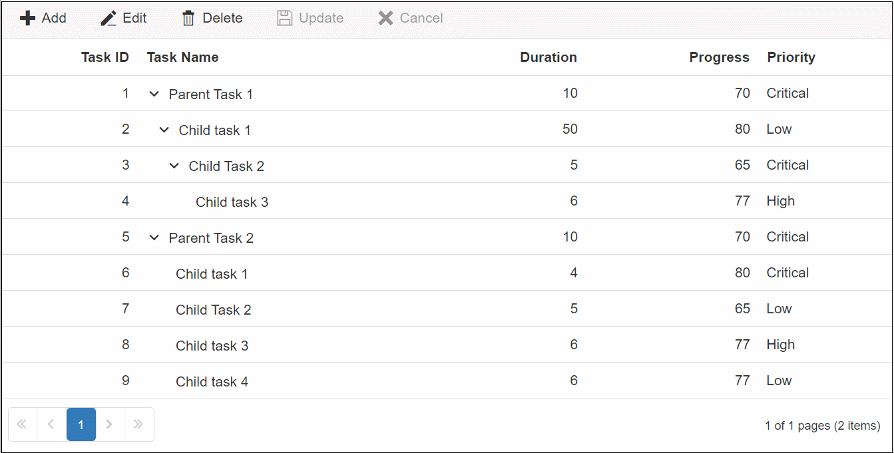

# Template Editing in Blazor Tree Grid Component

## Dialog template

To know about customizing the Dialog Template in Blazor tree grid component, you can check this video.



The dialog template editing provides an option to customize the default behavior of dialog editing. Using the dialog template, render your own editors by defining the [TreeGridEditSettings.Mode](https://help.syncfusion.com/cr/blazor/Syncfusion.Blazor~Syncfusion.Blazor.TreeGrid.TreeGridEditSettings~Mode.html) as **Dialog** and [Template](https://help.syncfusion.com/cr/blazor/Syncfusion.Blazor~Syncfusion.Blazor.TreeGrid.TreeGridEditSettings~Template.html) using the **Template** of the **TreeGridEditSettings**.

In some cases, the new field editors must be added in the dialog which are not present in the column model. In that situation, the dialog template will help to customize the default edit dialog.





@using TreeGridComponent.Data;
@using Syncfusion.Blazor.TreeGrid;
@using Syncfusion.Blazor.DropDowns;

<SfTreeGrid DataSource="@TreeGridData" AllowPaging="true" IdMapping="TaskId" ParentIdMapping="ParentId" TreeColumnIndex="1" Toolbar="@(new List<string>() { "Add", "Edit", "Delete", "Update", "Cancel" })">
    <TreeGridEvents TValue="TreeData" OnActionComplete="OnComplete"></TreeGridEvents>
    <TreeGridEditSettings AllowEditing="true" AllowAdding="true" AllowDeleting="true" Mode="Syncfusion.Blazor.TreeGrid.EditMode.Dialog" NewRowPosition="RowPosition.Child">
        <Template>
            @{
               var employee = (context as TreeData);
             }
            

                

                    

                        <SfNumericTextBox ID="TaskId" @bind-Value="@(employee.TaskId)" Enabled="@Check" FloatLabelType="FloatLabelType.Always" Placeholder="Task ID"></SfNumericTextBox>
                    

                    

                        <SfAutoComplete TItem="TreeData" ID="TaskName" @bind-Value="@(employee.TaskName)" TValue="string" DataSource="@TreeGridData" FloatLabelType="FloatLabelType.Always" Placeholder="Task Name">
                            <AutoCompleteFieldSettings Value="TaskName"></AutoCompleteFieldSettings>
                        </SfAutoComplete>
                    

                

                

                    

                        <SfNumericTextBox ID="Duration" @bind-Value="@(employee.Duration)" TValue="int?" FloatLabelType="FloatLabelType.Always" Placeholder="Duration"></SfNumericTextBox>
                    

                    

                        <SfNumericTextBox ID="Progress" @bind-Value="@(employee.Progress)" TValue="int?" FloatLabelType="FloatLabelType.Always" Placeholder="Progress"></SfNumericTextBox>
                    

                

                

                    

                        <SfDropDownList ID="Priority" TItem="TreeData" @bind-Value="@(employee.Priority)" TValue="string" DataSource="@TreeGridData" FloatLabelType="FloatLabelType.Always" Placeholder="Priority">
                            <DropDownListFieldSettings Value="Priority" Text="Priority"></DropDownListFieldSettings>
                        </SfDropDownList>
                    
                    
                
                
            

        </Template>
    </TreeGridEditSettings>
    <TreeGridColumns>
        <TreeGridColumn Field="TaskId" HeaderText="Task ID" IsPrimaryKey="true" Width="80" TextAlign="Syncfusion.Blazor.Grids.TextAlign.Right"></TreeGridColumn>
        <TreeGridColumn Field="TaskName" HeaderText="Task Name" Width="160"></TreeGridColumn>
        <TreeGridColumn Field="Duration" HeaderText="Duration" Width="100" TextAlign="Syncfusion.Blazor.Grids.TextAlign.Right"></TreeGridColumn>
        <TreeGridColumn Field="Progress" HeaderText="Progress" Width="100" TextAlign="Syncfusion.Blazor.Grids.TextAlign.Right"></TreeGridColumn>
        <TreeGridColumn Field="Priority" HeaderText="Priority" Width="80"></TreeGridColumn>
    </TreeGridColumns>
</SfTreeGrid>

@code{

    private Boolean Check = false;

    public List<TreeData> TreeGridData { get; set; }

    protected override void OnInitialized()
    {
        this.TreeGridData = TreeData.GetSelfDataSource().ToList();
    }

    private void OnComplete(ActionEventArgs<TreeData> args)
    {
        if (args.RequestType.ToString() == "Add")
        {
            Check = true;
        }
        else
        {
            Check = false;
        }
    }

}





namespace TreeGridComponent.Data {

public class TreeData
    {
            public int TaskId { get; set;}
            public string TaskName { get; set;}
            public int? Duration { get; set;}
            public int? Progress { get; set;}
            public string Priority { get; set;}
            public int? ParentId { get; set;}
       
        public static List<TreeData> GetSelfDataSource()
        {
            List<TreeData> TreeDataCollection = new List<TreeData>();
            TreeDataCollection.Add(new TreeData() { TaskId = 1,TaskName = "Parent Task 1",Duration = 10,Progress = 70,Priority = "Critical",ParentId = null});
            TreeDataCollection.Add(new TreeData() { TaskId = 2,TaskName = "Child task 1",Progress = 80,Priority = "Low",Duration = 50,ParentId = 1 });
            TreeDataCollection.Add(new TreeData() { TaskId = 3,TaskName = "Child Task 2",Duration = 5,Progress = 65,Priority = "Critical",ParentId = 2 });
            TreeDataCollection.Add(new TreeData() { TaskId = 4,TaskName = "Child task 3",Duration = 6,Priority = "High",Progress = 77,ParentId = 3 });
            TreeDataCollection.Add(new TreeData() { TaskId = 5,TaskName = "Parent Task 2",Duration = 10,Progress = 70,Priority = "Critical",ParentId = null});
            TreeDataCollection.Add(new TreeData() { TaskId = 6,TaskName = "Child task 1",Duration = 4,Progress = 80,Priority = "Critical",ParentId = 5});
            TreeDataCollection.Add(new TreeData() { TaskId = 7,TaskName = "Child Task 2",Duration = 5,Progress = 65,Priority = "Low",ParentId = 5});
            TreeDataCollection.Add(new TreeData() { TaskId = 8,TaskName = "Child task 3",Duration = 6,Progress = 77,Priority = "High",ParentId = 5});
            TreeDataCollection.Add(new TreeData() { TaskId = 9,TaskName = "Child task 4",Duration = 6,Progress = 77,Priority = "Low",ParentId = 5});
            return TreeDataCollection;
        }
    }
}





> The template form editors should have a **name** attribute.

### Disable components in dialog template

It is possible to disable particular components rendered inside the dialog template using the data source value. This can be achieved by utilizing the `Enabled` property of the components which specifies whether the component is enabled or disabled.

This is demonstrated in the following sample code, where if the `RequestType` argument value of the [OnActionBegin](https://help.syncfusion.com/cr/blazor/Syncfusion.Blazor.TreeGrid.TreeGridEvents-1.html#Syncfusion_Blazor_TreeGrid_TreeGridEvents_1_OnActionBegin) event is **BeginEdit**, the `Enabled` property of the **TaskId** and **TaskName** Textbox is set to false.





@using TreeGridComponent.Data;
@using Syncfusion.Blazor.TreeGrid;
@using Syncfusion.Blazor.Calendars
@using Syncfusion.Blazor.DropDowns
@using Syncfusion.Blazor.Inputs
@using Syncfusion.Blazor.Grids;

<SfTreeGrid DataSource="@TreeGridData" AllowPaging="true" IdMapping="TaskId" ParentIdMapping="ParentId" TreeColumnIndex="1" Toolbar="@(new List<string>() { "Add", "Edit", "Delete", "Update", "Cancel" })">
    <TreeGridEvents TValue="TreeData" OnActionBegin="ActionBeginHandler"></TreeGridEvents>
    <TreeGridEditSettings AllowEditing="true" AllowAdding="true" AllowDeleting="true" Mode="Syncfusion.Blazor.TreeGrid.EditMode.Dialog" NewRowPosition="RowPosition.Child">
        <Template>
            @{
               var employee = (context as TreeData);
             }
            

                

                    

                        <SfNumericTextBox ID="TaskId" @bind-Value="@(employee.TaskId)" Enabled="@Enabled" FloatLabelType="FloatLabelType.Always" Placeholder="Task ID"></SfNumericTextBox>
                    

                    

                        <SfAutoComplete TItem="TreeData" ID="TaskName" Enabled="@Enabled" @bind-Value="@(employee.TaskName)" TValue="string" DataSource="@TreeGridData" FloatLabelType="FloatLabelType.Always" Placeholder="Task Name">
                            <AutoCompleteFieldSettings Value="TaskName"></AutoCompleteFieldSettings>
                        </SfAutoComplete>
                    

                

                

                    

                        <SfNumericTextBox ID="Duration" @bind-Value="@(employee.Duration)" TValue="int?" FloatLabelType="FloatLabelType.Always" Placeholder="Duration"></SfNumericTextBox>
                    

                    

                        <SfNumericTextBox ID="Progress" @bind-Value="@(employee.Progress)" TValue="int?" FloatLabelType="FloatLabelType.Always" Placeholder="Progress"></SfNumericTextBox>
                    

                

                

                    

                        <SfDropDownList ID="Priority" TItem="TreeData" @bind-Value="@(employee.Priority)" TValue="string" DataSource="@TreeGridData" FloatLabelType="FloatLabelType.Always" Placeholder="Priority">
                            <DropDownListFieldSettings Value="Priority" Text="Priority"></DropDownListFieldSettings>
                        </SfDropDownList>
                    
                    
                
                
            

        </Template>
    </TreeGridEditSettings>
    <TreeGridColumns>
        <TreeGridColumn Field="TaskId" HeaderText="Task ID" IsPrimaryKey="true" Width="80" TextAlign="Syncfusion.Blazor.Grids.TextAlign.Right"></TreeGridColumn>
        <TreeGridColumn Field="TaskName" HeaderText="Task Name" Width="160"></TreeGridColumn>
        <TreeGridColumn Field="Duration" HeaderText="Duration" Width="100" TextAlign="Syncfusion.Blazor.Grids.TextAlign.Right"></TreeGridColumn>
        <TreeGridColumn Field="Progress" HeaderText="Progress" Width="100" TextAlign="Syncfusion.Blazor.Grids.TextAlign.Right"></TreeGridColumn>
        <TreeGridColumn Field="Priority" HeaderText="Priority" Width="80"></TreeGridColumn>
    </TreeGridColumns>
</SfTreeGrid>

@code{

    public bool Enabled = true;

    public List<TreeData> TreeGridData { get; set; }

    protected override void OnInitialized()
    {
        this.TreeGridData = TreeData.GetSelfDataSource().ToList();
    }

    public void ActionBeginHandler(ActionEventArgs<TreeData> args)
    {
        if (args.RequestType == Syncfusion.Blazor.Grids.Action.BeginEdit)
        {
            // The Textbox component is disabled using its Enabled property
            this.Enabled = false;
        }
        else
        {
            this.Enabled = true;
        }
    }
}





namespace TreeGridComponent.Data {

public class TreeData
    {
            public int TaskId { get; set;}
            public string TaskName { get; set;}
            public int? Duration { get; set;}
            public int? Progress { get; set;}
            public string Priority { get; set;}
            public int? ParentId { get; set;}
       
        public static List<TreeData> GetSelfDataSource()
        {
            List<TreeData> TreeDataCollection = new List<TreeData>();
            TreeDataCollection.Add(new TreeData() { TaskId = 1,TaskName = "Parent Task 1",Duration = 10,Progress = 70,Priority = "Critical",ParentId = null});
            TreeDataCollection.Add(new TreeData() { TaskId = 2,TaskName = "Child task 1",Progress = 80,Priority = "Low",Duration = 50,ParentId = 1 });
            TreeDataCollection.Add(new TreeData() { TaskId = 3,TaskName = "Child Task 2",Duration = 5,Progress = 65,Priority = "Critical",ParentId = 2 });
            TreeDataCollection.Add(new TreeData() { TaskId = 4,TaskName = "Child task 3",Duration = 6,Priority = "High",Progress = 77,ParentId = 3 });
            TreeDataCollection.Add(new TreeData() { TaskId = 5,TaskName = "Parent Task 2",Duration = 10,Progress = 70,Priority = "Critical",ParentId = null});
            TreeDataCollection.Add(new TreeData() { TaskId = 6,TaskName = "Child task 1",Duration = 4,Progress = 80,Priority = "Critical",ParentId = 5});
            TreeDataCollection.Add(new TreeData() { TaskId = 7,TaskName = "Child Task 2",Duration = 5,Progress = 65,Priority = "Low",ParentId = 5});
            TreeDataCollection.Add(new TreeData() { TaskId = 8,TaskName = "Child task 3",Duration = 6,Progress = 77,Priority = "High",ParentId = 5});
            TreeDataCollection.Add(new TreeData() { TaskId = 9,TaskName = "Child task 4",Duration = 6,Progress = 77,Priority = "Low",ParentId = 5});
            return TreeDataCollection;
        }
    }
}





The following image represents the dialog template of the tree grid component with the disabled components,

### Set focus to editor

By default, the first input element in the dialog will be focused while opening it. If the first input element is in a disabled or hidden state, set focus to the required input element in the corresponding components [Created](https://help.syncfusion.com/cr/blazor/Syncfusion.Blazor.DropDowns.AutoCompleteEvents-2.html#Syncfusion_Blazor_DropDowns_AutoCompleteEvents_2_Created) or [DataBound](https://help.syncfusion.com/cr/blazor/Syncfusion.Blazor.DropDowns.AutoCompleteEvents-2.html#Syncfusion_Blazor_DropDowns_AutoCompleteEvents_2_DataBound) event.

In the following sample code, the first input element is in a disabled state. So the **TaskName** edit field is focused by invoking its [FocusIn](https://help.syncfusion.com/cr/blazor/Syncfusion.Blazor.DropDowns.SfDropDownList-2.html#Syncfusion_Blazor_DropDowns_SfDropDownList_2_FocusIn) method in the AutoComplete's `DataBound` event.





@using TreeGridComponent.Data;
@using Syncfusion.Blazor.TreeGrid;
@using Syncfusion.Blazor.Calendars
@using Syncfusion.Blazor.DropDowns
@using Syncfusion.Blazor.Inputs
@using Syncfusion.Blazor.Grids;

<SfTreeGrid DataSource="@TreeGridData" AllowPaging="true" IdMapping="TaskId" ParentIdMapping="ParentId" TreeColumnIndex="1" Toolbar="@(new List<string>() { "Add", "Edit", "Delete", "Update", "Cancel" })">
    <TreeGridEditSettings AllowEditing="true" AllowAdding="true" AllowDeleting="true" Mode="Syncfusion.Blazor.TreeGrid.EditMode.Dialog" NewRowPosition="RowPosition.Child">
        <Template>
            @{
               var employee = (context as TreeData);
             }
            

                

                    

                        <SfNumericTextBox ID="TaskId" @bind-Value="@(employee.TaskId)" Enabled="@((employee.TaskId == null) ? true : false)" Placeholder="Task ID"></SfNumericTextBox>
                    

                    

                        <SfAutoComplete TItem="TreeData" ID="TaskName" @bind-Value="@(employee.TaskName)" TValue="string" DataSource="@TreeGridData" FloatLabelType="FloatLabelType.Always" Placeholder="Task Name">
                            <AutoCompleteFieldSettings Value="TaskName"></AutoCompleteFieldSettings>
                            <AutoCompleteEvents TValue="string" TItem="TreeData" DataBound="FocusAutoComplete"></AutoCompleteEvents>
                        </SfAutoComplete>
                    

                

                

                    

                        <SfNumericTextBox ID="Duration" @bind-Value="@(employee.Duration)" TValue="int?" FloatLabelType="FloatLabelType.Always" Placeholder="Duration"></SfNumericTextBox>
                    

                    

                        <SfNumericTextBox ID="Progress" @bind-Value="@(employee.Progress)" TValue="int?" FloatLabelType="FloatLabelType.Always" Placeholder="Progress"></SfNumericTextBox>
                    

                

                

                    

                        <SfDropDownList ID="Priority" TItem="TreeData" @bind-Value="@(employee.Priority)" TValue="string" DataSource="@TreeGridData" FloatLabelType="FloatLabelType.Always" Placeholder="Priority">
                            <DropDownListFieldSettings Value="Priority" Text="Priority"></DropDownListFieldSettings>
                        </SfDropDownList>
                    
                    
                
                
            

        </Template>
    </TreeGridEditSettings>
    <TreeGridColumns>
        <TreeGridColumn Field="TaskId" HeaderText="Task ID" IsPrimaryKey="true" Width="80" TextAlign="Syncfusion.Blazor.Grids.TextAlign.Right"></TreeGridColumn>
        <TreeGridColumn Field="TaskName" HeaderText="Task Name" Width="160"></TreeGridColumn>
        <TreeGridColumn Field="Duration" HeaderText="Duration" Width="100" TextAlign="Syncfusion.Blazor.Grids.TextAlign.Right"></TreeGridColumn>
        <TreeGridColumn Field="Progress" HeaderText="Progress" Width="100" TextAlign="Syncfusion.Blazor.Grids.TextAlign.Right"></TreeGridColumn>
        <TreeGridColumn Field="Priority" HeaderText="Priority" Width="80"></TreeGridColumn>
    </TreeGridColumns>
</SfTreeGrid>

@code{

    SfAutoComplete<string, TreeData> AutoComplete { get; set; }

    public List<TreeData> TreeGridData { get; set; }

    protected override void OnInitialized()
    {
        this.TreeGridData = TreeData.GetSelfDataSource().ToList();
    }
    private async Task FocusAutoComplete() {
        await this.AutoComplete.FocusIn();
    }
}





namespace TreeGridComponent.Data {

public class TreeData
    {
            public int TaskId { get; set;}
            public string TaskName { get; set;}
            public int? Duration { get; set;}
            public int? Progress { get; set;}
            public string Priority { get; set;}
            public int? ParentId { get; set;}
       
        public static List<TreeData> GetSelfDataSource()
        {
            List<TreeData> TreeDataCollection = new List<TreeData>();
            TreeDataCollection.Add(new TreeData() { TaskId = 1,TaskName = "Parent Task 1",Duration = 10,Progress = 70,Priority = "Critical",ParentId = null});
            TreeDataCollection.Add(new TreeData() { TaskId = 2,TaskName = "Child task 1",Progress = 80,Priority = "Low",Duration = 50,ParentId = 1 });
            TreeDataCollection.Add(new TreeData() { TaskId = 3,TaskName = "Child Task 2",Duration = 5,Progress = 65,Priority = "Critical",ParentId = 2 });
            TreeDataCollection.Add(new TreeData() { TaskId = 4,TaskName = "Child task 3",Duration = 6,Priority = "High",Progress = 77,ParentId = 3 });
            TreeDataCollection.Add(new TreeData() { TaskId = 5,TaskName = "Parent Task 2",Duration = 10,Progress = 70,Priority = "Critical",ParentId = null});
            TreeDataCollection.Add(new TreeData() { TaskId = 6,TaskName = "Child task 1",Duration = 4,Progress = 80,Priority = "Critical",ParentId = 5});
            TreeDataCollection.Add(new TreeData() { TaskId = 7,TaskName = "Child Task 2",Duration = 5,Progress = 65,Priority = "Low",ParentId = 5});
            TreeDataCollection.Add(new TreeData() { TaskId = 8,TaskName = "Child task 3",Duration = 6,Progress = 77,Priority = "High",ParentId = 5});
            TreeDataCollection.Add(new TreeData() { TaskId = 9,TaskName = "Child task 4",Duration = 6,Progress = 77,Priority = "Low",ParentId = 5});
            return TreeDataCollection;
        }
    }
}





The following image represents the AutoComplete component in a focused state inside the dialog template of the tree grid component,
