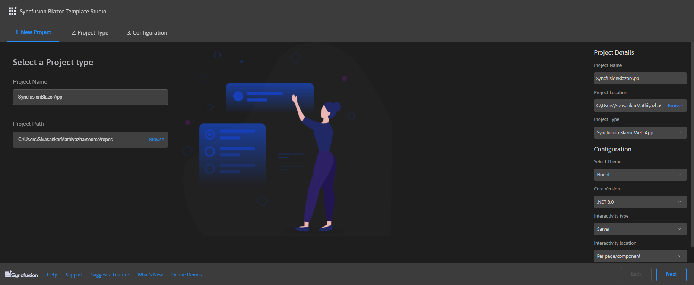
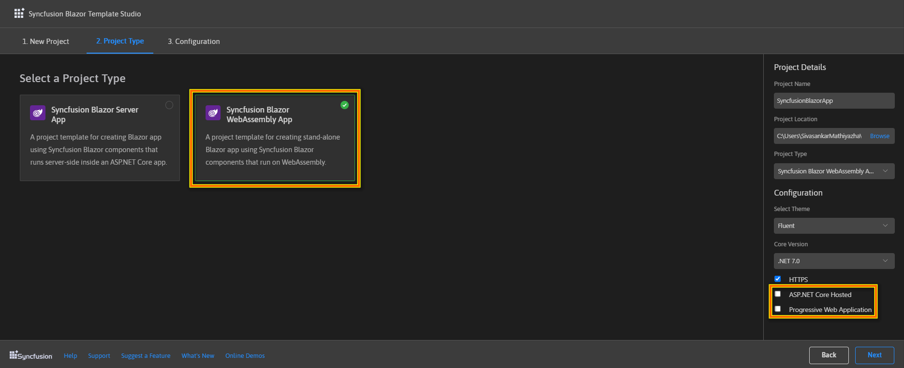
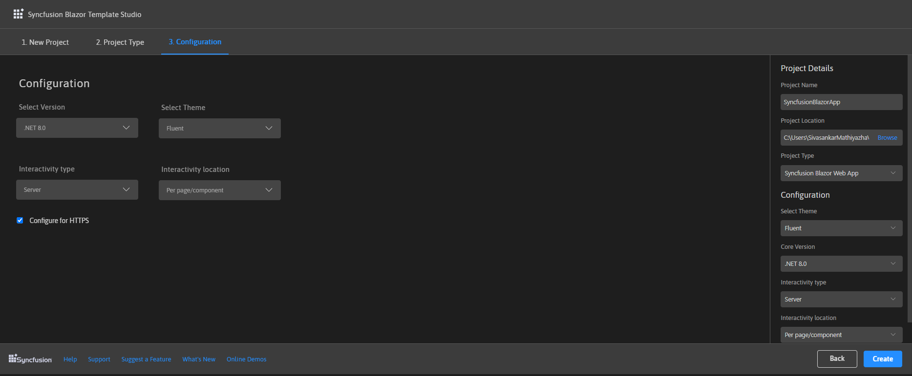

# Creating a Syncfusion Blazor application

Syncfusion provides **Visual Studio Code project templates** for creating Syncfusion Blazor application. Syncfusion Blazor generates application that include the necessary Syncfusion NuGet packages, namespaces, and component render code for the Calendar, Button, and DataGrid components, as well as the style for making Syncfusion component development easier.

> Blazor project templates from `v17.4.0.39` are supported by the Syncfusion Visual Studio Code project template.

The instructions below assist you in creating **Syncfusion Blazor Applications** using **Visual Studio Code**:

1. To create a Syncfusion Blazor application in Visual Studio Code, open the command palette by pressing **Ctrl+Shift+P**. Search for the word **Syncfusion** in the Visual Studio Code palette to get the templates provided by Syncfusion.

    

2. Select **Syncfusion Blazor Template Studio: Launch**, then press **Enter** key. The Template Studio wizard for configuring the Syncfusion Blazor app will be launched. Provide the Project Name and Project Path.

    

    > .NET 6.0 and .NET 7.0 is available from v19.4.0.38 and support from Visual Studio 2022.

3. Select either **Next** or the **Project Type** tab. Syncfusion Blazor Project Types will be displayed. Select one of the following Syncfusion Blazor project types:
   * Syncfusion Blazor Server App
   * Syncfusion Blazor WebAssembly App

    You can select ASP.NET Core hosted, Progressive Web Application, or both in the Syncfusion Blazor Web Assembly App project type.

    

4. The Configuration section will be displayed when you click either **Next** or the **Configuration** tab. Here, you have the option for selecting the required .NET Core version, themes, https configuration, and Blazor Web Assembly project types (ASP.NET Core hosted and Progressive Web Application).

    

    > ASP.NET Core hosted and Progressive Web Application options are only visible if Blazor Web Assembly App project type is selected.

5. Click the **Create** button. The Syncfusion Blazor application has been created. The created Syncfusion Blazor app has the Syncfusion NuGet packages, styles, and the component render code for the Syncfusion component added to the Index, Counter, and FetchData pages.

6. You can run the application to see the Syncfusion components. Click **F5** or go to **Run>Start Debugging**.

    

7. If you installed the trial setup or NuGet packages from nuget.org you must register the Syncfusion license key to your application since Syncfusion introduced the licensing system from 2018 Volume 2 (v16.2.0.41) Essential Studio release. Navigate to the [help topic](https://help.syncfusion.com/common/essential-studio/licensing/license-key#how-to-generate-syncfusion-license-key) to generate and register the Syncfusion license key to your application. Refer to this [blog](https://blog.syncfusion.com/post/Whats-New-in-2018-Volume-2-Licensing-Changes-in-the-1620x-Version-of-Essential-Studio.aspx?_ga=2.11237684.1233358434.1587355730-230058891.1567654773) post for understanding the licensing changes introduced in Essential Studio.

## Syncfusion integration

The Syncfusion Blazor application configures with latest Syncfusion Blazor NuGet packages, styles, namespaces, and component render code for Syncfusion components are added in the created application.

### NuGet Packages

The `Syncfusion.Blazor` NuGet package will be added as NuGet references for all application types.

### Style

The selected theme is added from Syncfusion NuGet and its reference at these applications locations in Blazor.

| Application type  | File location  |
|---|---|
| Syncfusion Blazor Server App | {Project location}/Pages//_Host.cshtml |
| Syncfusion Blazor WebAssembly App (ASPNET Core hosted)   Syncfusion Blazor WebAssembly App (Progressive Web Application) | {Client Project location}/wwwroot/index.html  |
| Syncfusion Blazor WebAssembly App  | {Project location}/wwwroot/index.html|

### Namespaces

The Syncfusion Blazor namespaces are added in the **`_imports.razor`** file.

### Component render code

The Syncfusion Blazor Calendar, Button, and DataGrid component render code is in the Razor files in the pages folder. The render code is updated in these Razor files.

| File name  | Code snippet added |
|---|---|
| `~/Pages/Index.razor`  |  |
| `~/Pages/Counter.razor` |  |
| `~/Pages/FetchData.razor`  |  |